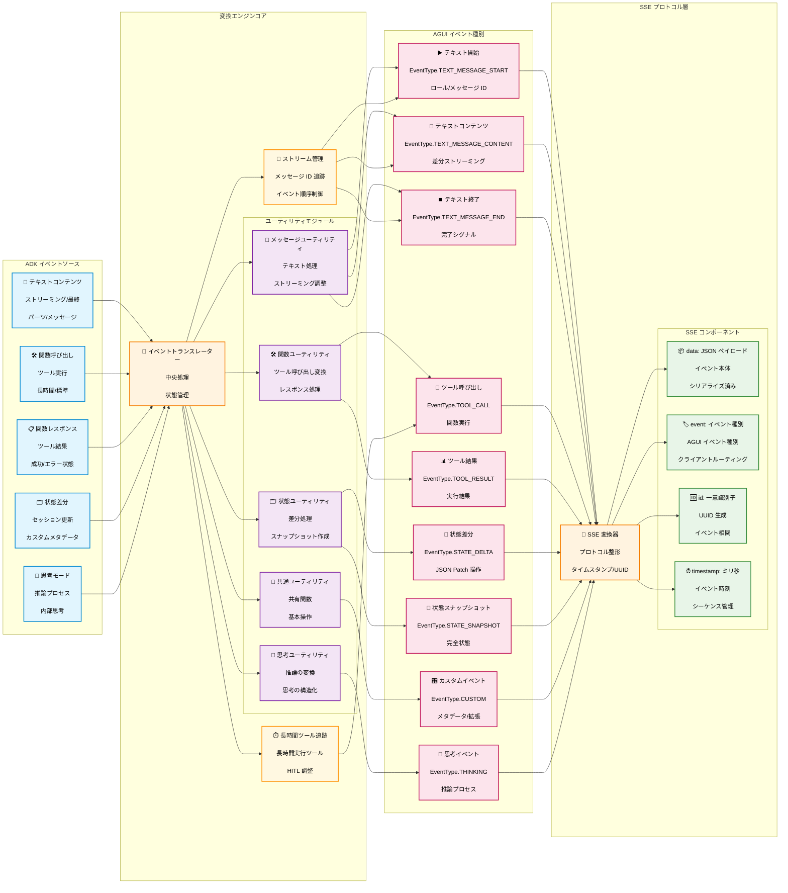
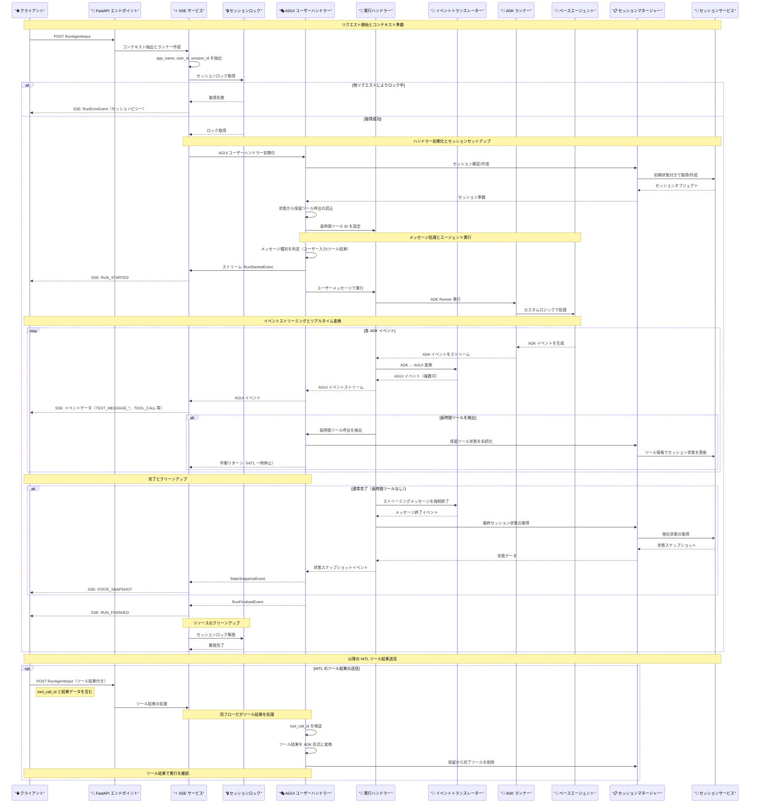
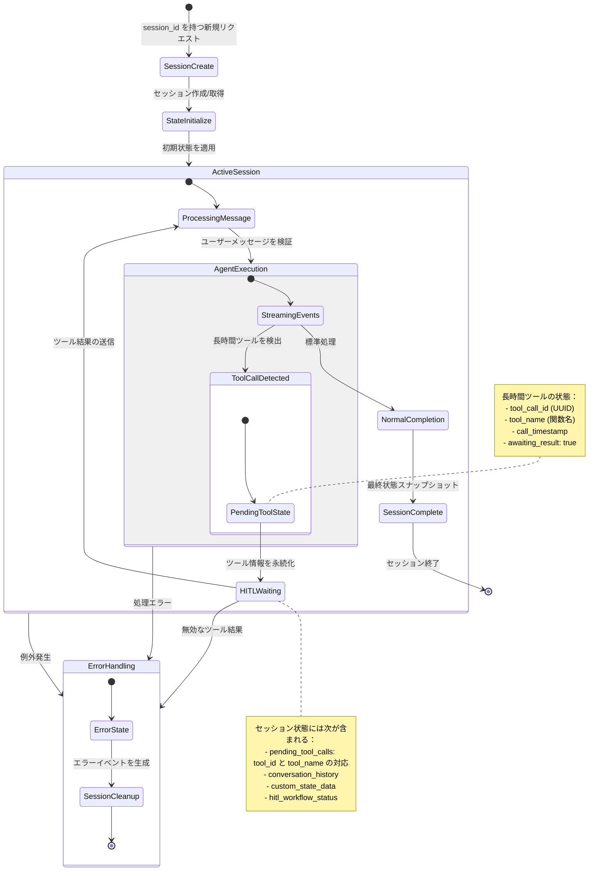

# ADK AGUI Middleware

[](https://deepwiki.com/trendmicro/adk-agui-middleware)
[](https://github.com/trendmicro/adk-agui-middleware/actions/workflows/ci.yml)
[](https://github.com/trendmicro/adk-agui-middleware/actions/workflows/codeql.yml)
[](https://github.com/trendmicro/adk-agui-middleware/actions/workflows/semgrep.yml)
[](https://github.com/trendmicro/adk-agui-middleware/actions/workflows/gitleaks.yml)
[](https://opensource.org/licenses/MIT)
[](https://github.com/astral-sh/ruff)
[](https://github.com/PyCQA/bandit)
[](https://github.com/python/mypy)

Languages: [English](README.md) | [繁體中文](README.zh-TW.md) | [简体中文](README.zh-CN.md) | [日本語](README.ja.md)

**Google の Agent Development Kit (ADK) と AGUI プロトコルをシームレスに橋渡しする、エンタープライズ向け Python 3.13+ ミドルウェア。Server-Sent Events (SSE) による高性能ストリーミングと Human-in-the-Loop (HITL) ワークフローのオーケストレーションを提供します。**

## 概要

Google の Agent Development Kit (ADK) と AGUI プロトコルを橋渡しし、Server-Sent Events ストリーミングと HITL ワークフローにより、リアルタイムな AI エージェントアプリケーションを実現するエンタープライズ向け Python 3.13+ ミドルウェアです。

### 主な特長

- **⚡ SSE ストリーミング**: 高性能 SSE による ADK ↔ AGUI のリアルタイム変換
- **🔒 セッション管理**: スレッドセーフなロック、タイムアウトとリトライの設定が可能
- **🤝 HITL ワークフロー**: 人間参加型の完全なオーケストレーションと状態永続化
- **🏗️ エンタープライズ設計**: 依存性注入と関心分離によるモジュラー設計
- **🛡️ 本番運用レディ**: 包括的なエラーハンドリング、ロギング、グレースフルシャットダウン
- **🎯 型安全**: Python 3.13 の完全な型注釈と厳格な mypy 検証

## インストール

```bash
pip install adk-agui-middleware
```

### 必要条件

- Python 3.13+（推奨 3.13.3+）
- Google ADK >= 1.9.0
- AGUI プロトコル >= 0.1.7
- FastAPI >= 0.104.0

## サンプル

`examples/` ディレクトリのハンズオンで段階的に高度なサンプルから始められます。

- 01_minimal_sse
  - 最小構成で、ADK の `LlmAgent` から Server-Sent Events (SSE) をストリーミングします。
  - パス: `examples/01_minimal_sse/app.py`
- 02_context_history
  - メインの SSE エンドポイントに加え、History/State エンドポイントとシンプルなコンテキスト抽出。
  - パス: `examples/02_context_history/app.py`
- 03_advanced_pipeline
  - カスタムの入出力レコーダーと `RunAgentInput` の安全なプリプロセッサを追加。
  - パス: `examples/03_advanced_pipeline/app.py`
- 04_lifecycle_handlers
  - リクエストライフサイクル全体と `HandlerContext` のフック（セッションロック、ADK/AGUI ハンドラー、変換、状態スナップショット、I/O 記録）を解説。
  - パス: `examples/04_lifecycle_handlers/app.py`

## アーキテクチャ概要

### 全体アーキテクチャ

```mermaid
graph TB
    subgraph "クライアントアプリケーション"
        WEB[🌐 Web アプリケーション<br/>React/Vue/Angular]
        MOBILE[📱 モバイルアプリ<br/>iOS/Android/Flutter]
        API[🔌 API クライアント<br/>REST/GraphQL/SDK]
    end

    subgraph "FastAPI エンドポイント層"
        MAIN_EP[🎯 メインエンドポイント<br/>/agui_main_path<br/>POST RunAgentInput]
        HIST_EP[📚 履歴エンドポイント<br/>GET /thread/list<br/>DELETE /thread/ID<br/>GET /message_snapshot/ID]
        STATE_EP[🗄️ 状態エンドポイント<br/>PATCH /state/ID<br/>GET /state_snapshot/ID]
    end

    subgraph "サービス層"
        SSE_SVC[⚡ SSE サービス<br/>イベントオーケストレーション<br/>& ストリーミング管理]
        HIST_SVC[📖 履歴サービス<br/>会話の取得
<br/>& スレッド管理]
        STATE_SVC[🗃️ 状態サービス<br/>セッション状態管理
<br/>& JSON Patch 操作]
    end

    subgraph "ハンドラーコンテキスト"
        LOCK_HDL[🔒 セッションロックハンドラー<br/>並行制御
<br/>& リソース保護]
        IO_HDL[📊 入出力ハンドラー<br/>リクエスト/レスポンスのロギング
<br/>& 監査トレース]
        CTX_MGR[🎛️ ハンドラーコンテキスト<br/>プラガブルなイベント処理
<br/>& カスタムワークフロー]
    end

    subgraph "コア処理パイプライン"
        AGUI_USER[🎭 AGUI ユーザーハンドラー<br/>ワークフローオーケストレーション<br/>& HITL 調整]
        RUNNING[🏃 実行ハンドラー<br/>エージェント実行エンジン<br/>& イベント変換]
        USER_MSG[💬 ユーザーメッセージハンドラー<br/>入力処理
<br/>& ツール結果処理]
        SESSION_HDL[📝 セッションハンドラー<br/>状態管理
<br/>& ツール呼び出し追跡]
    end

    subgraph "イベント変換エンジン"
        TRANSLATOR[🔄 イベントトランスレーター<br/>ADK ↔ AGUI 変換<br/>ストリーミング管理]
        MSG_UTIL[📝 メッセージユーティリティ
<br/>テキストイベント処理
<br/>& ストリーミング調整]
        FUNC_UTIL[🛠️ 関数ユーティリティ
<br/>ツール呼び出し変換
<br/>& レスポンス処理]
        STATE_UTIL[🗂️ 状態ユーティリティ
<br/>差分処理
<br/>& スナップショット作成]
        THK_UTIL[🤔 思考ユーティリティ
<br/>推論モード
<br/>& 思考処理]
    end

    subgraph "セッション/状態管理"
        SESS_MGR[📋 セッションマネージャー<br/>ADK セッション操作
<br/>& ライフサイクル管理]
        SESS_PARAM[🏷️ セッションパラメータ
<br/>アプリ/ユーザー/セッション ID
<br/>& コンテキスト抽出]
        CONFIG_CTX[⚙️ 設定コンテキスト
<br/>マルチテナント対応
<br/>& 動的設定]
    end

    subgraph "Google ADK 連携"
        ADK_RUNNER[🚀 ADK ランナー<br/>エージェントコンテナ
<br/>& 実行環境]
        BASE_AGENT[🤖 ベースエージェント
<br/>カスタム実装
<br/>& ビジネスロジック]
        ADK_SESS[💾 ADK セッションサービス
<br/>状態永続化
<br/>& イベント保存]
        RUN_CONFIG[⚙️ 実行設定
<br/>ストリーミングモード
<br/>& 実行パラメータ]
    end

    subgraph "サービス設定"
        ARTIFACT_SVC[📎 アーティファクトサービス
<br/>ファイル管理
<br/>& データ保存]
        MEMORY_SVC[🧠 メモリサービス
<br/>エージェントメモリ
<br/>& コンテキスト保持]
        CREDENTIAL_SVC[🔐 クレデンシャルサービス
<br/>認証
<br/>& セキュリティ管理]
    end

    subgraph "インフラ/ユーティリティ"
        LOGGER[📋 構造化ログ
<br/>イベント追跡
<br/>& デバッグ情報]
        SHUTDOWN[🔌 シャットダウンハンドラー
<br/>グレースフルクリーンアップ
<br/>& リソース管理]
        JSON_ENC[📤 JSON エンコーダー
<br/>シリアライズ
<br/>& データ整形]
        CONVERT[🔄 変換ユーティリティ
<br/>データ変換
<br/>& フォーマット適応]
    end

    %% Client → Endpoint
    WEB --> MAIN_EP
    MOBILE --> MAIN_EP
    API --> MAIN_EP
    WEB --> HIST_EP
    WEB --> STATE_EP

    %% Endpoint → Service
    MAIN_EP --> SSE_SVC
    HIST_EP --> HIST_SVC
    STATE_EP --> STATE_SVC

    %% Service → Handler
    SSE_SVC --> LOCK_HDL
    SSE_SVC --> IO_HDL
    SSE_SVC --> CTX_MGR
    SSE_SVC --> AGUI_USER

    %% Core pipeline
    AGUI_USER --> RUNNING
    AGUI_USER --> USER_MSG
    AGUI_USER --> SESSION_HDL
    RUNNING --> TRANSLATOR

    %% Translation components
    TRANSLATOR --> MSG_UTIL
    TRANSLATOR --> FUNC_UTIL
    TRANSLATOR --> STATE_UTIL
    TRANSLATOR --> THK_UTIL

    %% Session management links
    SESSION_HDL --> SESS_MGR
    SESS_MGR --> ADK_SESS
    SESS_MGR --> SESS_PARAM
    SSE_SVC --> CONFIG_CTX

    %% ADK integration
    RUNNING --> ADK_RUNNER
    ADK_RUNNER --> BASE_AGENT
    ADK_RUNNER --> RUN_CONFIG
    SESS_MGR --> ADK_SESS

    %% Service config
    ADK_RUNNER --> ARTIFACT_SVC
    ADK_RUNNER --> MEMORY_SVC
    ADK_RUNNER --> CREDENTIAL_SVC

    %% Infra links
    RUNNING --> LOGGER
    SESS_MGR --> LOGGER
    TRANSLATOR --> JSON_ENC
    SSE_SVC --> CONVERT
    SSE_SVC --> SHUTDOWN

    %% Styles
    classDef client fill:#e3f2fd,color:#000,stroke:#1976d2,stroke-width:2px
    classDef endpoint fill:#e8f5e8,color:#000,stroke:#388e3c,stroke-width:2px
    classDef service fill:#fff3e0,color:#000,stroke:#f57c00,stroke-width:2px
    classDef handler fill:#f3e5f5,color:#000,stroke:#7b1fa2,stroke-width:2px
    classDef core fill:#fce4ec,color:#000,stroke:#c2185b,stroke-width:2px
    classDef translation fill:#e1f5fe,color:#000,stroke:#0288d1,stroke-width:2px
    classDef session fill:#f1f8e9,color:#000,stroke:#689f38,stroke-width:2px
    classDef adk fill:#fff8e1,color:#000,stroke:#ff8f00,stroke-width:2px
    classDef config fill:#fafafa,color:#000,stroke:#424242,stroke-width:2px
    classDef infra fill:#e8eaf6,color:#000,stroke:#3f51b5,stroke-width:2px

    class WEB,MOBILE,API client
    class MAIN_EP,HIST_EP,STATE_EP endpoint
    class SSE_SVC,HIST_SVC,STATE_SVC service
    class LOCK_HDL,IO_HDL,CTX_MGR handler
    class AGUI_USER,RUNNING,USER_MSG,SESSION_HDL core
    class TRANSLATOR,MSG_UTIL,FUNC_UTIL,STATE_UTIL,THK_UTIL translation
    class SESS_MGR,SESS_PARAM,CONFIG_CTX session
    class ADK_RUNNER,BASE_AGENT,ADK_SESS,RUN_CONFIG adk
    class ARTIFACT_SVC,MEMORY_SVC,CREDENTIAL_SVC config
    class LOGGER,SHUTDOWN,JSON_ENC,CONVERT infra
```



### イベント変換パイプライン



### Human-in-the-Loop (HITL) ワークフロー

```mermaid
graph TD
    subgraph "クライアントリクエスト処理"
        REQ[📥 クライアントリクエスト<br/>RunAgentInput<br/>POST /]
        AUTH[🔐 認証
<br/>ユーザーコンテキスト抽出
<br/>セッション検証]
        LOCK[🔒 セッションロック
<br/>排他アクセスの取得
<br/>同時実行の防止]
    end

    subgraph "セッション/状態管理"
        SESS_CHECK[📋 セッション確認
<br/>取得/作成
<br/>既存状態の読込]
        STATE_INIT[🗂️ 状態初期化
<br/>初期状態の適用
<br/>保留ツールの読込]
        TOOL_RESUME[⏱️ ツール再開確認
<br/>長時間ツールの検出
<br/>HITL 再開]
    end

    subgraph "メッセージ処理"
        MSG_TYPE{❓ メッセージ種別?}
        USER_MSG[💬 ユーザーメッセージ
<br/>内容抽出
<br/>エージェント準備]
        TOOL_RESULT[🛠️ ツール結果
<br/>ツール呼出 ID 検証
<br/>ADK 形式へ変換]
        MSG_ERROR[❌ メッセージエラー
<br/>無効なツール ID または
<br/>内容不足]
    end

    subgraph "エージェント実行パイプライン"
        AGENT_START[▶️ 実行開始
<br/>RUN_STARTED
<br/>処理開始]
        ADK_RUN[🚀 ADK ランナー
<br/>エージェント処理
<br/>イベントストリーミング]
        EVENT_PROC[🔄 イベント処理
<br/>ADK → AGUI 変換
<br/>リアルタイム]
    end

    subgraph "ツール呼出検出"
        TOOL_CHECK{🔍 長時間ツール?}
        LRO_DETECT[⏱️ 長時間検出
<br/>長時間としてマーキング
<br/>呼出情報の保存]
        HITL_PAUSE[⏸️ HITL 一時停止
<br/>早期リターン
<br/>人手入力待ち]
        NORMAL_FLOW[➡️ 通常フロー
<br/>処理継続
<br/>標準ツール]
    end

    subgraph "状態永続化"
        TOOL_PERSIST[💾 ツール状態永続化
<br/>保留ツールの保存
<br/>セッション状態更新]
        STATE_SNAP[📸 状態スナップショット
<br/>最終状態の作成
<br/>クライアントへ送信]
        COMPLETION[✅ 完了
<br/>RUN_FINISHED
<br/>リソース解放]
    end

    subgraph "エラーハンドリング"
        ERROR_CATCH[🚨 エラー捕捉
<br/>例外捕捉
<br/>エラーイベント生成]
        ERROR_EVENT[⚠️ エラーイベント
<br/>AGUI エラー形式
<br/>クライアント通知]
        CLEANUP[🧹 後始末
<br/>セッションロック解放
<br/>リソース清掃]
    end

    %% Flow
    REQ --> AUTH
    AUTH --> LOCK
    LOCK --> SESS_CHECK

    SESS_CHECK --> STATE_INIT
    STATE_INIT --> TOOL_RESUME
    TOOL_RESUME --> MSG_TYPE

    MSG_TYPE -->|ユーザーメッセージ| USER_MSG
    MSG_TYPE -->|ツール結果| TOOL_RESULT
    MSG_TYPE -->|エラー| MSG_ERROR
    USER_MSG --> AGENT_START
    TOOL_RESULT --> AGENT_START
    MSG_ERROR --> ERROR_EVENT

    AGENT_START --> ADK_RUN
    ADK_RUN --> EVENT_PROC
    EVENT_PROC --> TOOL_CHECK

    TOOL_CHECK -->|長時間ツール| LRO_DETECT
    TOOL_CHECK -->|標準ツール| NORMAL_FLOW
    LRO_DETECT --> HITL_PAUSE
    NORMAL_FLOW --> STATE_SNAP

    HITL_PAUSE --> TOOL_PERSIST
    TOOL_PERSIST --> COMPLETION

    STATE_SNAP --> COMPLETION

    ADK_RUN -.->|例外| ERROR_CATCH
    EVENT_PROC -.->|例外| ERROR_CATCH
    ERROR_CATCH --> ERROR_EVENT
    ERROR_EVENT --> CLEANUP

    COMPLETION --> CLEANUP
    CLEANUP --> REQ

    %% Styles
    classDef request fill:#e3f2fd,color:#000,stroke:#1976d2,stroke-width:2px
    classDef session fill:#f1f8e9,color:#000,stroke:#689f38,stroke-width:2px
    classDef message fill:#fff3e0,color:#000,stroke:#f57c00,stroke-width:2px
    classDef agent fill:#fce4ec,color:#000,stroke:#c2185b,stroke-width:2px
    classDef tool fill:#fff8e1,color:#000,stroke:#ff8f00,stroke-width:2px
    classDef state fill:#f3e5f5,color:#000,stroke:#7b1fa2,stroke-width:2px
    classDef error fill:#ffebee,color:#000,stroke:#d32f2f,stroke-width:2px
    classDef decision fill:#e8f5e8,color:#000,stroke:#388e3c,stroke-width:3px

    class REQ,AUTH,LOCK request
    class SESS_CHECK,STATE_INIT,TOOL_RESUME session
    class USER_MSG,TOOL_RESULT,MSG_ERROR message
    class AGENT_START,ADK_RUN,EVENT_PROC agent
    class LRO_DETECT,HITL_PAUSE,NORMAL_FLOW tool
    class TOOL_PERSIST,STATE_SNAP,COMPLETION state
    class ERROR_CATCH,ERROR_EVENT,CLEANUP error
    class MSG_TYPE,TOOL_CHECK decision
```



### リクエストライフサイクル（完全版）



### セッション状態管理ライフサイクル



## ⚠️ 重要設定: SSE レスポンスモード

### CopilotKit フロントエンドの互換性問題

重要: CopilotKit のフロントエンド実装は標準的な Server-Sent Events (SSE) 仕様に準拠していないため、FastAPI の標準 `EventSourceResponse` を使用するとパースに失敗します。CopilotKit は自身のストリーミングを「SSE」と称していますが、実際には仕様に準拠していません。

#### 問題点

- **標準 SSE 形式（`EventSourceResponse`）**: [W3C SSE 仕様](https://html.spec.whatwg.org/multipage/server-sent-events.html)に準拠
- **CopilotKit の期待**: `StreamingResponse` による非標準形式を要求し、SSE 準拠性を損なう
- **影響**: 標準の `EventSourceResponse` を使うと、CopilotKit フロントエンドが正しく解析できない

#### 解決策

`ConfigContext` に、標準準拠 SSE と CopilotKit 互換ストリーミングを切り替えるフラグを用意しています:

```python
from adk_agui_middleware.data_model.context import ConfigContext

# CopilotKit フロントエンド向け（デフォルト・非標準）
config_context = ConfigContext(
    app_name="my-app",
    user_id=extract_user_id,
    session_id=extract_session_id,
    event_source_response_mode=False  # 既定: CopilotKit 用に StreamingResponse を使用
)

# SSE 準拠フロントエンド向け（自作実装に推奨）
config_context = ConfigContext(
    app_name="my-app",
    user_id=extract_user_id,
    session_id=extract_session_id,
    event_source_response_mode=True  # 標準の EventSourceResponse を使用
)
```

#### 設定ガイド

| 設定 | レスポンス種別 | 用途 | SSE 準拠 |
|--------------|---------------|----------|----------------|
| `event_source_response_mode=False`（既定） | `StreamingResponse` | CopilotKit フロント | ❌ 非準拠 |
| `event_source_response_mode=True` | `EventSourceResponse` | 自作/標準フロント | ✅ W3C 準拠 |

#### 方針

社内フロントエンドは CopilotKit を使用しない完全な再設計であるため、バックエンドは SSE 仕様に厳密に準拠することを求めます。CopilotKit 利用者の後方互換のために、既定では CopilotKit の非標準モードを提供しつつ、切替可能にしています。

本番の自作フロントでは、次を強く推奨します:

```python
config_context = ConfigContext(
    app_name="my-app",
    user_id=extract_user_id,
    session_id=extract_session_id,
    event_source_response_mode=True  # 標準 SSE を使用
)
```

これにより Web 標準に準拠し、標準的な SSE クライアントとの長期的な互換性を確保できます。

---

## クイックスタート

### 基本実装

```python
from fastapi import FastAPI, Request
from google.adk.agents import BaseAgent
from adk_agui_middleware import SSEService
from adk_agui_middleware.endpoint import register_agui_endpoint
from adk_agui_middleware.data_model.config import RunnerConfig
from adk_agui_middleware.data_model.context import ConfigContext

# FastAPI アプリを初期化
app = FastAPI(title="AI Agent Service", version="1.0.0")

# カスタム ADK エージェントを定義
class MyAgent(BaseAgent):
    def __init__(self):
        super().__init__()
        self.instructions = "You are a helpful AI assistant."

# シンプルなユーザー ID 抽出
async def extract_user_id(content, request: Request) -> str:
    return request.headers.get("x-user-id", "default-user")

# SSE サービスを作成
agent = MyAgent()
sse_service = SSEService(
    agent=agent,
    config_context=ConfigContext(
        app_name="my-app",
        user_id=extract_user_id,
        session_id=lambda content, req: content.thread_id,
    )
)

# エンドポイントを登録
register_agui_endpoint(app, sse_service)

if __name__ == "__main__":
    import uvicorn
    uvicorn.run(app, host="0.0.0.0", port=8000)
```

### RunnerConfig の設定

`RunnerConfig` は ADK ランナーのセットアップとサービス構成を管理します。開発/テスト環境向けに、柔軟なサービス設定と自動メモリ実装のフォールバックを提供します。

#### 既定設定（インメモリサービス）

既定では、開発/テストに最適なインメモリサービスを使用します：

```python
from adk_agui_middleware.data_model.config import RunnerConfig
from adk_agui_middleware import SSEService

# 既定: 自動インメモリサービス
runner_config = RunnerConfig()

sse_service = SSEService(
    agent=MyAgent(),
    config_context=config_context,
    runner_config=runner_config  # 省略可: 未指定時は既定を使用
)
```

#### カスタムサービス設定

本番環境では、以下のようにカスタムサービスを構成します：

```python
from google.adk.sessions import FirestoreSessionService
from google.adk.artifacts import GCSArtifactService
from google.adk.memory import RedisMemoryService
from google.adk.auth.credential_service import VaultCredentialService
from google.adk.agents.run_config import StreamingMode
from google.adk.agents import RunConfig

# 本番設定
runner_config = RunnerConfig(
    # サービス設定
    session_service=FirestoreSessionService(project_id="my-project"),
    artifact_service=GCSArtifactService(bucket_name="my-artifacts"),
    memory_service=RedisMemoryService(host="redis.example.com"),
    credential_service=VaultCredentialService(vault_url="https://vault.example.com"),

    # 本番では自動インメモリフォールバックを無効化
    use_in_memory_services=False,

    # 任意: ADK プラグインで機能拡張
    plugins=[MyCustomPlugin(), AnotherPlugin()],

    # エージェント実行の挙動を調整
    run_config=RunConfig(
        streaming_mode=StreamingMode.SSE,
        max_iterations=50,
        timeout=300
    )
)

sse_service = SSEService(
    agent=MyAgent(),
    config_context=config_context,
    runner_config=runner_config
)
```

#### RunnerConfig の属性

| 属性 | 型 | 既定値 | 説明 |
|-----------|------|---------|-------------|
| `use_in_memory_services` | `bool` | `True` | サービスが `None` の場合にインメモリ実装を自動生成 |
| `run_config` | `RunConfig` | `RunConfig(streaming_mode=SSE)` | エージェント実行の挙動を制御する ADK 実行設定 |
| `session_service` | `BaseSessionService` | `InMemorySessionService()` | 会話履歴の永続化サービス |
| `artifact_service` | `BaseArtifactService` | `None` | ファイル/データ管理のアーティファクトサービス |
| `memory_service` | `BaseMemoryService` | `None` | エージェントメモリ管理サービス |
| `credential_service` | `BaseCredentialService` | `None` | 認証/認可のクレデンシャルサービス |
| `plugins` | `list[BasePlugin]` | `None` | 機能拡張用 ADK プラグインのリスト |

#### 設定例

**開発/テスト:**
```python
# 全てインメモリサービスを自動使用
runner_config = RunnerConfig()
```

**Firestore を用いた本番:**
```python
from google.adk.sessions import FirestoreSessionService

runner_config = RunnerConfig(
    use_in_memory_services=False,
    session_service=FirestoreSessionService(
        project_id="my-project",
        database_id="my-database"
    )
)
```

**混在環境（一部カスタム/一部インメモリ）:**
```python
# セッションサービスのみカスタム、他は自動インメモリ
runner_config = RunnerConfig(
    use_in_memory_services=True,  # 欠けているサービスを自動生成
    session_service=FirestoreSessionService(project_id="my-project"),
    # artifact_service, memory_service, credential_service は自動生成
)
```

**エージェント実行の詳細設定:**
```python
from google.adk.agents import RunConfig
from google.adk.agents.run_config import StreamingMode

runner_config = RunnerConfig(
    run_config=RunConfig(
        streaming_mode=StreamingMode.SSE,  # SSE モード
        max_iterations=100,  # 最大反復回数
        timeout=600,  # 実行タイムアウト（秒）
        enable_thinking=True,  # 思考/推論モードを有効化
    )
)
```

### 設定クラスを使った高度な構成

```python
from fastapi import FastAPI, Request
from google.adk.agents import BaseAgent
from adk_agui_middleware import SSEService
from adk_agui_middleware.endpoint import (
    register_agui_endpoint,
    register_agui_history_endpoint,
    register_state_endpoint
)
from adk_agui_middleware.data_model.config import HistoryConfig, RunnerConfig, StateConfig
from adk_agui_middleware.data_model.context import ConfigContext, HandlerContext
from adk_agui_middleware.service.history_service import HistoryService
from adk_agui_middleware.service.state_service import StateService
from ag_ui.core import RunAgentInput

class MyAgent(BaseAgent):
    def __init__(self):
        super().__init__()
        self.instructions = "You are a helpful AI assistant."

class AGUIConfig:
    @staticmethod
    async def extract_user_id(request: Request) -> str:
        return request.headers.get("x-user-id", "default-user")

    @staticmethod
    async def extract_session_id(request: Request) -> str:
        return request.path_params.get("thread_id", "default-session")

    @staticmethod
    async def extract_initial_state(content: RunAgentInput, request: Request) -> dict:
        return {"frontend_state": content.state or {}}

    def create_sse_service(self) -> SSEService:
        return SSEService(
            agent=MyAgent(),
            config_context=ConfigContext(
                app_name="my-app",
                user_id=lambda content, req: self.extract_user_id(req),
                session_id=lambda content, req: content.thread_id,
                extract_initial_state=self.extract_initial_state,
            ),
            # 任意: カスタムハンドラーを追加
            # handler_context=HandlerContext(
            #     translate_handler=MyTranslateHandler,
            #     adk_event_handler=MyADKEventHandler,
            #     in_out_record_handler=MyInOutHandler,
            # ),
        )

    def create_history_service(self) -> HistoryService:
        return HistoryService(
            HistoryConfig(
                app_name="my-app",
                user_id=self.extract_user_id,
                session_id=self.extract_session_id,
            )
        )

    def create_state_service(self) -> StateService:
        return StateService(
            StateConfig(
                app_name="my-app",
                user_id=self.extract_user_id,
                session_id=self.extract_session_id,
            )
        )

# FastAPI とサービスの初期化
app = FastAPI(title="AI Agent Service", version="1.0.0")
config = AGUIConfig()

# すべてのエンドポイントを登録
register_agui_endpoint(app, config.create_sse_service())
register_agui_history_endpoint(app, config.create_history_service())
register_state_endpoint(app, config.create_state_service())

if __name__ == "__main__":
    import uvicorn
    uvicorn.run(app, host="0.0.0.0", port=8000)
```

### カスタムイベントハンドラー

```python
from collections.abc import AsyncGenerator
from adk_agui_middleware.base_abc.handler import (
    BaseADKEventHandler,
    BaseInOutHandler,
    BaseTranslateHandler
)
from adk_agui_middleware.data_model.common import InputInfo
from adk_agui_middleware.data_model.event import TranslateEvent
from google.adk.events import Event

class MyADKEventHandler(BaseADKEventHandler):
    def __init__(self, input_info: InputInfo | None):
        pass  # ハンドラーの初期化

    async def process(self, event: Event) -> AsyncGenerator[Event | None]:
        # 変換前に ADK イベントをフィルタ/変更
        yield event

class MyTranslateHandler(BaseTranslateHandler):
    def __init__(self, input_info: InputInfo | None):
        pass  # ハンドラーの初期化

    async def translate(self, adk_event: Event) -> AsyncGenerator[TranslateEvent]:
        # カスタム変換ロジック
        yield TranslateEvent()  # カスタム変換

class MyInOutHandler(BaseInOutHandler):
    async def input_record(self, input_info: InputInfo) -> None:
        # 監査/デバッグ用に入力を記録
        pass

    async def output_record(self, agui_event: dict[str, str]) -> None:
        # 出力イベントを記録
        pass

    async def output_catch_and_change(self, agui_event: dict[str, str]) -> dict[str, str]:
        # クライアント送信前に出力を変更
        return agui_event
```

## サンプル

examples ディレクトリにはすぐに実行できる使用例があります。各サンプルは独立しており、uvicorn で起動できます。

- 基本 SSE: `uvicorn examples.01_basic_sse_app.main:app --reload`
- カスタムコンテキスト + 入力変換: `uvicorn examples.02_custom_context.main:app --reload`
- プラグインとタイムアウト: `uvicorn examples.03_plugins_and_timeouts.main:app --reload`
- 履歴 API（スレッド/スナップショット/パッチ）: `uvicorn examples.04_history_api.main:app --reload`
- カスタムセッションロック: `uvicorn examples.05_custom_lock.main:app --reload`
- HITL ツールフロー: `uvicorn examples.06_hitl_tool_flow.main:app --reload`

詳細は `examples/README.md` を参照してください。

## HandlerContext ライフサイクル

HandlerContext はリクエストライフサイクルのプラガブルなフックを構成します。インスタンスはリクエスト単位で作成されます（セッションロックは例外で、SSEService 作成時に生成）。定義済みのタイミングで呼び出されます。

- session_lock_handler（SSEService 初期化時に作成）
  - タイミング: リクエストストリーム実行前と finally のクリーンアップ時
  - 使用箇所: SSEService.runner（ロック/アンロック、ロック中エラーイベント生成）
- in_out_record_handler
  - タイミング: InputInfo 作成直後（input_record）、以降は出力イベント毎（output_record、output_catch_and_change）
  - 使用箇所: SSEService.get_runner および SSEService.event_generator
- adk_event_handler
  - タイミング: 変換前の各 ADK イベント
  - 使用箇所: RunningHandler._process_events_with_handler（ADK ストリーム）
- adk_event_timeout_handler
  - タイミング: ADK イベント処理にタイムアウトを適用。TimeoutError 発生時はフォールバックイベントを生成
  - 使用箇所: RunningHandler._process_events_with_handler(enable_timeout=True)
- translate_handler
  - タイミング: 既定変換の前。AGUI イベントの生成、リチューンの要求、ADK イベントの置換が可能
  - 使用箇所: RunningHandler._translate_adk_to_agui_async
- agui_event_handler
  - タイミング: 変換後/エンコード前の各 AGUI イベント
  - 使用箇所: RunningHandler._process_events_with_handler（AGUI ストリーム）
- agui_state_snapshot_handler
  - タイミング: 終了直前に 1 回。最終状態を変換して StateSnapshotEvent を生成
  - 使用箇所: RunningHandler.create_state_snapshot_event

## API リファレンス

### メイン AGUI エンドポイント
`register_agui_endpoint(app, sse_service)` で登録

| Method | Endpoint | 説明 | リクエストボディ | レスポンスタイプ |
|--------|----------|-------------|--------------|---------------|
| `POST` | `/` | ストリーミング実行 | `RunAgentInput` | `EventSourceResponse` |

### 履歴エンドポイント
`register_agui_history_endpoint(app, history_service)` で登録

| Method | Endpoint | 説明 | リクエストボディ | レスポンスタイプ |
|--------|----------|-------------|--------------|---------------|
| `GET` | `/thread/list` | ユーザーの会話スレッド一覧 | - | `List[Dict[str, str]]` |
| `DELETE` | `/thread/{thread_id}` | 会話スレッドを削除 | - | `Dict[str, str]` |
| `GET` | `/message_snapshot/{thread_id}` | 会話履歴を取得 | - | `MessagesSnapshotEvent` |

### 状態管理エンドポイント
`register_state_endpoint(app, state_service)` で登録

| Method | Endpoint | 説明 | リクエストボディ | レスポンスタイプ |
|--------|----------|-------------|--------------|---------------|
| `GET` | `/state_snapshot/{thread_id}` | セッション状態のスナップショット | - | `StateSnapshotEvent` |
| `PATCH` | `/state/{thread_id}` | セッション状態を更新 | `List[JSONPatch]` | `Dict[str, str]` |

### イベント種別

このミドルウェアは ADK と AGUI の間の包括的なイベント変換をサポートします。

#### AGUI イベント種別
- `TEXT_MESSAGE_START` - テキスト応答のストリーミング開始
- `TEXT_MESSAGE_CONTENT` - テキストコンテンツの差分チャンク
- `TEXT_MESSAGE_END` - テキスト応答の完了
- `TOOL_CALL` - エージェントのツール/関数呼び出し
- `TOOL_RESULT` - ツール実行結果
- `STATE_DELTA` - 状態差分の更新
- `STATE_SNAPSHOT` - 状態のスナップショット
- `RUN_STARTED` - 実行開始
- `RUN_FINISHED` - 実行完了
- `ERROR` - エラー詳細を含むイベント

## ライセンス

本プロジェクトは MIT ライセンスの下で公開されています。詳細は [LICENSE](LICENSE) を参照してください。

## Contributing

行動規範およびプルリクエストの手順については [CONTRIBUTING.md](CONTRIBUTING.md) をお読みください。

## セキュリティ

セキュリティポリシーおよび脆弱性報告手順については [SECURITY.md](SECURITY.md) を参照してください。

