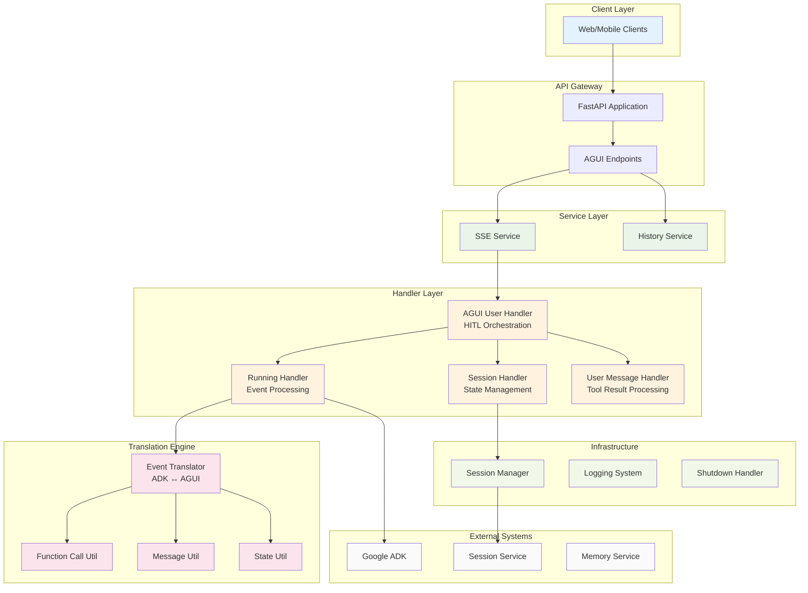
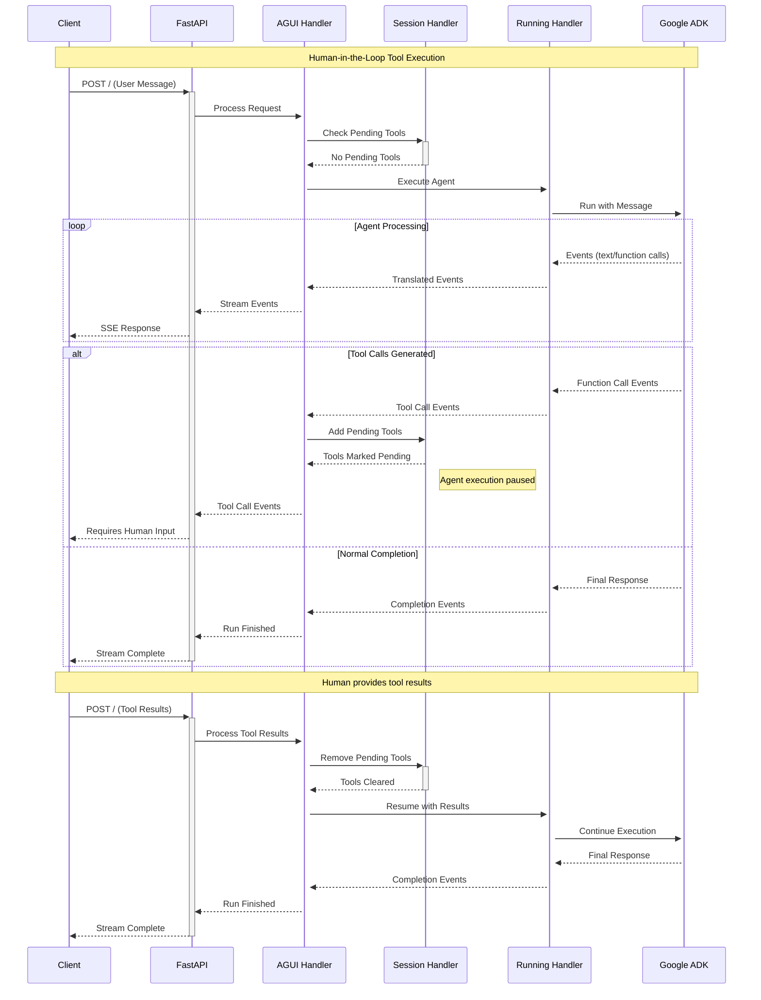

# ADK AGUI Python Middleware

[](https://github.com/DennySORA/adk-agui-middleware/actions/workflows/ci.yml)
[](https://github.com/DennySORA/adk-agui-middleware/actions/workflows/codeql.yml)
[](https://github.com/DennySORA/adk-agui-middleware/actions/workflows/semgrep.yml)
[](https://github.com/DennySORA/adk-agui-middleware/actions/workflows/gitleaks.yml)
[](https://opensource.org/licenses/MIT)
[](https://github.com/astral-sh/ruff)
[](https://github.com/PyCQA/bandit)
[](https://github.com/python/mypy)

A production-ready Python 3.13 middleware that bridges Google's Agent Development Kit (ADK) with the AGUI protocol, providing enterprise-grade Server-Sent Events streaming and Human-in-the-Loop capabilities.

## Features

- **🚀 Real-time Streaming**: High-performance SSE with async/await patterns
- **🤝 HITL Workflows**: Complete Human-in-the-Loop tool call management  
- **🏗️ Enterprise Architecture**: Modular design with dependency injection
- **🔐 Session Management**: Persistent conversation state with multi-tenant support
- **🔄 Event Translation**: Bidirectional ADK ↔ AGUI event conversion
- **⚡ Type Safety**: Full Python 3.13 type annotations with Pydantic v2
- **🛡️ Error Handling**: Comprehensive exception management and recovery

## Installation

```bash
pip install adk-agui-middleware
```

**Requirements:**
- Python 3.10+ (optimized for Python 3.13)
- Google ADK ≥1.9.0
- AGUI Protocol ≥0.1.7
- FastAPI ≥0.104.0

## Quick Start

```python
from fastapi import FastAPI, Request
from google.adk.agents import BaseAgent
from adk_agui_middleware import register_agui_endpoint, SSEService
from adk_agui_middleware.data_model.context import (
    RunnerConfig, ConfigContext, HandlerContext
)

app = FastAPI()

# Define your agent
class MyAgent(BaseAgent):
    def __init__(self):
        super().__init__()
        self.instructions = "You are a helpful assistant."

# Extract context from requests
async def extract_user_id(agui_content, request: Request) -> str:
    return request.headers.get("X-User-ID", "default-user")

# Configure middleware
context_config = ConfigContext(
    user_id=extract_user_id,
    session_id=lambda content, req: content.thread_id,
)

runner_config = RunnerConfig()
sse_service = SSEService(MyAgent(), runner_config, context_config)

# Register endpoints
register_agui_endpoint(app, sse_service)
```

## Architecture

The middleware implements a layered architecture optimized for enterprise AI agent deployments:

### System Architecture



### HITL Workflow



## Core Components

### Event Processing Pipeline

The middleware processes events through a sophisticated translation engine:

- **`EventTranslator`**: Converts ADK events to AGUI format with streaming support
- **`RunningHandler`**: Manages agent execution and event processing pipelines
- **`AGUIUserHandler`**: Orchestrates HITL workflows and session management

### Session Management

Sessions provide persistent conversation state and HITL coordination:

- **`SessionManager`**: Low-level session operations and state persistence  
- **`SessionHandler`**: High-level session interface with HITL support
- **Pending Tool Calls**: Tracks tools awaiting human intervention

### Translation Utilities

Specialized utilities handle different event types:

- **`FunctionCallEventUtil`**: Tool call translation and HITL integration
- **`MessageEventUtil`**: Text streaming and message processing
- **`StateEventUtil`**: State delta updates and snapshots

## Configuration

### Context Configuration

```python
from adk_agui_middleware.data_model.context import ConfigContext

async def extract_user_from_jwt(agui_content, request):
    # Extract user from JWT token
    auth_header = request.headers.get("Authorization", "")
    # ... JWT validation logic
    return user_id

async def extract_app_from_subdomain(agui_content, request):
    # Extract app name from subdomain
    host = request.headers.get("host", "")
    return host.split(".")[0] if "." in host else "default"

config = ConfigContext(
    app_name=extract_app_from_subdomain,
    user_id=extract_user_from_jwt,
    session_id=lambda content, req: content.thread_id,
    extract_initial_state=lambda content, req: {
        "user_preferences": {"theme": "dark"},
        "feature_flags": {"enable_hitl": True}
    }
)
```

### Service Configuration

```python
from adk_agui_middleware.data_model.context import RunnerConfig
from google.adk.agents.run_config import StreamingMode
from google.adk.agents import RunConfig

runner_config = RunnerConfig(
    use_in_memory_services=False,  # Use persistent services
    run_config=RunConfig(
        streaming_mode=StreamingMode.SSE,
        max_iterations=50
    )
)
```

### Custom Handlers

```python
from adk_agui_middleware.base_abc.handler import BaseAGUIEventHandler
from adk_agui_middleware.data_model.context import HandlerContext

class CustomEventFilter(BaseAGUIEventHandler):
    async def process(self, event):
        # Filter or modify events before transmission
        if event.type == EventType.TEXT_MESSAGE_CONTENT:
            # Apply custom filtering logic
            yield event
        else:
            yield event

handler_context = HandlerContext(
    agui_event_handler=CustomEventFilter
)
```

## API Endpoints

The middleware registers the following endpoints:

| Method | Path | Description |
|--------|------|-------------|
| `POST` | `/` | Main agent interaction with SSE streaming |
| `GET` | `/thread/list` | List conversation threads |
| `DELETE` | `/thread/{thread_id}` | Delete conversation thread |
| `GET` | `/message_snapshot/{thread_id}` | Get conversation history |
| `GET` | `/state_snapshot/{thread_id}` | Get session state |
| `PATCH` | `/state/{thread_id}` | Update session state |

## HITL (Human-in-the-Loop) Workflows

The middleware provides comprehensive HITL support for enterprise AI deployments:

### Tool Call Management

When agents generate tool calls requiring human approval:

1. **Tool Detection**: Agent generates function calls during execution
2. **Pause Execution**: Tool calls are marked as pending in session state
3. **Human Intervention**: External systems query pending tools and present to users
4. **Result Submission**: Humans provide tool results via API
5. **Resume Execution**: Agent continues with human-provided input

### State Persistence

HITL workflows maintain state across async interactions:

```python
# Check pending tools for a session
pending_tools = await session_handler.get_pending_tool_calls()

# Add tools requiring human input  
await session_handler.add_pending_tool_call(["tool_call_123"])

# Remove tools after human provides results
await session_handler.check_and_remove_pending_tool_call(["tool_call_123"])
```

## Error Handling

The middleware provides comprehensive error handling with structured logging:

```python
# Automatic error recovery for encoding failures
try:
    return convert_agui_event_to_sse(event)
except Exception as e:
    return AGUIEncoderError.create_encoding_error_event(e)

# Graceful agent execution error handling  
try:
    async for event in agent_runner():
        yield event
except Exception as e:
    yield AGUIErrorEvent.create_execution_error_event(e)
```

## Production Deployment

Licensed under the MIT License. See [LICENSE](LICENSE) file for details.

## 🤝 Contributing & Conduct

- Please see [CONTRIBUTING.md](CONTRIBUTING.md) for how to set up, test, and propose changes.
- This project follows a [Code of Conduct](CODE_OF_CONDUCT.md) to foster a welcoming community.

## 🔐 Security

- See [SECURITY.md](SECURITY.md) for reporting vulnerabilities, scanning, and dependency security.
- Never commit secrets (tokens, API keys, passwords); use environment variables or secret managers.
