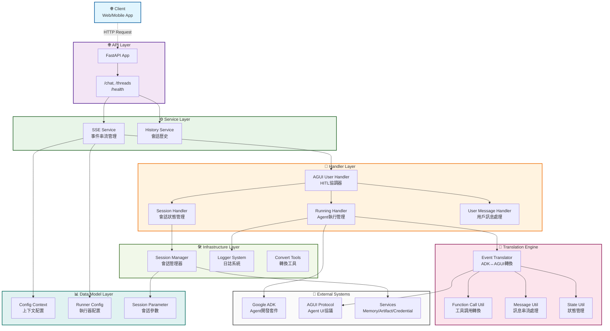
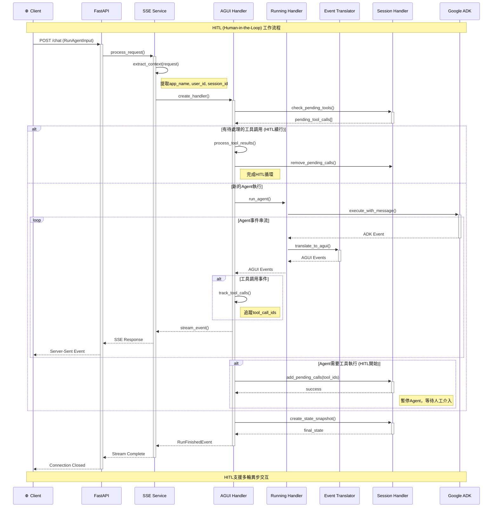

# ADK AGUI Python Middleware

專業的Python 3.10+中間件函式庫，連接Google ADK (Agent Development Kit) 與AGUI協議，提供Server-Sent Events (SSE) 串流功能，實現實時的Agent交互。

## ✨ 核心特色

- **🚀 實時串流**: Server-Sent Events (SSE) 即時Agent回應
- **🔐 會話管理**: 完整的會話處理與可配置的後端支援  
- **⚙️ 上下文提取**: 多租戶應用程式的靈活上下文配置
- **🛡️ 錯誤處理**: 強健的錯誤處理與結構化日誌記錄
- **🔧 工具整合**: 完整的工具調用生命週期管理與HITL支援
- **📊 事件轉換**: ADK ↔ AGUI 事件轉換與串流支援
- **🔒 類型安全**: 完整的類型註解與Pydantic模型
- **🏗️ 可擴展架構**: 抽象基類支援自定義實作
- **📚 完整文檔**: 專業的Google風格docstring
- **🎯 程式品質**: 嚴格的類型檢查與程式審查標準


## 🚀 快速開始

### 安裝

```bash
pip install adk-agui-middleware
```

**需求:** Python 3.10+ • Google ADK ≥1.9.0 • AGUI Protocol ≥0.1.7 • FastAPI ≥0.104.0 • Pydantic ≥2.11

### 基本使用

```python
from fastapi import FastAPI, Request
from google.adk.agents import BaseAgent
from ag_ui.core import RunAgentInput
from adk_agui_middleware import register_agui_endpoint, SSEService
from adk_agui_middleware.data_model.context import RunnerConfig, ConfigContext

app = FastAPI(title="AGUI Agent API", version="1.0.0")

class MyAgent(BaseAgent):
    def __init__(self):
        super().__init__()
        self.instructions = "You are a helpful AI assistant with access to various tools."

# 多租戶支援的上下文提取器
async def extract_user_id(agui_content: RunAgentInput, request: Request) -> str:
    """從JWT token或標頭提取用戶ID"""
    # 在生產環境中，這裡應該解碼JWT token
    return request.headers.get("X-User-ID", "anonymous")

async def extract_app_name(agui_content: RunAgentInput, request: Request) -> str:
    """從子域名或標頭提取應用程式名稱"""
    # 從子域名提取: api-myapp.domain.com -> myapp
    host = request.headers.get("host", "")
    if "-" in host:
        return host.split("-")[1].split(".")[0]
    return request.headers.get("X-App-Name", "default")

async def extract_initial_state(agui_content: RunAgentInput, request: Request) -> dict:
    """設置初始會話狀態與用戶上下文"""
    return {
        "user_preferences": {
            "theme": request.headers.get("X-Theme", "light"),
            "language": request.headers.get("Accept-Language", "en")[:2]
        },
        "session_metadata": {
            "start_time": agui_content.timestamp or 0,
            "client_ip": request.client.host if request.client else "unknown",
            "user_agent": request.headers.get("user-agent", "unknown")
        },
        "feature_flags": {
            "enable_thinking_mode": True,
            "enable_hitl": request.headers.get("X-Enable-HITL", "false") == "true"
        }
    }

# 配置設定
context_config = ConfigContext(
    app_name=extract_app_name,
    user_id=extract_user_id,
    extract_initial_state=extract_initial_state
)

runner_config = RunnerConfig(
    use_in_memory_services=True  # 生產環境請設為False以使用持久化服務
)

# 初始化並註冊AGUI端點
agent = MyAgent()
sse_service = SSEService(agent, runner_config, context_config)
register_agui_endpoint(app, sse_service)

# 健康檢查端點
@app.get("/health")
async def health_check():
    return {"status": "healthy", "service": "adk-agui-middleware"}

if __name__ == "__main__":
    import uvicorn
    uvicorn.run(app, host="0.0.0.0", port=8000, log_level="info")
```

### HITL (Human-in-the-Loop) 範例

```python
from adk_agui_middleware.data_model.context import PathConfig
from adk_agui_middleware.service.history_service import HistoryService
from adk_agui_middleware.data_model.context import HistoryConfig

# 配置歷史服務以支援HITL工作流
history_config = HistoryConfig(
    user_id=extract_user_id,
    session_id=lambda request: request.path_params.get("thread_id", "default")
)

history_service = HistoryService(history_config)

# 配置自定義路徑
path_config = PathConfig(
    agui_main_path="/chat",
    agui_thread_list_path="/threads",
    agui_message_snapshot_path="/threads/{thread_id}/messages",
    agui_state_snapshot_path="/threads/{thread_id}/state"
)

# 註冊端點與歷史服務
register_agui_endpoint(
    app, 
    sse_service, 
    path_config=path_config,
    history_service=history_service
)
```


## 🏗️ 架構概覽

中間件採用分層架構，關注點分離清晰，通過複雜的事件處理和狀態管理為agent-人類交互提供完整解決方案。

### 🎯 核心分層

- **🌐 API層**: FastAPI端點註冊 (`endpoint.py`)
- **⚙️ 服務層**: SSE服務與上下文提取 (`service/`)
- **🔄 處理層**: 事件處理管線 (`handler/`)
- **🔀 轉換引擎**: ADK ↔ AGUI 事件轉換 (`event/`)
- **📊 數據模型層**: 配置與驗證模型 (`data_model/`)
- **🛠️ 基礎設施層**: 工具、日誌、會話管理 (`tools/`, `loggers/`, `manager/`)

### 🧩 關鍵組件

#### 事件處理管線
- **EventTranslator**: 核心ADK ↔ AGUI轉換，支援串流
- **AGUIUserHandler**: 協調HITL工作流與工具調用追蹤
- **RunningHandler**: 管理Agent執行與自定義處理管線
- **SessionHandler**: HITL狀態管理與工具調用生命週期

#### 轉換工具 (`utils/translate/`)
- **Function Calls**: 工具調用事件轉換，支援HITL
- **Messages**: 文本串流與訊息序列處理
- **State Management**: 差異更新與快照操作
- **Thinking Events**: AI推理顯示增強UX

#### 抽象介面 (`base_abc/`)
- **Handler基類**: 可擴展的事件處理介面
- **SSE服務介面**: 服務層抽象

### 系統架構圖



### 請求流程與事件處理管線



## 🔧 核心概念

### 主要特色

- **📊 事件轉換**: ADK ↔ AGUI 事件無縫轉換，支援串流
- **🤝 HITL工作流**: 內建Human-in-the-Loop支援工具調用核准
- **⚙️ 靈活配置**: 多租戶上下文提取與服務配置
- **🛡️ 錯誤處理**: 完整的錯誤處理與結構化日誌
- **🎯 處理管線**: 可擴展的事件處理與自定義處理器

### 事件轉換管線

中間件無縫轉換ADK與AGUI格式的事件：

| ADK事件 | AGUI事件 | 描述 |
|---------|----------|------|
| Text Content | TextMessage* | 串流文本回應 |
| Function Call | ToolCall* | 工具調用 |
| Function Response | ToolCallResult | 工具執行結果 |
| State Delta | StateDelta | 會話狀態變更 |
| Custom Metadata | CustomEvent | 自定義事件數據 |

### 配置模型

- **`ConfigContext`**: 從請求中提取上下文 (app_name, user_id, session_id)
- **`RunnerConfig`**: 管理ADK服務 (session, memory, artifacts, credentials)  
- **`HandlerContext`**: 注入自定義事件處理器

### 🤝 HITL (Human-in-the-Loop) 工作流

中間件實現複雜的HITL模式：

1. **工具調用啟動**: Agent調用工具 → ID添加到 `pending_tool_calls`
2. **狀態管理**: 會話跨請求持久化待處理調用
3. **人工介入**: 人類通過API或對話提交工具結果
4. **執行恢復**: Agent使用人類提供的結果繼續執行

#### 關鍵HITL組件
- `SessionHandler.add_pending_tool_call()` - 啟動HITL工作流
- `SessionHandler.get_pending_tool_calls()` - 查詢待處理介入
- `UserMessageHandler.is_tool_result_submission` - 檢測完成狀態
- `AGUIUserHandler.remove_pending_tool_call()` - 協調完成流程


## 📈 生產環境最佳實踐

### 配置設定
```python
from google.adk.agents.run_config import StreamingMode

# 生產環境配置
runner_config = RunnerConfig(
    use_in_memory_services=False,  # 使用持久化服務
    run_config=RunConfig(
        streaming_mode=StreamingMode.SSE,
        timeout_seconds=300
    )
)
```

### 關鍵特性
- **線程安全**: 異步/等待模式與適當的並發處理
- **錯誤恢復**: 完整的錯誤處理與結構化日誌
- **類型安全**: 完整的類型註解與Pydantic驗證
- **可擴展性**: 抽象基類支援自定義事件處理

## 🔧 擴展點

中間件提供多個自定義擴展點：

- **事件處理器**: 實現 `BaseADKEventHandler` 或 `BaseAGUIEventHandler`
- **轉換邏輯**: 繼承 `BaseTranslateHandler` 自定義事件轉換
- **狀態管理**: 實現 `BaseAGUIStateSnapshotHandler` 自定義狀態處理
- **I/O記錄**: 實現 `BaseInOutHandler` 請求/回應日誌記錄

## 🧪 測試

專案包含所有核心組件的完整測試覆蓋：

```bash
# 執行測試與覆蓋率
pytest --cov=src/adk_agui_middleware --cov-report=html

# 執行特定測試類別
pytest tests/test_handler_*  # 處理器測試
pytest tests/test_event_*    # 事件轉換測試
pytest tests/test_data_*     # 數據模型測試
```

## 🔧 開發

### 程式品質標準

本專案維持高程式品質標準：

- **類型安全**: 完整的類型註解，支援Python 3.13+
- **文檔**: 遵循Google風格的完整docstring，包含 `:param` 和 `:return` 註解
- **測試**: 所有組件的廣泛測試覆蓋，包含HITL工作流測試
- **程式審查**: 專業的程式審查標準與詳細分析
- **命名慣例**: 一致的Python命名標準 (類用PascalCase，函數/變數用snake_case)
- **錯誤處理**: 結構化錯誤處理與適當的日誌和恢復機制
- **HITL支援**: 內建Human-in-the-Loop工作流管理與會話持久化

### 架構原則

- **關注點分離**: 處理器、服務與數據模型間的清晰分離
- **依賴注入**: 透過上下文對象配置處理器與服務
- **事件驅動設計**: 完整的事件處理管線與轉換層
- **會話管理**: 強健的會話狀態管理與HITL工作流支援
- **可擴展性**: 抽象基類支援自定義實現，無需修改核心

### 貢獻指南

1. 遵循PEP 8並全程使用類型提示
2. 為所有類和函數添加完整的docstring，使用既定的`:param`/`:return`格式
3. 為新功能加入測試，包含適當的HITL工作流測試
4. 根據需要更新文檔，特別是HITL相關功能
5. 確保所有新程式路徑都有適當的錯誤處理和日誌記錄
6. 測試多租戶場景和會話隔離

## 🏆 程式品質亮點

此程式庫經過專業審查和增強：

### 📝 文檔卓越
- **完整Docstring**: 每個類和函數都有詳細描述
- **參數文檔**: 全程一致的`:param`和`:return`註解
- **架構文檔**: HITL工作流和事件處理的詳細説明
- **使用範例**: 多租戶配置的實際範例

### 🎯 專業標準
- **類型安全**: 完整的類型註解，支援Python 3.13+
- **錯誤處理**: 結構化錯誤處理與完整日誌記錄
- **測試**: 所有組件的廣泛測試覆蓋，包含HITL場景
- **性能**: 優化的事件處理與串流支援
- **安全**: 適當的會話隔離與多租戶支援

### 🔧 進階功能
- **HITL工作流**: 完整的Human-in-the-Loop實現與狀態持久化
- **事件轉換**: 複雜的ADK ↔ AGUI事件轉換
- **自定義處理器**: 可擴展的處理器系統支援自定義事件處理
- **會話管理**: 強健的會話狀態管理與可配置後端
- **多租戶支援**: 靈活的上下文提取支援多租戶部署

## 📄 授權

根據MIT授權條款授權。詳見 [LICENSE](LICENSE) 檔案。
