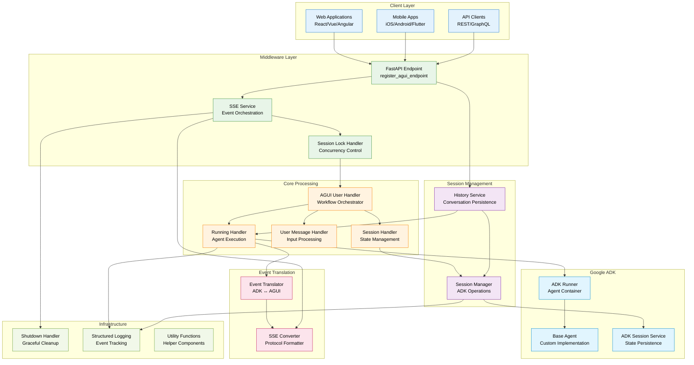
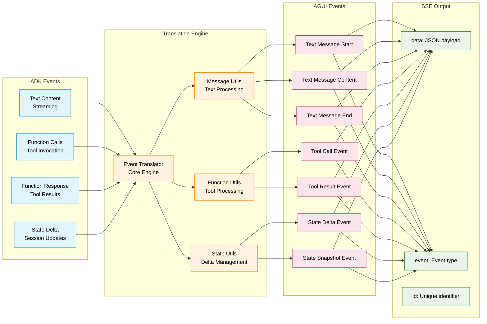
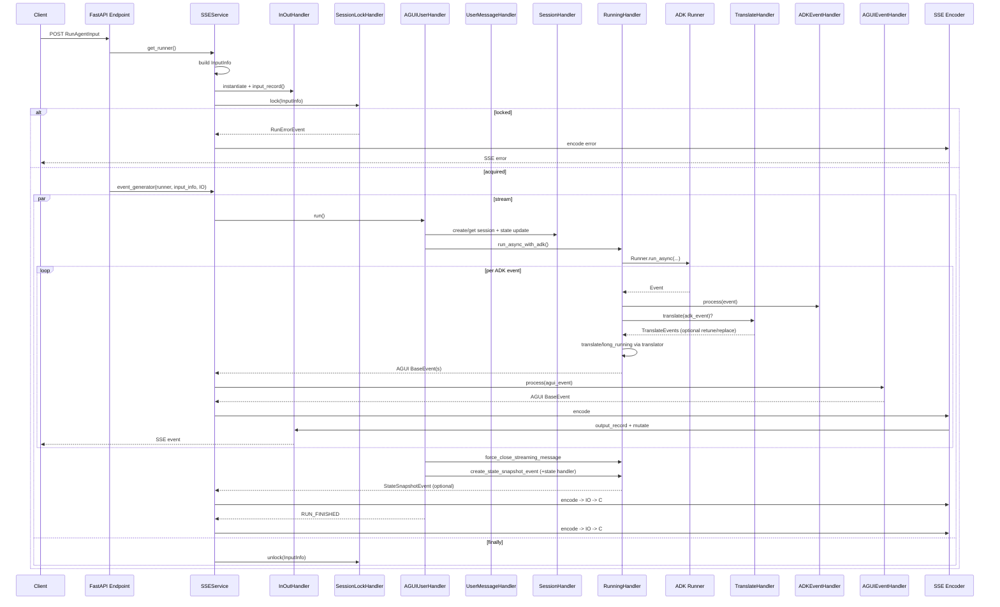

# ADK AGUI Middleware

[](https://deepwiki.com/trendmicro/adk-agui-middleware)
[](https://github.com/trendmicro/adk-agui-middleware/actions/workflows/ci.yml)
[](https://github.com/trendmicro/adk-agui-middleware/actions/workflows/codeql.yml)
[](https://github.com/trendmicro/adk-agui-middleware/actions/workflows/semgrep.yml)
[](https://github.com/trendmicro/adk-agui-middleware/actions/workflows/gitleaks.yml)
[](https://opensource.org/licenses/MIT)
[](https://github.com/astral-sh/ruff)
[](https://github.com/PyCQA/bandit)
[](https://github.com/python/mypy)

**Enterprise-grade Python 3.13+ middleware that seamlessly bridges Google's Agent Development Kit (ADK) with AGUI protocol, providing high-performance Server-Sent Events streaming and Human-in-the-Loop (HITL) workflow orchestration.**

## Overview

ADK AGUI Middleware is a production-ready Python 3.13+ library engineered for enterprise-scale integration between Google's Agent Development Kit and AGUI (Agent User Interface) protocol. The middleware provides a robust foundation for building AI agent applications with real-time streaming capabilities, concurrent session management, and sophisticated Human-in-the-Loop (HITL) workflows.

### Key Features

- **🏗️ Enterprise Architecture**: Modular design with dependency injection, abstract base classes, and clean separation of concerns
- **⚡ High-Performance SSE**: Asynchronous Server-Sent Events streaming with bidirectional event translation pipeline
- **🔒 Session Management**: Thread-safe session locking with configurable timeout and retry mechanisms
- **🤝 HITL Workflows**: Complete orchestration of Human-in-the-Loop tool call workflows with state persistence
- **🔄 Event Translation**: Real-time ADK ↔ AGUI event conversion with streaming message management
- **🛡️ Production-Ready**: Comprehensive error handling, structured logging, and graceful shutdown mechanisms
- **🎯 Type Safety**: Full Python 3.13 type annotations with strict mypy validation and Pydantic data models

### Highlights

- **Modernized foundation**: The core was redesigned from the ground up, replacing the legacy implementation and closing logic gaps that previously prevented outbound data from being delivered.
- **Conversation lifecycle APIs**: Fresh helpers&mdash;`get_agui_thread_list`, `delete_agui_thread`, `patch_agui_state`, `get_agui_message_snapshot`, and `get_agui_state_snapshot`&mdash;simplify querying, updating, and auditing multi-thread conversations.
- **Lifecycle-aware middleware plugins**: Each request instantiates a stateful middleware class that can coordinate message pipelines, convert accumulated events, and execute custom workflows across ADK↔ADK, ADK↔AGUI, and AGUI↔AGUI translations while handling timeouts gracefully.
- **Pluggable concurrency control**: A lock abstraction (memory-backed by default) allows swapping in providers such as Redis and tweaking retry behavior, enabling reliable operation across multiple Kubernetes pods without leaking in-memory state.
- **Observability extensions**: Input/output logging plugins capture request context, store conversation histories, and reshape final payloads&mdash;for example, mapping unexpected errors to standard error codes before responses reach clients.
- **Adaptive context extraction**: `app_name`, `user_id`, `session_id`, and `extract_initial_state` now accept request objects so headers and other metadata can populate runtime context beyond the standard `RunAgentInput` fields.
- **AGUI input transformers**: Custom plugins can modify inbound AGUI payloads, including promoting queued names and IDs and remapping selected user messages into tool invocations for long-running ADK tools.
- **Extension-ready craftsmanship**: The codebase follows SOLID principles, keeps functions compact, and exposes extensible base classes, making overrides straightforward when bespoke behavior is required.
- **Strict static analysis**: Comprehensive typing paired with rigorous mypy enforcement keeps the codebase close to statically checked reliability.
- **Utility-rich toolkit**: Dedicated utility modules streamline complex conversion logic, including support for ThinkingMessage and Thinking mode plus standards-compliant SSE encoding.
- **Revamped HITL pipeline**: The Human-in-the-Loop experience was rebuilt to leverage long-running tools for high-throughput, operator-friendly workflows.

## Installation

```bash
pip install adk-agui-middleware
```

### Requirements

- Python 3.13+ (recommended 3.13.3+)
- Google ADK >= 1.9.0
- AGUI Protocol >= 0.1.7
- FastAPI >= 0.104.0

## Architecture Overview

### High-Level System Architecture



### Event Translation Pipeline



## Quick Start

### Basic Enterprise Implementation

```python
from fastapi import FastAPI, Request
from google.adk.agents import BaseAgent
from adk_agui_middleware import SSEService, register_agui_endpoint
from adk_agui_middleware.data_model.config import RunnerConfig
from adk_agui_middleware.data_model.context import ConfigContext

# Initialize FastAPI application
app = FastAPI(
    title="AI Agent Service",
    description="Enterprise ADK-AGUI middleware service",
    version="1.0.0"
)

# Define your custom ADK agent
class EnterpriseAgent(BaseAgent):
    """Custom enterprise agent with HITL capabilities."""

    def __init__(self):
        super().__init__()
        self.instructions = """
        You are an enterprise AI assistant with access to various tools.

        Key behaviors:
        - Always ask for human approval before executing high-impact operations
        - Provide clear explanations for tool usage and reasoning
        - Handle errors gracefully and inform users of any issues
        - Maintain conversation context across multiple interactions
        """

# Context extraction functions for multi-tenant deployment
async def extract_user_id(content, request: Request) -> str:
    """Extract user ID from JWT token or API headers."""
    # Production: Implement JWT token validation
    auth_header = request.headers.get("Authorization", "")
    if auth_header.startswith("Bearer "):
        # Decode JWT and extract user_id
        pass

    # Fallback to header-based user identification
    return request.headers.get("X-User-ID", "anonymous")

async def extract_app_name(content, request: Request) -> str:
    """Extract application name from subdomain or headers."""
    host = request.headers.get("Host", "localhost")
    if "." in host:
        subdomain = host.split(".")[0]
        return f"enterprise-{subdomain}"
    return "enterprise-default"

# Configure middleware context
config_context = ConfigContext(
    app_name=extract_app_name,
    user_id=extract_user_id,
    session_id=lambda content, req: content.thread_id,
)

# Configure runner with production settings
runner_config = RunnerConfig(
    use_in_memory_services=True  # Set to False for production persistence
)

# Initialize and register services
agent = EnterpriseAgent()
sse_service = SSEService(agent, runner_config, config_context)
register_agui_endpoint(app, sse_service)


if __name__ == "__main__":
    import uvicorn
    uvicorn.run(
        app,
        host="0.0.0.0",
        port=8000,
        log_level="info",
        access_log=True
    )

```

## Examples

Explore ready-to-run usage patterns in the examples folder. Each example is self-contained with comments and can be launched via uvicorn.

- Basic SSE: `uvicorn examples.01_basic_sse_app.main:app --reload`
- Custom context + input conversion: `uvicorn examples.02_custom_context.main:app --reload`
- Plugins and timeouts: `uvicorn examples.03_plugins_and_timeouts.main:app --reload`
- History API (threads/snapshots/patch): `uvicorn examples.04_history_api.main:app --reload`
- Custom session lock: `uvicorn examples.05_custom_lock.main:app --reload`
- HITL tool flow: `uvicorn examples.06_hitl_tool_flow.main:app --reload`

See `examples/README.md` for details.

## HandlerContext Lifecycle

HandlerContext configures pluggable hooks for the request lifecycle. Instances are constructed per-request (except session lock, which is created with SSEService) and invoked at defined stages.

- session_lock_handler (created at SSEService init)
  - When: Before running the request stream and in finally cleanup
  - Used by: SSEService.runner (lock/unlock, generate locked error event)
- in_out_record_handler
  - When: Immediately after building InputInfo (input_record), then for every emitted SSE event (output_record, output_catch_and_change)
  - Used by: SSEService.get_runner and SSEService.event_generator
- adk_event_handler
  - When: On each ADK event before translation
  - Used by: RunningHandler._process_events_with_handler for ADK streams
- adk_event_timeout_handler
  - When: Surrounds ADK event processing with a timeout; on TimeoutError, yields fallback events
  - Used by: RunningHandler._process_events_with_handler(enable_timeout=True)
- translate_handler
  - When: Before default translation; can yield AGUI events, request retune, or replace the ADK event
  - Used by: RunningHandler._translate_adk_to_agui_async
- agui_event_handler
  - When: On each AGUI event after translation, before encoding
  - Used by: RunningHandler._process_events_with_handler for AGUI streams
- agui_state_snapshot_handler
  - When: Once at the end to transform final state before creating a StateSnapshotEvent
  - Used by: RunningHandler.create_state_snapshot_event

### Per-Request Sequence



## API Reference

### Core Endpoints

| Method | Endpoint | Description | Request Body | Response Type |
|--------|----------|-------------|--------------|---------------|
| `POST` | `/` | Execute agent with streaming response | `RunAgentInput` | `EventSourceResponse` |
| `GET` | `/thread/list` | List user's conversation threads | - | `List[Dict[str, str]]` |
| `DELETE` | `/thread/{thread_id}` | Delete conversation thread | - | `Dict[str, str]` |
| `GET` | `/message_snapshot/{thread_id}` | Get conversation history | - | `MessagesSnapshotEvent` |
| `GET` | `/state_snapshot/{thread_id}` | Get session state snapshot | - | `StateSnapshotEvent` |
| `PATCH` | `/state/{thread_id}` | Update session state | `List[JSONPatch]` | `Dict[str, str]` |

### Event Types

The middleware supports comprehensive event translation between ADK and AGUI formats:

#### AGUI Event Types
- `TEXT_MESSAGE_START` - Begin streaming text response
- `TEXT_MESSAGE_CONTENT` - Streaming text content chunk
- `TEXT_MESSAGE_END` - Complete streaming text response
- `TOOL_CALL` - Agent tool/function invocation
- `TOOL_RESULT` - Tool execution result
- `STATE_DELTA` - Incremental state update
- `STATE_SNAPSHOT` - Complete state snapshot
- `RUN_STARTED` - Agent execution began
- `RUN_FINISHED` - Agent execution completed
- `ERROR` - Error event with details

#### SSE Format
All events are converted to Server-Sent Events format:
```javascript
{
  "data": "{...}",        // JSON-serialized event data
  "event": "event_type",  // AGUI event type
  "id": "unique_id"       // UUID for event correlation
}
```
### Security Best Practices

- **Authentication**: JWT token validation and RBAC integration
- **Session Isolation**: Proper tenant isolation for multi-tenant deployments
- **Audit Logging**: Comprehensive audit trails for compliance requirements
- **Error Handling**: Secure error handling without information leakage

## License

This project is licensed under the MIT License - see the [LICENSE](LICENSE) file for details.

## Contributing

Please read [CONTRIBUTING.md](CONTRIBUTING.md) for details on our code of conduct and the process for submitting pull requests.

## Security

See [SECURITY.md](SECURITY.md) for our security policy and vulnerability reporting process.
