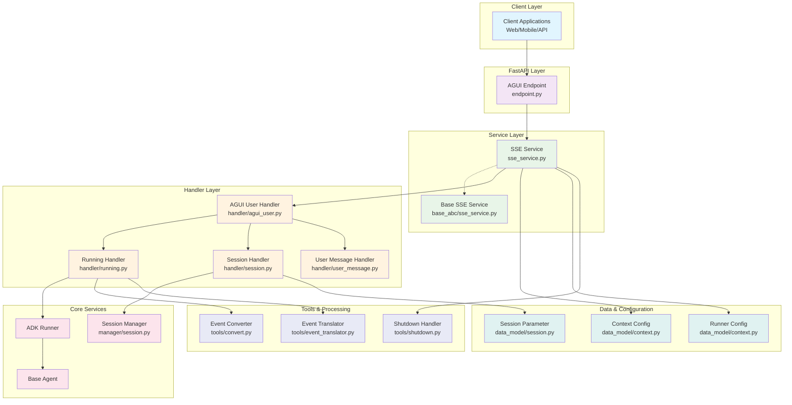
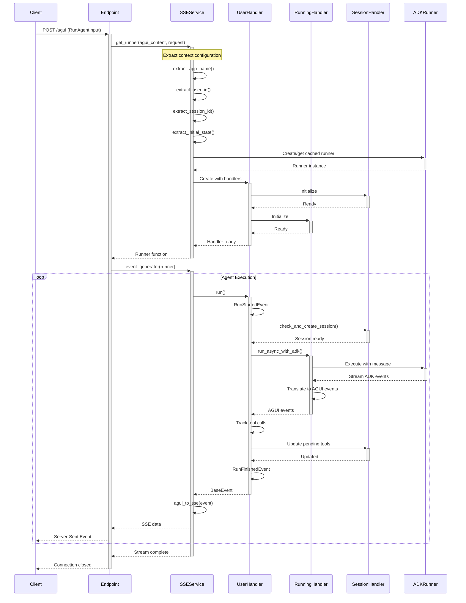

# ADK AGUI Python Middleware

A professional Python middleware library that bridges Agent Development Kit (ADK) agents with AGUI (Agent UI) protocol, providing Server-Sent Events (SSE) streaming capabilities for real-time agent interactions.

## Overview

This middleware facilitates seamless integration between Google's Agent Development Kit and AGUI-compatible frontends, enabling developers to build interactive agent applications with real-time streaming responses. The library handles agent execution, session management, event encoding, and error handling in a production-ready framework.

## Features

- **Real-time Streaming**: Server-Sent Events (SSE) support for live agent responses
- **Session Management**: Comprehensive session handling with configurable backends
- **Context Extraction**: Flexible context configuration for multi-tenant applications  
- **Error Handling**: Robust error handling with detailed logging and recovery
- **Tool Integration**: Support for tool calls and tool result processing
- **Event Encoding**: Multiple event encoding formats with automatic content negotiation
- **Type Safety**: Full type annotations with Pydantic models
- **Extensible Architecture**: Abstract base classes for custom implementations

## Architecture

The middleware follows a modular architecture with clear separation of concerns:

### System Architecture



### Request Processing Flow



### Component Structure

```
├── base_abc/           # Abstract base classes
├── config/            # Configuration and logging setup
├── data_model/        # Pydantic models and data structures
├── endpoint.py        # FastAPI endpoint registration
├── event/             # Event handling and error events
├── handler/           # Request and session handlers
├── loggers/           # Logging infrastructure
├── manager/           # Session and resource management
├── sse_service.py     # Core SSE service implementation
└── tools/             # Utility functions and converters
```

## Installation

### Using pip

```bash
pip install adk-agui-py-middleware
```

Available on PyPI: https://pypi.org/project/adk-agui-py-middleware/

### Requirements

- Python 3.13+
- Google ADK (`google-adk>=1.9.0`)
- AGUI Protocol (`ag-ui-protocol>=0.1.7`)
- Pydantic (`pydantic>=2.11.7`)
- FastAPI (`fastapi>=0.104.0`)

### Development Install

```bash
# Using uv (recommended)
uv sync

# Or using pip
pip install -r requirements.txt
```

## Quick Start

### Basic Setup

```python
from fastapi import FastAPI
from google.adk.agents import BaseAgent
from adk_agui_middleware import register_agui_endpoint, SSEService
from adk_agui_middleware.data_model.context import RunnerConfig, ConfigContext

# Create FastAPI app
app = FastAPI(title="My Agent API", version="1.0.0")

# Define your custom agent
class MyAgent(BaseAgent):
    def __init__(self):
        super().__init__()
        self.instructions = "You are a helpful assistant."

# Initialize components
agent = MyAgent()
context_config = ConfigContext(
    app_name="my-app",
    user_id="user-123"
)
runner_config = RunnerConfig(use_in_memory_services=True)

# Create and register service
sse_service = SSEService(agent, runner_config, context_config)
register_agui_endpoint(app, sse_service, path="/agui")

@app.get("/health")
async def health():
    return {"status": "healthy"}

if __name__ == "__main__":
    import uvicorn
    uvicorn.run(app, host="0.0.0.0", port=8000)
```

### Production Configuration

```python
import logging
from fastapi import FastAPI, Request, HTTPException
from fastapi.middleware.cors import CORSMiddleware
from google.adk.agents import BaseAgent
from ag_ui.core import RunAgentInput
from adk_agui_middleware import register_agui_endpoint, SSEService
from adk_agui_middleware.data_model.context import RunnerConfig, ConfigContext

# Production agent
class ProductionAgent(BaseAgent):
    def __init__(self):
        super().__init__()
        self.instructions = "Production assistant with advanced capabilities."

# Dynamic context extraction
async def extract_user_id(agui_content: RunAgentInput, request: Request) -> str:
    auth_header = request.headers.get("authorization")
    if not auth_header or not auth_header.startswith("Bearer "):
        raise HTTPException(status_code=401, detail="Missing authorization")
    # Implement JWT validation here
    return "validated-user-id"

async def extract_app_name(agui_content: RunAgentInput, request: Request) -> str:
    return request.headers.get("x-app-name", "default-app")

# Configure app
app = FastAPI(title="Production ADK AGUI API", version="1.0.0")
app.add_middleware(
    CORSMiddleware,
    allow_origins=["https://your-domain.com"],
    allow_credentials=True,
    allow_methods=["GET", "POST"],
    allow_headers=["*"],
)

# Initialize services
agent = ProductionAgent()
context_config = ConfigContext(
    app_name=extract_app_name,
    user_id=extract_user_id,
    session_id=lambda content, req: content.thread_id
)
runner_config = RunnerConfig(use_in_memory_services=False)

sse_service = SSEService(agent, runner_config, context_config)
register_agui_endpoint(app, sse_service, path="/api/v1/agui")

@app.get("/health")
async def health():
    return {"status": "healthy", "version": "1.0.0"}

@app.on_event("shutdown")
async def shutdown():
    await sse_service.close()

if __name__ == "__main__":
    import uvicorn
    uvicorn.run(app, host="0.0.0.0", port=8000)
```

### Client Usage

#### JavaScript Client

```javascript
class ADKClient {
    constructor(baseUrl, authToken) {
        this.baseUrl = baseUrl;
        this.authToken = authToken;
    }

    async startSession(threadId, message) {
        const response = await fetch(`${this.baseUrl}/agui`, {
            method: 'POST',
            headers: {
                'Content-Type': 'application/json',
                'Authorization': `Bearer ${this.authToken}`
            },
            body: JSON.stringify({
                thread_id: threadId,
                run_id: crypto.randomUUID(),
                message: { role: 'user', content: message }
            })
        });

        return this.handleStream(response);
    }

    async *handleStream(response) {
        const reader = response.body.getReader();
        const decoder = new TextDecoder();

        while (true) {
            const { value, done } = await reader.read();
            if (done) break;

            const chunk = decoder.decode(value);
            for (const line of chunk.split('\n')) {
                if (line.startsWith('data: ')) {
                    const data = line.slice(6);
                    if (data === '[DONE]') return;
                    try {
                        yield JSON.parse(data);
                    } catch (e) {
                        console.error('Parse error:', e);
                    }
                }
            }
        }
    }
}

// Usage
const client = new ADKClient('https://api.example.com', 'token');
for await (const event of client.startSession('thread-123', 'Hello!')) {
    console.log(event.type, event.text || '');
}
```

#### Python Client

```python
import asyncio
import aiohttp
import json
import uuid

class ADKClient:
    def __init__(self, base_url: str, auth_token: str):
        self.base_url = base_url
        self.auth_token = auth_token
    
    async def start_session(self, thread_id: str, message: str):
        headers = {
            'Authorization': f'Bearer {self.auth_token}',
            'Content-Type': 'application/json'
        }
        
        payload = {
            'thread_id': thread_id,
            'run_id': str(uuid.uuid4()),
            'message': {'role': 'user', 'content': message}
        }
        
        async with aiohttp.ClientSession() as session:
            async with session.post(f'{self.base_url}/agui', headers=headers, json=payload) as response:
                async for line in response.content:
                    line = line.decode('utf-8').strip()
                    if line.startswith('data: '):
                        data = line[6:]
                        if data == '[DONE]':
                            break
                        try:
                            yield json.loads(data)
                        except json.JSONDecodeError:
                            continue

# Usage
async def main():
    client = ADKClient('https://api.example.com', 'token')
    async for event in client.start_session('thread-123', 'Hello!'):
        print(f"{event['type']}: {event.get('text', '')}")

asyncio.run(main())
```


## Advanced Usage

### Custom Event Processing

```python
from adk_agui_middleware.base_abc.sse_service import BaseSSEService

class CustomSSEService(BaseSSEService):
    async def event_generator(self, runner):
        async for event in runner():
            # Apply custom filtering or transformation
            if self.should_process_event(event):
                yield self.transform_event(event)
    
    def should_process_event(self, event) -> bool:
        return True  # Custom filtering logic
    
    def transform_event(self, event):
        return event  # Custom transformation
```

### Error Handling

```python
from adk_agui_middleware.config.log import setup_logging
import logging

setup_logging(level="INFO", format="json")
logger = logging.getLogger(__name__)

@app.exception_handler(Exception)
async def handle_errors(request, exc):
    logger.error("Error occurred", exc_info=exc)
    return {"error": "Server error", "request_id": request.headers.get("x-request-id")}
```

## API Reference

| Component | Description |
|-----------|-------------|
| `SSEService` | Core service for SSE-based agent interactions |
| `register_agui_endpoint()` | Registers AGUI endpoint on FastAPI apps |
| `ConfigContext` | Configuration for request context extraction |
| `RunnerConfig` | Configuration for ADK runner and services |
| `SessionParameter` | Session identification parameters |

## Development

### Setup & Testing

```bash
# Setup
uv sync

# Code quality
ruff format && ruff check && mypy src/

# Testing
pytest --cov=adk_agui_middleware

# Security
bandit -r src/
```

### Environment Variables

```bash
LOG_LEVEL=INFO
USE_IN_MEMORY_SERVICES=true  # false for production
SESSION_SERVICE_URL=redis://localhost:6379
```

## Production Checklist

- Use external services (Redis/PostgreSQL) instead of in-memory
- Implement JWT authentication and HTTPS
- Configure proper CORS settings
- Monitor execution times and error rates
- Set up connection pooling and session cleanup

## Contributing

1. Follow Google docstring style and type annotations
2. Write tests for new functionality
3. Update documentation for API changes

## License

Licensed under the terms specified in the [LICENSE](LICENSE) file.

## Support

- 📖 **Documentation**: Check examples and architecture diagrams above
- 🐛 **Issues**: [GitHub Issues](https://github.com/DennySORA/adk-agui-py-middleware/issues)  
- 📦 **PyPI**: [adk-agui-py-middleware](https://pypi.org/project/adk-agui-py-middleware/)