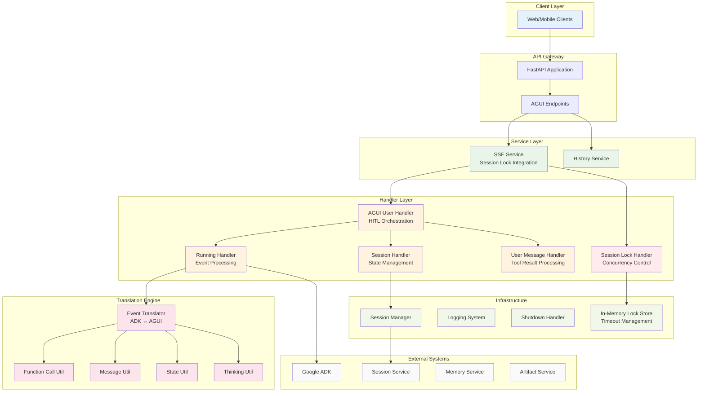
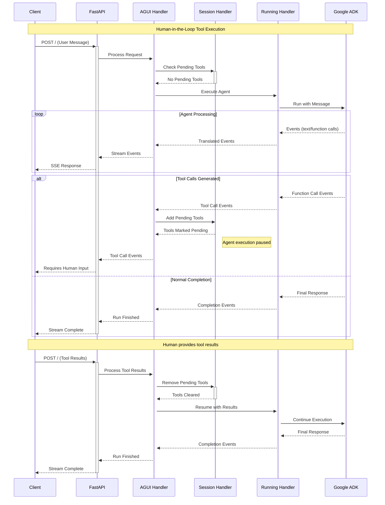

# ADK AGUI Python Middleware

[](https://github.com/DennySORA/adk-agui-middleware/actions/workflows/ci.yml)
[](https://github.com/DennySORA/adk-agui-middleware/actions/workflows/codeql.yml)
[](https://github.com/DennySORA/adk-agui-middleware/actions/workflows/semgrep.yml)
[](https://github.com/DennySORA/adk-agui-middleware/actions/workflows/gitleaks.yml)
[](https://opensource.org/licenses/MIT)
[](https://github.com/astral-sh/ruff)
[](https://github.com/PyCQA/bandit)
[](https://github.com/python/mypy)

A production-ready Python 3.13 middleware that bridges Google's Agent Development Kit (ADK) with the AGUI protocol, providing enterprise-grade Server-Sent Events streaming and Human-in-the-Loop capabilities.

## Features

- **🚀 Real-time Streaming**: High-performance SSE with async/await patterns
- **🤝 HITL Workflows**: Complete Human-in-the-Loop tool call management  
- **🏗️ Enterprise Architecture**: Modular design with dependency injection
- **🔐 Session Management**: Persistent conversation state with multi-tenant support
- **🔄 Event Translation**: Bidirectional ADK ↔ AGUI event conversion
- **⚡ Type Safety**: Full Python 3.13 type annotations with Pydantic v2
- **🛡️ Error Handling**: Comprehensive exception management and recovery

## Installation

```bash
pip install adk-agui-middleware
```

**Requirements:**
- Python 3.10+ (optimized for Python 3.13)
- Google ADK ≥1.9.0
- AGUI Protocol ≥0.1.7
- FastAPI ≥0.104.0

## Quick Start

```python
from fastapi import FastAPI, Request
from google.adk.agents import BaseAgent
from adk_agui_middleware import register_agui_endpoint, SSEService
from adk_agui_middleware.data_model.context import (
    RunnerConfig, ConfigContext, HandlerContext
)

app = FastAPI()

# Define your agent
class MyAgent(BaseAgent):
    def __init__(self):
        super().__init__()
        self.instructions = "You are a helpful assistant."

# Extract context from requests
async def extract_user_id(agui_content, request: Request) -> str:
    return request.headers.get("X-User-ID", "default-user")

# Configure middleware
context_config = ConfigContext(
    user_id=extract_user_id,
    session_id=lambda content, req: content.thread_id,
)

runner_config = RunnerConfig()
sse_service = SSEService(MyAgent(), runner_config, context_config)

# Register endpoints
register_agui_endpoint(app, sse_service)
```

## Architecture

The middleware implements a layered architecture optimized for enterprise AI agent deployments:

### System Architecture



### HITL Workflow



## Core Components

### Event Processing Pipeline

The middleware processes events through a sophisticated translation engine:

- **`EventTranslator`**: Converts ADK events to AGUI format with streaming support
- **`RunningHandler`**: Manages agent execution and event processing pipelines
- **`AGUIUserHandler`**: Orchestrates HITL workflows and session management

### Session Management

Sessions provide persistent conversation state and HITL coordination:

- **`SessionManager`**: Low-level session operations and state persistence
- **`SessionHandler`**: High-level session interface with HITL support
- **Pending Tool Calls**: Tracks tools awaiting human intervention

### Session Locking Mechanism

The middleware implements a robust session locking system to prevent concurrent access and ensure data consistency:

#### `DefaultSessionLockHandler`

```python
class DefaultSessionLockHandler(SessionLockHandler):
    """Thread-safe session locking with automatic timeout and cleanup."""

    def __init__(self, lock_config: SessionLockConfig):
        self.lock_config = lock_config
        self.locks: dict[str, dict[str, Any]] = {}
        self.internal_lock = asyncio.Lock()
```

**Key Features:**
- **Automatic Timeout**: Locks expire after configured duration (default: 300 seconds)
- **Retry Logic**: Configurable retry attempts with intervals (default: 3 retries, 10s intervals)
- **Thread Safety**: Uses asyncio.Lock for concurrent access protection
- **Cleanup**: Automatic expired lock removal during operations
- **Error Handling**: Graceful lock failure with standardized error events

#### Lock Configuration

```python
@dataclass
class SessionLockConfig:
    lock_timeout: int | None = 300      # Lock expiration in seconds
    lock_retry_times: int = 3           # Maximum retry attempts
    lock_retry_interval: float = 10.0   # Delay between retries in seconds
```

#### Lock Workflow

```mermaid
sequenceDiagram
    participant Client as Client Request
    participant SSE as SSE Service
    participant Lock as Session Lock Handler
    participant Agent as Agent Handler
    participant Session as Session State

    Note over Client,Session: Session Lock Workflow

    Client->>+SSE: Request Agent Execution
    SSE->>+Lock: lock(input_info)

    Lock->>Lock: _cleanup_expired_lock()
    Lock->>Lock: Check if session locked

    alt Session Available
        Lock->>Lock: Acquire lock with timestamp
        Lock-->>SSE: Lock acquired (True)

        SSE->>+Agent: Create and execute agent
        Agent->>Session: Read/Write session state
        Agent-->>SSE: Stream events to client
        SSE-->>Client: SSE stream with events

        Note over Agent,Session: Agent execution protected by lock

        Agent-->>-SSE: Execution complete
        SSE->>Lock: unlock(input_info)
        Lock->>Lock: Remove session lock
        Lock-->>SSE: Lock released
        SSE-->>-Client: Stream complete

    else Session Locked
        Lock-->>SSE: Lock failed (False)
        SSE->>Lock: get_locked_message(input_info)
        Lock-->>SSE: RunErrorEvent (THREAD_IS_LOCKED)
        SSE-->>-Client: Error: Thread is locked
    end

    alt Lock Retry Logic
        Note over Lock: If initial lock fails
        Loop: retry_times (3)
            Lock->>Lock: sleep(retry_interval)
            Lock->>Lock: _try_acquire_lock()
            alt Lock Available
                Lock-->>SSE: Lock acquired
            else Still Locked
                Lock->>Lock: Continue retry loop
            end
        end

        Note over Lock: After all retries failed
        Lock-->>SSE: Lock failed (False)
    end
```

#### Lock Usage Pattern

The locking mechanism is automatically applied in the SSE service:

```python
# In SSEService.get_runner()
async def runner() -> AsyncGenerator[BaseEvent]:
    # 1. Attempt to acquire session lock
    if not await self.session_lock_handler.lock(input_info):
        # 2. If lock fails, return error event immediately
        yield await self.session_lock_handler.get_locked_message(input_info)
        return

    try:
        # 3. Execute agent with exclusive session access
        user_handler = AGUIUserHandler(...)
        async for event in user_handler.start():
            yield event

    except Exception as e:
        # 4. Handle execution errors
        yield AGUIEncoderError.create_agent_error_event(e)
    finally:
        # 5. Always release lock in finally block
        await self.session_lock_handler.unlock(input_info)
```

**Lock Lifecycle:**
1. **Acquisition**: `lock(input_info)` attempts to acquire exclusive access
2. **Validation**: Automatic cleanup of expired locks before acquisition
3. **Protection**: Critical section executes with guaranteed exclusive access
4. **Error Handling**: Lock failures return `THREAD_IS_LOCKED` error events
5. **Release**: `unlock(input_info)` in finally block ensures cleanup

**Concurrency Benefits:**
- **Data Consistency**: Prevents race conditions in session state updates
- **HITL Integrity**: Ensures tool call sequences aren't corrupted by concurrent access
- **Resource Protection**: Guards against simultaneous agent executions on same session
- **Graceful Degradation**: Clients receive clear error messages for locked sessions

### Translation Utilities

Specialized utilities handle different event types:

- **`FunctionCallEventUtil`**: Tool call translation and HITL integration
- **`MessageEventUtil`**: Text streaming and message processing
- **`StateEventUtil`**: State delta updates and snapshots

## Configuration

### Context Configuration

```python
from adk_agui_middleware.data_model.context import ConfigContext

async def extract_user_from_jwt(agui_content, request):
    # Extract user from JWT token
    auth_header = request.headers.get("Authorization", "")
    # ... JWT validation logic
    return user_id

async def extract_app_from_subdomain(agui_content, request):
    # Extract app name from subdomain
    host = request.headers.get("host", "")
    return host.split(".")[0] if "." in host else "default"

config = ConfigContext(
    app_name=extract_app_from_subdomain,
    user_id=extract_user_from_jwt,
    session_id=lambda content, req: content.thread_id,
    extract_initial_state=lambda content, req: {
        "user_preferences": {"theme": "dark"},
        "feature_flags": {"enable_hitl": True}
    }
)
```

### Service Configuration

```python
from adk_agui_middleware.data_model.context import RunnerConfig
from google.adk.agents.run_config import StreamingMode
from google.adk.agents import RunConfig

runner_config = RunnerConfig(
    use_in_memory_services=False,  # Use persistent services
    run_config=RunConfig(
        streaming_mode=StreamingMode.SSE,
        max_iterations=50
    )
)
```

### Session Lock Configuration

```python
from adk_agui_middleware.data_model.common import SessionLockConfig
from adk_agui_middleware.handler.session_lock_handler import DefaultSessionLockHandler
from adk_agui_middleware.data_model.context import HandlerContext

# Configure session locking
lock_config = SessionLockConfig(
    lock_timeout=300,           # Lock expiration time (5 minutes)
    lock_retry_times=3,         # Maximum retry attempts
    lock_retry_interval=10.0    # Wait between retries (10 seconds)
)

# Use custom lock configuration
handler_context = HandlerContext(
    session_lock_handler=DefaultSessionLockHandler,
    session_lock_config=lock_config
)

# For high-concurrency environments
high_concurrency_config = SessionLockConfig(
    lock_timeout=60,            # Shorter timeout for fast turnover
    lock_retry_times=5,         # More aggressive retries
    lock_retry_interval=2.0     # Faster retry intervals
)

# For long-running operations
long_running_config = SessionLockConfig(
    lock_timeout=1800,          # 30-minute timeout
    lock_retry_times=2,         # Fewer retries
    lock_retry_interval=30.0    # Longer intervals
)
```

### Custom Handlers

```python
from adk_agui_middleware.base_abc.handler import BaseAGUIEventHandler
from adk_agui_middleware.data_model.context import HandlerContext

class CustomEventFilter(BaseAGUIEventHandler):
    async def process(self, event):
        # Filter or modify events before transmission
        if event.type == EventType.TEXT_MESSAGE_CONTENT:
            # Apply custom filtering logic
            yield event
        else:
            yield event

handler_context = HandlerContext(
    agui_event_handler=CustomEventFilter
)
```

## API Endpoints

The middleware registers the following endpoints:

| Method | Path | Description |
|--------|------|-------------|
| `POST` | `/` | Main agent interaction with SSE streaming |
| `GET` | `/thread/list` | List conversation threads |
| `DELETE` | `/thread/{thread_id}` | Delete conversation thread |
| `GET` | `/message_snapshot/{thread_id}` | Get conversation history |
| `GET` | `/state_snapshot/{thread_id}` | Get session state |
| `PATCH` | `/state/{thread_id}` | Update session state |

## HITL (Human-in-the-Loop) Workflows

The middleware provides comprehensive HITL support for enterprise AI deployments:

### Tool Call Management

When agents generate tool calls requiring human approval:

1. **Tool Detection**: Agent generates function calls during execution
2. **Pause Execution**: Tool calls are marked as pending in session state
3. **Human Intervention**: External systems query pending tools and present to users
4. **Result Submission**: Humans provide tool results via API
5. **Resume Execution**: Agent continues with human-provided input

### State Persistence

HITL workflows maintain state across async interactions:

```python
# Check pending tools for a session
pending_tools = await session_handler.get_pending_tool_calls()

# Add tools requiring human input  
await session_handler.add_pending_tool_call(["tool_call_123"])

# Remove tools after human provides results
await session_handler.check_and_remove_pending_tool_call(["tool_call_123"])
```

## Error Handling

The middleware provides comprehensive error handling with structured logging:

### Session Lock Error Handling

```python
# Session lock timeout error
{
    "type": "RUN_ERROR",
    "message": "Thread is currently locked",
    "code": "THREAD_IS_LOCKED"
}

# Lock acquisition with error handling
if not await self.session_lock_handler.lock(input_info):
    # Returns standardized locked session error
    yield await self.session_lock_handler.get_locked_message(input_info)
    return

# Automatic lock cleanup on errors
try:
    async for event in agent_runner():
        yield event
except Exception as e:
    yield AGUIErrorEvent.create_execution_error_event(e)
finally:
    # Always release lock, even on errors
    await self.session_lock_handler.unlock(input_info)
```

### General Error Recovery

```python
# Automatic error recovery for encoding failures
try:
    return convert_agui_event_to_sse(event)
except Exception as e:
    return AGUIEncoderError.create_encoding_error_event(e)

# Graceful agent execution error handling
try:
    async for event in agent_runner():
        yield event
except Exception as e:
    yield AGUIErrorEvent.create_execution_error_event(e)

# Tool result processing errors
try:
    await process_tool_results(tool_results)
except Exception as e:
    yield AGUIErrorEvent.create_tool_processing_error_event(e)
```

### Error Event Types

| Error Code | Description | Trigger Condition |
|------------|-------------|-------------------|
| `THREAD_IS_LOCKED` | Session currently locked by another request | Concurrent access attempt |
| `EXECUTION_ERROR` | General agent execution failure | Agent runtime errors |
| `ENCODING_ERROR` | Event serialization failure | SSE format conversion errors |
| `TOOL_RESULT_PROCESSING_ERROR` | Tool result handling failure | HITL workflow errors |
| `NO_TOOL_RESULTS` | Missing tool results in submission | Malformed HITL requests |
| `AGENT_ERROR` | Agent-specific execution error | Agent internal failures |

## Production Deployment

Licensed under the MIT License. See [LICENSE](LICENSE) file for details.

## 🤝 Contributing & Conduct

- Please see [CONTRIBUTING.md](CONTRIBUTING.md) for how to set up, test, and propose changes.
- This project follows a [Code of Conduct](CODE_OF_CONDUCT.md) to foster a welcoming community.

## 🔐 Security

- See [SECURITY.md](SECURITY.md) for reporting vulnerabilities, scanning, and dependency security.
- Never commit secrets (tokens, API keys, passwords); use environment variables or secret managers.
