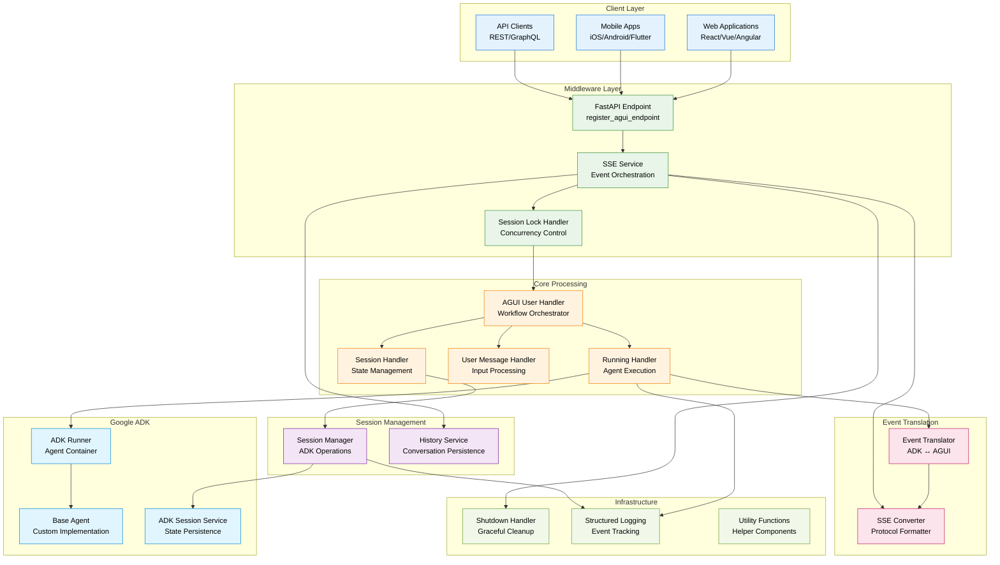
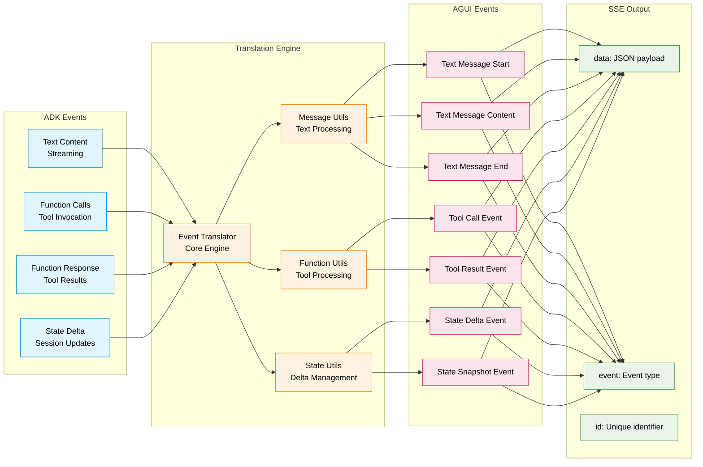

# ADK AGUI Middleware

[](https://deepwiki.com/trendmicro/adk-agui-middleware)
[](https://github.com/trendmicro/adk-agui-middleware/actions/workflows/ci.yml)
[](https://github.com/trendmicro/adk-agui-middleware/actions/workflows/codeql.yml)
[](https://github.com/trendmicro/adk-agui-middleware/actions/workflows/semgrep.yml)
[](https://github.com/trendmicro/adk-agui-middleware/actions/workflows/gitleaks.yml)
[](https://opensource.org/licenses/MIT)
[](https://github.com/astral-sh/ruff)
[](https://github.com/PyCQA/bandit)
[](https://github.com/python/mypy)

**Enterprise-grade Python 3.13+ middleware that seamlessly bridges Google's Agent Development Kit (ADK) with AGUI protocol, providing high-performance Server-Sent Events streaming and Human-in-the-Loop (HITL) workflow orchestration.**

## Overview

ADK AGUI Middleware is a production-ready Python 3.13+ library engineered for enterprise-scale integration between Google's Agent Development Kit and AGUI (Agent User Interface) protocol. The middleware provides a robust foundation for building AI agent applications with real-time streaming capabilities, concurrent session management, and sophisticated Human-in-the-Loop (HITL) workflows.

### Key Features

- **🏗️ Enterprise Architecture**: Modular design with dependency injection, abstract base classes, and clean separation of concerns
- **⚡ High-Performance SSE**: Asynchronous Server-Sent Events streaming with bidirectional event translation pipeline
- **🔒 Session Management**: Thread-safe session locking with configurable timeout and retry mechanisms
- **🤝 HITL Workflows**: Complete orchestration of Human-in-the-Loop tool call workflows with state persistence
- **🔄 Event Translation**: Real-time ADK ↔ AGUI event conversion with streaming message management
- **🛡️ Production-Ready**: Comprehensive error handling, structured logging, and graceful shutdown mechanisms
- **🎯 Type Safety**: Full Python 3.13 type annotations with strict mypy validation and Pydantic data models

## Installation

```bash
pip install adk-agui-middleware
```

### Requirements

- Python 3.13+ (recommended 3.13.3+)
- Google ADK >= 1.9.0
- AGUI Protocol >= 0.1.7
- FastAPI >= 0.104.0

## Architecture Overview

### High-Level System Architecture



### Event Translation Pipeline



## Quick Start

### Basic Enterprise Implementation

```python
import asyncio
from fastapi import FastAPI, Request
from google.adk.agents import BaseAgent
from adk_agui_middleware import SSEService, register_agui_endpoint
from adk_agui_middleware.data_model.config import RunnerConfig, PathConfig
from adk_agui_middleware.data_model.context import ConfigContext
from adk_agui_middleware.service.history_service import HistoryService

# Initialize FastAPI application
app = FastAPI(
    title="Enterprise AI Agent Service",
    description="Production ADK-AGUI middleware with HITL capabilities",
    version="1.0.0",
    docs_url="/docs",
    redoc_url="/redoc"
)

class EnterpriseAgent(BaseAgent):
    """Production-ready agent with comprehensive tool support and HITL workflows."""

    def __init__(self):
        super().__init__()
        self.instructions = """
        You are an enterprise AI assistant with advanced reasoning capabilities.

        Core Behaviors:
        - Always request human approval for high-impact operations (data deletion, financial transactions, system changes)
        - Provide clear explanations for tool usage and decision-making processes
        - Handle errors gracefully and inform users of any issues or limitations
        - Maintain conversation context and reference previous interactions when relevant
        - Use appropriate tools efficiently and explain their selection criteria

        Security Guidelines:
        - Never expose sensitive information in logs or responses
        - Validate all inputs and sanitize outputs appropriately
        - Follow principle of least privilege for all operations
        - Report any suspicious activities or potential security concerns
        """

# Advanced context extraction for multi-tenant enterprise deployment
async def extract_user_id(content, request: Request) -> str:
    """Extract user ID from JWT token with enterprise authentication."""
    # Production implementation should include:
    # - JWT token validation and parsing
    # - RBAC (Role-Based Access Control) integration
    # - Audit trail logging for compliance
    auth_header = request.headers.get("Authorization", "")
    if auth_header.startswith("Bearer "):
        # Implement JWT validation here
        # token = auth_header[7:]
        # decoded = jwt.decode(token, secret_key, algorithms=["HS256"])
        # return decoded.get("user_id")
        pass

    # Fallback for development/testing
    return request.headers.get("X-User-ID", "anonymous")

async def extract_app_name(content, request: Request) -> str:
    """Extract application name from request context for multi-tenant routing."""
    # Extract from subdomain for tenant isolation
    host = request.headers.get("Host", "localhost")
    if "." in host and not host.startswith("localhost"):
        tenant = host.split(".")[0]
        return f"enterprise-{tenant}"

    # Extract from custom header for API-based routing
    if app_header := request.headers.get("X-App-Name"):
        return f"enterprise-{app_header}"

    return "enterprise-default"

async def extract_initial_state(content, request: Request) -> dict[str, str] | None:
    """Extract initial session state from request headers for context-aware initialization."""
    initial_state = {}

    # Extract user roles and permissions
    if user_role := request.headers.get("X-User-Role"):
        initial_state["user_role"] = user_role

    # Extract department or team context
    if department := request.headers.get("X-Department"):
        initial_state["department"] = department

    # Extract session preferences
    if preferences := request.headers.get("X-Session-Preferences"):
        initial_state["preferences"] = preferences

    return initial_state if initial_state else None

# Configure middleware with enterprise context
config_context = ConfigContext(
    app_name=extract_app_name,
    user_id=extract_user_id,
    session_id=lambda content, req: content.thread_id,
    extract_initial_state=extract_initial_state,
)

# Configure runner with production-grade settings
runner_config = RunnerConfig(
    use_in_memory_services=False,  # Use persistent services in production
    # Configure external services for production:
    # session_service=CloudSessionService(),
    # artifact_service=S3ArtifactService(),
    # memory_service=VectorMemoryService(),
    # credential_service=VaultCredentialService(),
)

# Configure custom endpoint paths for enterprise deployment
path_config = PathConfig(
    agui_main_path="/v1/agent/execute",
    agui_thread_list_path="/v1/conversations",
    agui_thread_delete_path="/v1/conversations/{thread_id}",
    agui_message_snapshot_path="/v1/conversations/{thread_id}/messages",
    agui_state_snapshot_path="/v1/conversations/{thread_id}/state",
    agui_patch_state_path="/v1/conversations/{thread_id}/state",
)

# Initialize services
agent = EnterpriseAgent()
sse_service = SSEService(agent, runner_config, config_context)
history_service = HistoryService(config_context, runner_config.session_service)

# Register enterprise endpoints
register_agui_endpoint(
    app,
    sse_service,
    path_config=path_config,
    history_service=history_service
)

# Add enterprise middleware for monitoring and security
@app.middleware("http")
async def enterprise_middleware(request: Request, call_next):
    """Enterprise middleware for monitoring, security, and compliance."""
    # Add request tracking and monitoring
    start_time = asyncio.get_event_loop().time()

    # Add security headers
    response = await call_next(request)
    response.headers["X-Content-Type-Options"] = "nosniff"
    response.headers["X-Frame-Options"] = "DENY"
    response.headers["X-XSS-Protection"] = "1; mode=block"

    # Log request metrics for monitoring
    process_time = asyncio.get_event_loop().time() - start_time
    response.headers["X-Process-Time"] = str(process_time)

    return response

# Health check endpoint for load balancers
@app.get("/health")
async def health_check():
    """Health check endpoint for monitoring and load balancing."""
    return {
        "status": "healthy",
        "version": "1.0.0",
        "middleware": "adk-agui-middleware",
        "timestamp": asyncio.get_event_loop().time()
    }

# Graceful shutdown handling
@app.on_event("shutdown")
async def shutdown_event():
    """Graceful shutdown with proper resource cleanup."""
    await sse_service.close()

if __name__ == "__main__":
    import uvicorn

    # Production configuration
    uvicorn.run(
        app,
        host="0.0.0.0",
        port=8000,
        workers=1,  # Use multiple workers in production with reverse proxy
        log_level="info",
        access_log=True,
        reload=False,  # Disable reload in production
        loop="asyncio"
    )
```


## API Reference

### Core Endpoints

| Method | Endpoint | Description | Request Body | Response Type |
|--------|----------|-------------|--------------|---------------|
| `POST` | `/` | Execute agent with streaming response | `RunAgentInput` | `EventSourceResponse` |
| `GET` | `/thread/list` | List user's conversation threads | - | `List[Dict[str, str]]` |
| `DELETE` | `/thread/{thread_id}` | Delete conversation thread | - | `Dict[str, str]` |
| `GET` | `/message_snapshot/{thread_id}` | Get conversation history | - | `MessagesSnapshotEvent` |
| `GET` | `/state_snapshot/{thread_id}` | Get session state snapshot | - | `StateSnapshotEvent` |
| `PATCH` | `/state/{thread_id}` | Update session state | `List[JSONPatch]` | `Dict[str, str]` |

### Event Types

The middleware supports comprehensive event translation between ADK and AGUI formats:

#### AGUI Event Types
- `TEXT_MESSAGE_START` - Begin streaming text response
- `TEXT_MESSAGE_CONTENT` - Streaming text content chunk
- `TEXT_MESSAGE_END` - Complete streaming text response
- `TOOL_CALL` - Agent tool/function invocation
- `TOOL_RESULT` - Tool execution result
- `STATE_DELTA` - Incremental state update
- `STATE_SNAPSHOT` - Complete state snapshot
- `RUN_STARTED` - Agent execution began
- `RUN_FINISHED` - Agent execution completed
- `ERROR` - Error event with details

#### SSE Format
All events are converted to Server-Sent Events format:
```javascript
{
  "data": "{...}",        // JSON-serialized event data
  "event": "event_type",  // AGUI event type
  "id": "unique_id"       // UUID for event correlation
}
```

## Architecture Patterns

### Dependency Injection & Extensibility

The middleware employs dependency injection patterns for maximum extensibility:

```python
# Abstract base classes define contracts
from adk_agui_middleware.base_abc.handler import BaseAGUIEventHandler

# Implement custom handlers
class CustomEventProcessor(BaseAGUIEventHandler):
    async def process(self, event: BaseEvent) -> list[BaseEvent]:
        # Custom event processing logic
        return [event]

# Inject into handler context
handler_context = HandlerContext(
    agui_event_handler=CustomEventProcessor
)
```

### Session Management & State Persistence

Session management follows enterprise patterns with proper state isolation:

```python
from adk_agui_middleware.manager.session import SessionManager
from adk_agui_middleware.data_model.session import SessionParameter

# Session operations are thread-safe and persistent
session_manager = SessionManager(session_service)
session_param = SessionParameter(
    app_name="enterprise-app",
    user_id="user123",
    session_id="conversation456"
)

# Get or create session with initial state
session = await session_manager.check_and_create_session(
    session_param,
    initial_state={"user_role": "admin"}
)
```

### Event Translation Pipeline

The event translation system uses a sophisticated pipeline:

```python
from adk_agui_middleware.event.event_translator import EventTranslator

# Event translator handles complex ADK→AGUI conversion
translator = EventTranslator()

# Supports streaming text, tool calls, and state management
async for agui_event in translator.translate(adk_event):
    # Process translated AGUI events
    yield agui_event
```

## Production Deployment

### Performance Considerations

- **Concurrent Sessions**: The middleware supports thousands of concurrent sessions with proper session locking
- **Memory Management**: Configurable in-memory vs persistent services for different deployment scales
- **Event Streaming**: Optimized SSE streaming with minimal latency and proper error handling
- **Resource Cleanup**: Automatic cleanup of resources and graceful shutdown handling

### Monitoring & Observability

```python
# Built-in structured logging for enterprise monitoring
from adk_agui_middleware.loggers.record_log import record_event_raw_log

# Custom metrics integration
class MetricsHandler(BaseAGUIEventHandler):
    async def process(self, event: BaseEvent) -> list[BaseEvent]:
        # Send metrics to monitoring system
        await self.send_metrics(event.type, event.timestamp)
        return [event]
```

### Security Best Practices

- **Authentication**: JWT token validation and RBAC integration
- **Session Isolation**: Proper tenant isolation for multi-tenant deployments
- **Audit Logging**: Comprehensive audit trails for compliance requirements
- **Error Handling**: Secure error handling without information leakage

## License

This project is licensed under the MIT License - see the [LICENSE](LICENSE) file for details.

## Contributing

Please read [CONTRIBUTING.md](CONTRIBUTING.md) for details on our code of conduct and the process for submitting pull requests.

## Security

See [SECURITY.md](SECURITY.md) for our security policy and vulnerability reporting process.
