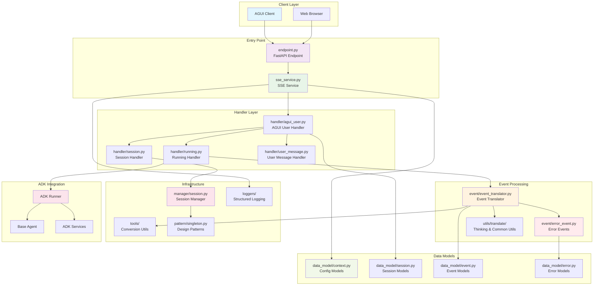
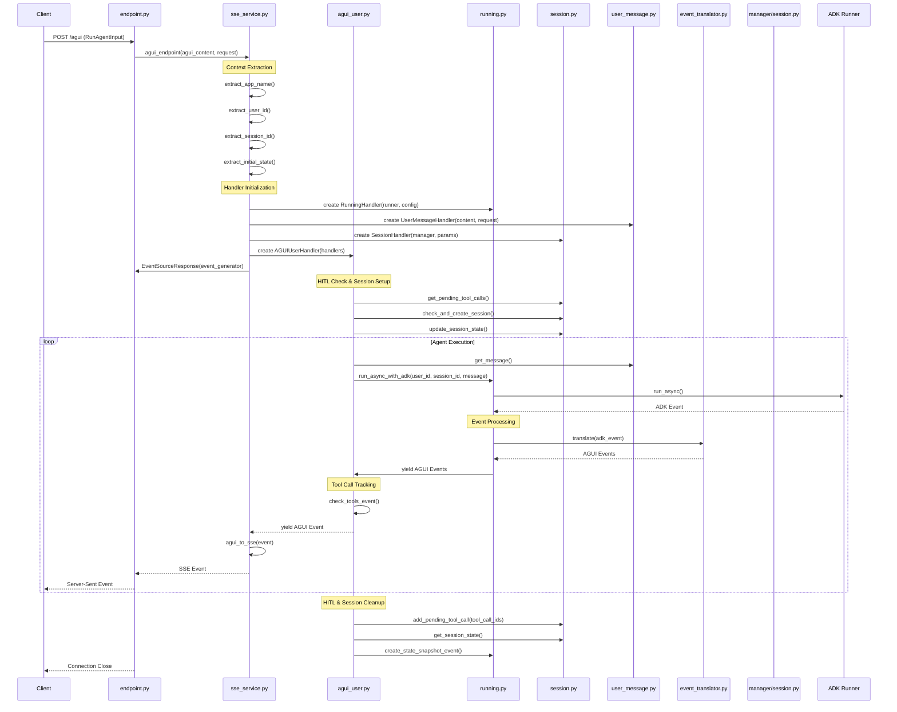

# ADK AGUI Python Middleware

A professional Python 3.10+ middleware library that bridges Google's Agent Development Kit (ADK) with AGUI protocol, providing Server-Sent Events (SSE) streaming for real-time agent interactions.

## ✨ Key Features

- **🚀 Real-time Streaming**: Server-Sent Events (SSE) for live agent responses
- **🔐 Session Management**: Comprehensive session handling with configurable backends  
- **⚙️ Context Extraction**: Flexible context configuration for multi-tenant applications
- **🛡️ Error Handling**: Robust error handling with structured logging and recovery
- **🔧 Tool Integration**: Complete tool call lifecycle management with HITL support
- **📊 Event Translation**: ADK ↔ AGUI event conversion with streaming support
- **🔒 Type Safety**: Full type annotations with Pydantic models
- **🏗️ Extensible Architecture**: Abstract base classes for custom implementations


## 🚀 Quick Start

### Installation

```bash
pip install adk-agui-middleware
```

**Requirements:** Python 3.10+ • Google ADK ≥1.9.0 • AGUI Protocol ≥0.1.7 • FastAPI ≥0.104.0

### Basic Implementation

```python
from fastapi import FastAPI, Request
from google.adk.agents import BaseAgent
from ag_ui.core import RunAgentInput
from adk_agui_middleware import register_agui_endpoint, SSEService
from adk_agui_middleware.data_model.context import RunnerConfig, ConfigContext

app = FastAPI(title="Agent API", version="1.0.0")

class MyAgent(BaseAgent):
    def __init__(self):
        super().__init__()
        self.instructions = "You are a helpful AI assistant with tools."

# Context extractors for multi-tenant support
async def extract_user_id(agui_content: RunAgentInput, request: Request) -> str:
    """Extract user ID from JWT token or headers."""
    return request.headers.get("X-User-ID", "default-user")

async def extract_app_name(agui_content: RunAgentInput, request: Request) -> str:
    """Extract app name from subdomain or headers."""
    return request.headers.get("X-App-Name", "default-app")

async def extract_initial_state(agui_content: RunAgentInput, request: Request) -> dict:
    """Set up initial session state with user preferences."""
    return {
        "user_preferences": {"theme": "dark", "language": "en"},
        "session_start_time": agui_content.timestamp or 0,
        "client_info": {
            "user_agent": request.headers.get("user-agent", "unknown"),
            "ip": request.client.host if request.client else "unknown"
        }
    }

# Initialize configuration
context_config = ConfigContext(
    app_name=extract_app_name,
    user_id=extract_user_id,
    extract_initial_state=extract_initial_state
)

runner_config = RunnerConfig(
    use_in_memory_services=True  # For development
)

# Create SSE service and register endpoint
agent = MyAgent()
sse_service = SSEService(agent, runner_config, context_config)
register_agui_endpoint(app, sse_service, path="/agui")

if __name__ == "__main__":
    import uvicorn
    uvicorn.run(app, host="0.0.0.0", port=8000)
```

### Advanced HITL Implementation

```python
from typing import AsyncGenerator
from fastapi import FastAPI, HTTPException
from google.adk.agents import BaseAgent
from google.adk.events import Event as ADKEvent
from ag_ui.core import RunAgentInput, BaseEvent
from adk_agui_middleware import register_agui_endpoint, SSEService
from adk_agui_middleware.data_model.context import RunnerConfig, ConfigContext, HandlerContext
from adk_agui_middleware.base_abc.handler import BaseADKEventHandler, BaseTranslateHandler
from adk_agui_middleware.data_model.event import TranslateEvent
from adk_agui_middleware.utils.translate.thinking import ThinkingEventUtil

app = FastAPI(title="Advanced Agent API with HITL", version="2.0.0")

class AdvancedAgent(BaseAgent):
    def __init__(self):
        super().__init__()
        self.instructions = """You are an advanced AI assistant with human-in-the-loop capabilities.
        When you need human approval for sensitive operations, use the appropriate tools."""

class EventFilterHandler(BaseADKEventHandler):
    """Filter events to only process meaningful content."""
    
    @staticmethod
    async def _filter_events(event: ADKEvent) -> AsyncGenerator[ADKEvent | None]:
        # Only process events with text content or state changes
        if event.content and event.content.parts and event.content.parts[0].text:
            yield event
        elif event.actions and event.actions.state_delta:
            # Filter sensitive state data
            filtered_delta = {
                k: v for k, v in event.actions.state_delta.items()
                if not k.startswith("_private")
            }
            if filtered_delta:
                event.actions.state_delta = filtered_delta
                yield event
            else:
                yield None
        else:
            yield None
    
    async def process(self, event: ADKEvent) -> AsyncGenerator[ADKEvent | None]:
        return self._filter_events(event)

class ThinkingTranslateHandler(BaseTranslateHandler):
    """Add AI thinking events for better UX."""
    
    def __init__(self):
        self.thinking_util = ThinkingEventUtil()
        self.event_count = 0
    
    async def _generate_thinking(self, adk_event: ADKEvent) -> AsyncGenerator[TranslateEvent]:
        # Add thinking events every 3 text events
        if adk_event.content and adk_event.content.parts:
            self.event_count += 1
            if self.event_count % 3 == 0:
                yield TranslateEvent(
                    agui_event=self.thinking_util.thinking_content_event(
                        "Processing your request with advanced reasoning..."
                    )
                )
        yield TranslateEvent(is_retune=True)
    
    async def translate(self, adk_event: ADKEvent) -> AsyncGenerator[TranslateEvent]:
        return self._generate_thinking(adk_event)

# HITL API endpoints
@app.get("/sessions/{session_id}/pending")
async def get_pending_actions(session_id: str):
    """Get pending tool calls requiring human approval."""
    # Implementation would check session state for pending tools
    return {"session_id": session_id, "pending_actions": []}

@app.post("/sessions/{session_id}/approve/{tool_call_id}")
async def approve_tool_call(session_id: str, tool_call_id: str, approved: bool):
    """Approve or reject a pending tool call."""
    if not approved:
        raise HTTPException(status_code=400, detail="Tool call rejected by human")
    return {"status": "approved", "resuming_execution": True}

# Advanced configuration with custom handlers
context_config = ConfigContext(
    app_name="advanced-agent",
    user_id=lambda content, req: req.headers.get("X-User-ID", "anonymous"),
    extract_initial_state=lambda content, req: {
        "hitl_enabled": True,
        "thinking_mode": "enhanced",
        "approval_required": req.headers.get("X-Require-Approval", "false") == "true"
    }
)

runner_config = RunnerConfig(use_in_memory_services=True)

handler_context = HandlerContext(
    adk_event_handler=EventFilterHandler,
    translate_handler=ThinkingTranslateHandler
)

# Initialize with custom handlers
agent = AdvancedAgent()
sse_service = SSEService(agent, runner_config, context_config, handler_context)
register_agui_endpoint(app, sse_service, path="/agui")

if __name__ == "__main__":
    import uvicorn
    uvicorn.run(app, host="0.0.0.0", port=8000)
```

## 🏗️ Architecture Overview

The middleware is organized into distinct layers with clear separation of concerns, providing a comprehensive solution for agent-human interactions through sophisticated event processing and state management.

### 📁 Module Structure

The codebase follows a modular architecture with well-defined responsibilities:

#### Core Service Layer (`adk_agui_middleware/`)
- **`endpoint.py`**: FastAPI endpoint registration for agent interactions
- **`sse_service.py`**: Main SSE service implementation with runner management

#### Abstract Base Classes (`base_abc/`)
- **`handler.py`**: Abstract base classes for event and state handlers
- **`sse_service.py`**: Base SSE service interface definition

#### Configuration Management (`config/`)
- **`log.py`**: Logging configuration with environment variable support

#### Data Models (`data_model/`)
- **`context.py`**: Configuration models for context extraction and runner setup
- **`error.py`**: HTTP error response models
- **`event.py`**: Event translation data models for ADK ↔ AGUI conversion
- **`log.py`**: Structured log message model for comprehensive logging
- **`session.py`**: Session parameter model for session identification

#### Event Processing (`event/`)
- **`error_event.py`**: Error event classes for encoding and execution failures
- **`event_translator.py`**: Core event translation service (ADK ↔ AGUI formats)

#### Handler Layer (`handler/`)
- **`agui_user.py`**: Main AGUI user interaction and workflow orchestration
- **`running.py`**: Agent execution and event translation management
- **`session.py`**: Session operations and tool call lifecycle management
- **`user_message.py`**: User message and tool result processing

#### Logging System (`loggers/`)
- **`exception.py`**: HTTP exception handling and error response utilities
- **`logger.py`**: JSON logging formatter and logger configuration
- **`record_log.py`**: Structured logging functions for application events
- **`record_request_log.py`**: Request logging utilities for HTTP tracking

#### Session Management (`manager/`)
- **`session.py`**: ADK session operations and state management

#### Design Patterns (`pattern/`)
- **`singleton.py`**: Singleton design pattern implementation

#### Utility Tools (`tools/`)
- **`convert.py`**: Event conversion utilities for SSE format
- **`function_name.py`**: Function name extraction for debugging
- **`json_encoder.py`**: Custom JSON encoder for Pydantic models
- **`shutdown.py`**: Graceful shutdown handler for application cleanup

#### Translation Utilities (`utils/translate/`)
- **`common.py`**: Common translation utilities for retune events
- **`thinking.py`**: Thinking event utilities for AI reasoning display

### System Architecture



### Request Flow



## 🔧 Core Concepts

### Key Features

- **📊 Event Translation**: Seamless ADK ↔ AGUI event conversion with streaming support
- **🤝 HITL Workflows**: Built-in Human-in-the-Loop support for tool call approval
- **⚙️ Flexible Configuration**: Multi-tenant context extraction and service configuration
- **🛡️ Error Handling**: Comprehensive error handling with structured logging
- **🎯 Handler Pipeline**: Extensible event processing with custom handlers

### Event Translation Pipeline

The middleware seamlessly converts events between ADK and AGUI formats:

| ADK Event | AGUI Event | Description |
|-----------|------------|-------------|
| Text Content | TextMessage* | Streaming text responses |
| Function Call | ToolCall* | Tool invocations |
| Function Response | ToolCallResult | Tool execution results |
| State Delta | StateDelta | Session state changes |
| Custom Metadata | CustomEvent | Custom event data |

### Configuration Models

- **`ConfigContext`**: Extracts context (app_name, user_id, session_id) from requests
- **`RunnerConfig`**: Manages ADK services (session, memory, artifacts, credentials)  
- **`HandlerContext`**: Injects custom event processing handlers

## ⚠️ Implementation Notes

### Handler Pattern

When implementing custom handlers, follow this pattern:

```python
class MyEventHandler(BaseADKEventHandler):
    @staticmethod
    async def _process_event(event: Event) -> AsyncGenerator[Event | None]:
        # Your processing logic here - yield in this method
        yield event
    
    async def process(self, event: Event) -> AsyncGenerator[Event | None]:
        # Interface method - return the generator, don't yield
        return self._process_event(event)
```

**Key Point**: Interface methods should return async generators, not yield directly.

## 🚀 Usage Examples

See the examples above for basic and advanced implementations including HITL workflows, custom event handlers, and production configurations.

## 📄 License

Licensed under the MIT License. See [LICENSE](LICENSE) file for details.
