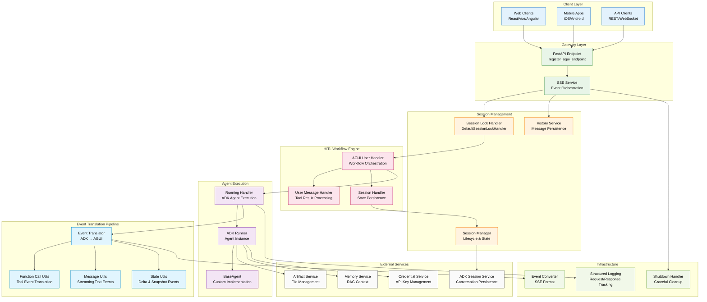

# ADK AGUI Middleware

[](https://github.com/trendmicro/adk-agui-middleware/actions/workflows/ci.yml)
[](https://github.com/trendmicro/adk-agui-middleware/actions/workflows/codeql.yml)
[](https://github.com/trendmicro/adk-agui-middleware/actions/workflows/semgrep.yml)
[](https://github.com/trendmicro/adk-agui-middleware/actions/workflows/gitleaks.yml)
[](https://opensource.org/licenses/MIT)
[](https://github.com/astral-sh/ruff)
[](https://github.com/PyCQA/bandit)
[](https://github.com/python/mypy)

**Enterprise-grade Python 3.13+ middleware that seamlessly bridges Google's Agent Development Kit (ADK) with AGUI protocol, providing high-performance Server-Sent Events streaming and Human-in-the-Loop (HITL) workflow orchestration.**

## Overview

ADK AGUI Middleware is a production-ready Python 3.13+ library engineered for enterprise-scale integration between Google's Agent Development Kit and AGUI (Agent User Interface) protocol. The middleware provides a robust foundation for building AI agent applications with real-time streaming capabilities, concurrent session management, and sophisticated Human-in-the-Loop (HITL) workflows.

### Architecture Highlights

- **🏗️ Enterprise Architecture**: Modular design with dependency injection, abstract base classes, and clean separation of concerns
- **⚡ High-Performance SSE**: Asynchronous Server-Sent Events streaming with event translation pipeline
- **🔒 Concurrent Session Management**: Thread-safe session locking with configurable timeout and retry mechanisms
- **🤝 HITL Workflows**: Complete orchestration of Human-in-the-Loop tool call workflows with state persistence
- **🔄 Event Translation Engine**: Bidirectional ADK ↔ AGUI event conversion with streaming message management
- **🛡️ Production-Ready**: Comprehensive error handling, structured logging, and graceful shutdown mechanisms
- **🎯 Type Safety**: Full Python 3.13 type annotations with strict mypy validation and Pydantic data models

## Installation

```bash
pip install adk-agui-middleware
```

### Requirements

- Python 3.13+ (recommended 3.13.3+)
- Google ADK >= 1.9.0
- AGUI Protocol >= 0.1.7
- FastAPI >= 0.104.0

## Core Architecture

### System Architecture



## Quick Start

### Basic Implementation

```python
from fastapi import FastAPI, Request
from google.adk.agents import BaseAgent
from adk_agui_middleware import SSEService, register_agui_endpoint
from adk_agui_middleware.data_model.config import RunnerConfig
from adk_agui_middleware.data_model.context import ConfigContext

# Initialize FastAPI application
app = FastAPI(
    title="AI Agent Service",
    description="Enterprise ADK-AGUI middleware service",
    version="1.0.0"
)

# Define your custom ADK agent
class EnterpriseAgent(BaseAgent):
    """Custom enterprise agent with HITL capabilities."""

    def __init__(self):
        super().__init__()
        self.instructions = """
        You are an enterprise AI assistant with access to various tools.

        Key behaviors:
        - Always ask for human approval before executing high-impact operations
        - Provide clear explanations for tool usage and reasoning
        - Handle errors gracefully and inform users of any issues
        - Maintain conversation context across multiple interactions
        """

# Context extraction functions for multi-tenant deployment
async def extract_user_id(content, request: Request) -> str:
    """Extract user ID from JWT token or API headers."""
    # Production: Implement JWT token validation
    auth_header = request.headers.get("Authorization", "")
    if auth_header.startswith("Bearer "):
        # Decode JWT and extract user_id
        pass

    # Fallback to header-based user identification
    return request.headers.get("X-User-ID", "anonymous")

async def extract_app_name(content, request: Request) -> str:
    """Extract application name from subdomain or headers."""
    host = request.headers.get("Host", "localhost")
    if "." in host:
        subdomain = host.split(".")[0]
        return f"enterprise-{subdomain}"
    return "enterprise-default"

# Configure middleware context
config_context = ConfigContext(
    app_name=extract_app_name,
    user_id=extract_user_id,
    session_id=lambda content, req: content.thread_id,
)

# Configure runner with production settings
runner_config = RunnerConfig(
    use_in_memory_services=True  # Set to False for production persistence
)

# Initialize and register services
agent = EnterpriseAgent()
sse_service = SSEService(agent, runner_config, config_context)
register_agui_endpoint(app, sse_service)


if __name__ == "__main__":
    import uvicorn
    uvicorn.run(
        app,
        host="0.0.0.0",
        port=8000,
        log_level="info",
        access_log=True
    )
```

## API Reference

### Endpoints

| Method | Endpoint | Description | Authentication |
|--------|----------|-------------|----------------|
| `POST` | `/` | Execute agent with streaming response | Required |
| `GET` | `/thread/list` | List user's conversation threads | Required |
| `DELETE` | `/thread/{thread_id}` | Delete conversation thread | Required |
| `GET` | `/message_snapshot/{thread_id}` | Get conversation history | Required |
| `GET` | `/state_snapshot/{thread_id}` | Get session state snapshot | Required |
| `PATCH` | `/state/{thread_id}` | Update session state | Required |

## Performance & Monitoring

### Key Metrics

- **Session Lock Acquisition Time**: Monitor lock contention
- **Event Translation Latency**: Track ADK→AGUI conversion performance
- **Concurrent Session Count**: Monitor resource utilization
- **HITL Resolution Time**: Track human intervention workflows
- **Error Rate by Type**: Monitor system health

## License

This project is licensed under the MIT License - see the [LICENSE](LICENSE) file for details.

## Contributing

Please read [CONTRIBUTING.md](CONTRIBUTING.md) for details on our code of conduct and the process for submitting pull requests.

## Security

See [SECURITY.md](SECURITY.md) for our security policy and vulnerability reporting process.