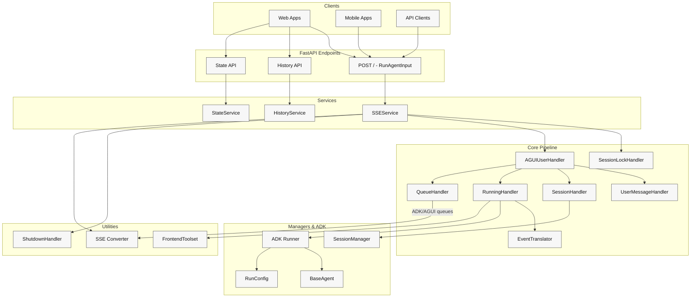

# ADK AGUI Middleware

[](https://deepwiki.com/trendmicro/adk-agui-middleware)
[](https://github.com/trendmicro/adk-agui-middleware/actions/workflows/ci.yml)
[](https://github.com/trendmicro/adk-agui-middleware/actions/workflows/codeql.yml)
[](https://github.com/trendmicro/adk-agui-middleware/actions/workflows/semgrep.yml)
[](https://github.com/trendmicro/adk-agui-middleware/actions/workflows/gitleaks.yml)
[](https://opensource.org/licenses/MIT)
[](https://github.com/astral-sh/ruff)
[](https://github.com/PyCQA/bandit)
[](https://github.com/python/mypy)

**Enterprise-grade Python 3.10+ middleware that seamlessly bridges Google's Agent Development Kit (ADK) with AGUI protocol, providing high-performance Server-Sent Events streaming and Human-in-the-Loop (HITL) workflow orchestration.**

## Overview

Enterprise-grade Python 3.10+ middleware that bridges Google's Agent Development Kit (ADK) with AGUI protocol, enabling real-time AI agent applications with Server-Sent Events streaming and Human-in-the-Loop workflows.

### Key Features

- **⚡ SSE Streaming**: High-performance Server-Sent Events with real-time ADK ↔ AGUI translation
- **🔒 Session Management**: Thread-safe locking with configurable timeout and retry mechanisms
- **🤝 HITL Workflows**: Complete Human-in-the-Loop orchestration with state persistence
- **🏗️ Enterprise Architecture**: Modular design with dependency injection and clean separation
- **🛡️ Production-Ready**: Comprehensive error handling, logging, and graceful shutdown
- **🎯 Type Safety**: Full Python 3.10 annotations with strict mypy validation

## Installation

```bash
pip install adk-agui-middleware
```

### Requirements

- Python 3.10+ (recommended 3.10.3+)
- Google ADK >= 1.9.0
- AGUI Protocol >= 0.1.7
- FastAPI >= 0.104.0

## Examples

Jump in with hands-on, progressively richer examples under `examples/`.

- 01_minimal_sse
  - Smallest working setup that streams Server-Sent Events (SSE) from an ADK `LlmAgent`.
  - Path: `examples/01_minimal_sse/app.py`
- 02_context_history
  - Main SSE endpoint plus History and State endpoints, with simple context extraction.
  - Path: `examples/02_context_history/app.py`
- 03_advanced_pipeline
  - Adds a custom input/output recorder and a safe preprocessor for `RunAgentInput`.
  - Path: `examples/03_advanced_pipeline/app.py`
- 04_lifecycle_handlers
  - Walks through the full request lifecycle and `HandlerContext` hooks (session lock, ADK/AGUI handlers, translation, state snapshot, I/O recording).
  - Path: `examples/04_lifecycle_handlers/app.py`

## Architecture Overview

### High-Level System Architecture



### Concurrent Event Processing Architecture

```mermaid
graph TB
    subgraph "Request Initiation"
        CLIENT_REQ[📥 Client Request<br/>POST RunAgentInput<br/>with Messages & Tools]
        INPUT_INFO[📋 Input Info Creation<br/>Extract Context<br/>Initialize Event Queues]
        QUEUE_INIT[🎯 Queue Initialization<br/>Create EventQueue Model<br/>ADK & AGUI Queues]
    end

    subgraph "Dual Queue Architecture"
        ADK_QUEUE[📊 ADK Event Queue<br/>Queue Event or None<br/>Producer: Agent Runner]
        AGUI_QUEUE[📦 AGUI Event Queue<br/>Queue BaseEvent or None<br/>Consumer: Client Stream]
    end

    subgraph "Queue Management Layer"
        QUEUE_HANDLER[🎯 Queue Handler<br/>Factory Pattern<br/>Create Managers]
        ADK_MGR[📊 ADK Queue Manager<br/>Logging & Iteration<br/>Caller Tracking]
        AGUI_MGR[📦 AGUI Queue Manager<br/>Logging & Iteration<br/>Caller Tracking]
    end

    subgraph "Concurrent Task Execution"
        TASK_GROUP[⚡ Async TaskGroup<br/>Concurrent Execution<br/>Exception Aggregation]

        subgraph "ADK Producer Task"
            ADK_TASK[🔵 Task 1: ADK Event Producer<br/>async _run_async_with_adk]
            ADK_RUNNER[🚀 ADK Agent Runner<br/>Execute Agent Logic<br/>Generate Events]
            ADK_PUT[➡️ Put Events to ADK Queue<br/>await adk_queue.put event<br/>Log with Caller Info]
            ADK_SENTINEL[🛑 ADK Termination<br/>Put None to ADK Queue<br/>Signal Completion]
        end

        subgraph "AGUI Translator Task"
            AGUI_TASK[🟢 Task 2: AGUI Event Translator<br/>async _run_async_with_agui]
            AGUI_ITER[🔄 ADK Queue Iterator<br/>async for adk_event<br/>in adk_queue.get_iterator]
            TRANSLATOR[🔄 Event Translator<br/>ADK → AGUI Translation<br/>Streaming & Tool Detection]
            AGUI_PUT[➡️ Put Events to AGUI Queue<br/>await agui_queue.put event<br/>Generate HITL Events]
            AGUI_SENTINEL[🛑 AGUI Termination<br/>Put None to AGUI Queue<br/>After Final State]
        end
    end

    subgraph "Client Stream Consumer"
        STREAM_CONSUMER[🌊 SSE Stream Consumer<br/>Main Workflow Loop<br/>async for agui_event]
        AGUI_OUTPUT[📤 AGUI Queue Iterator<br/>async for in agui_queue<br/>Yield to Client]
        SSE_FORMAT[🔌 SSE Formatter<br/>Convert to SSE Protocol<br/>Add Timestamps & IDs]
        CLIENT_STREAM[📡 Client SSE Stream<br/>Real-time Event Delivery<br/>EventSourceResponse]
    end

    subgraph "Exception Handling"
        ADK_EXCEPTION[⚠️ ADK Exception Handler<br/>Context Manager<br/>Ensure Sentinel in Finally]
        AGUI_EXCEPTION[⚠️ AGUI Exception Handler<br/>Context Manager<br/>Ensure Sentinel in Finally]
        TASK_EXCEPTION[🚨 TaskGroup Exception<br/>Aggregate Exceptions<br/>ExceptionGroup Handler]
        ERROR_EVENT[❌ Error Event Generation<br/>Convert to AGUI Error<br/>Send to Client]
    end

    subgraph "Synchronization & Termination"
        ITER_PROTOCOL[🔄 AsyncQueueIterator<br/>__aiter__ & __anext__<br/>task_done on get]
        NONE_SENTINEL[🛑 None Sentinel Pattern<br/>Signals Queue Termination<br/>Raises StopAsyncIteration]
        GRACEFUL_STOP[✅ Graceful Termination<br/>All Tasks Complete<br/>Queues Drained]
    end

    %% Request flow
    CLIENT_REQ --> INPUT_INFO
    INPUT_INFO --> QUEUE_INIT
    QUEUE_INIT --> ADK_QUEUE
    QUEUE_INIT --> AGUI_QUEUE

    %% Queue management setup
    QUEUE_INIT --> QUEUE_HANDLER
    QUEUE_HANDLER --> ADK_MGR
    QUEUE_HANDLER --> AGUI_MGR
    ADK_MGR --> ADK_QUEUE
    AGUI_MGR --> AGUI_QUEUE

    %% Concurrent task execution
    INPUT_INFO --> TASK_GROUP
    TASK_GROUP --> ADK_TASK
    TASK_GROUP --> AGUI_TASK

    %% ADK producer flow
    ADK_TASK --> ADK_EXCEPTION
    ADK_EXCEPTION --> ADK_RUNNER
    ADK_RUNNER --> ADK_PUT
    ADK_PUT --> ADK_MGR
    ADK_MGR --> ADK_QUEUE
    ADK_EXCEPTION -.->|Finally Block| ADK_SENTINEL
    ADK_SENTINEL --> ADK_QUEUE

    %% AGUI translator flow
    AGUI_TASK --> AGUI_EXCEPTION
    AGUI_EXCEPTION --> AGUI_ITER
    AGUI_ITER --> ADK_QUEUE
    ADK_QUEUE --> TRANSLATOR
    TRANSLATOR --> AGUI_PUT
    AGUI_PUT --> AGUI_MGR
    AGUI_MGR --> AGUI_QUEUE
    AGUI_EXCEPTION -.->|Finally Block| AGUI_SENTINEL
    AGUI_SENTINEL --> AGUI_QUEUE

    %% Stream consumer flow
    TASK_GROUP --> STREAM_CONSUMER
    STREAM_CONSUMER --> AGUI_OUTPUT
    AGUI_OUTPUT --> AGUI_QUEUE
    AGUI_QUEUE --> SSE_FORMAT
    SSE_FORMAT --> CLIENT_STREAM

    %% Exception handling
    ADK_TASK -.->|Exception| TASK_EXCEPTION
    AGUI_TASK -.->|Exception| TASK_EXCEPTION
    TASK_EXCEPTION --> ERROR_EVENT
    ERROR_EVENT --> AGUI_QUEUE

    %% Synchronization
    AGUI_ITER --> ITER_PROTOCOL
    AGUI_OUTPUT --> ITER_PROTOCOL
    ITER_PROTOCOL --> NONE_SENTINEL
    NONE_SENTINEL --> GRACEFUL_STOP

    %% Styling
    classDef request fill:#e3f2fd,color:#000,stroke:#1976d2,stroke-width:2px
    classDef queue fill:#ffebee,color:#000,stroke:#d32f2f,stroke-width:2px
    classDef manager fill:#fff3e0,color:#000,stroke:#f57c00,stroke-width:2px
    classDef task fill:#e8f5e9,color:#000,stroke:#43a047,stroke-width:2px
    classDef producer fill:#e1f5fe,color:#000,stroke:#0288d1,stroke-width:2px
    classDef translator fill:#f3e5f5,color:#000,stroke:#8e24aa,stroke-width:2px
    classDef consumer fill:#fff8e1,color:#000,stroke:#ffa000,stroke-width:2px
    classDef exception fill:#fbe9e7,color:#000,stroke:#ff6f00,stroke-width:2px
    classDef sync fill:#f1f8e9,color:#000,stroke:#689f38,stroke-width:2px

    class CLIENT_REQ,INPUT_INFO,QUEUE_INIT request
    class ADK_QUEUE,AGUI_QUEUE queue
    class QUEUE_HANDLER,ADK_MGR,AGUI_MGR manager
    class TASK_GROUP task
    class ADK_TASK,ADK_RUNNER,ADK_PUT,ADK_SENTINEL producer
    class AGUI_TASK,AGUI_ITER,TRANSLATOR,AGUI_PUT,AGUI_SENTINEL translator
    class STREAM_CONSUMER,AGUI_OUTPUT,SSE_FORMAT,CLIENT_STREAM consumer
    class ADK_EXCEPTION,AGUI_EXCEPTION,TASK_EXCEPTION,ERROR_EVENT exception
    class ITER_PROTOCOL,NONE_SENTINEL,GRACEFUL_STOP sync
```



### Human-in-the-Loop (HITL) Workflow

```mermaid
graph TD
    subgraph "Client Request Processing"
        REQ[📥 Client Request<br/>RunAgentInput<br/>POST /]
        AUTH[🔐 Authentication<br/>Extract User Context<br/>Session Validation]
        LOCK[🔒 Session Lock<br/>Acquire Exclusive Access<br/>Prevent Concurrency]
    end

    subgraph "Session & State Management"
        SESS_CHECK[📋 Session Check<br/>Get or Create Session<br/>Load Existing State]
        STATE_INIT[🗂️ State Initialization<br/>Apply Initial State<br/>Load Pending Tools]
        TOOL_RESUME[⏱️ Tool Resume Check<br/>Detect Pending LRO Tools<br/>Resume HITL Workflow]
        FRONTEND_TOOLS[🧰 Frontend Tools Setup<br/>Extract Client Tools<br/>Inject into Agent]
    end

    subgraph "Message Processing"
        MSG_TYPE{❓ Message Type?}
        USER_MSG[💬 User Message<br/>Extract Content<br/>Prepare for Agent]
        TOOL_RESULT[🛠️ Tool Result<br/>Validate Tool Call ID<br/>Convert to ADK Format]
        MSG_ERROR[❌ Message Error<br/>Invalid Tool ID or<br/>Missing Content]
    end

    subgraph "Agent Execution Pipeline"
        AGENT_START[▶️ Agent Execution<br/>RUN_STARTED Event<br/>Begin Processing]
        QUEUE_SETUP[🎯 Queue Setup<br/>Initialize Event Queues<br/>ADK & AGUI Managers]
        CONCURRENT_EXEC[⚡ Concurrent Execution<br/>TaskGroup with 2 Tasks<br/>Producer & Translator]
        ADK_RUN[🚀 ADK Runner Task<br/>Agent Processing<br/>Stream to ADK Queue]
        EVENT_PROC[🔄 AGUI Translator Task<br/>ADK → AGUI Translation<br/>Stream to AGUI Queue]
        CLIENT_STREAM[🌊 Client Stream Consumer<br/>AGUI Queue Iterator<br/>Yield to SSE Response]
    end

    subgraph "Tool Call Detection & Processing"
        TOOL_CHECK{🔍 Long-Running Tool?}
        FRONTEND_CALL{🧰 Frontend Tool Call?}
        LRO_DETECT[⏱️ LRO Detection<br/>Mark as Long-Running<br/>Store Tool Call Info]
        FRONTEND_EVENT[🎯 Frontend Tool Event<br/>Generate Function Call<br/>Put to AGUI Queue]
        HITL_PAUSE[⏸️ HITL Pause<br/>Early Return from Translator<br/>Wait for Human Input]
        NORMAL_FLOW[➡️ Normal Flow<br/>Continue Processing<br/>Standard Tools]
    end

    subgraph "State Persistence"
        TOOL_PERSIST[💾 Tool State Persist<br/>Save Pending Tools<br/>Update Session State]
        STATE_SNAP[📸 State Snapshot<br/>Create Final State<br/>Send to Client]
        COMPLETION[✅ Completion<br/>RUN_FINISHED Event<br/>Release Resources]
    end

    subgraph "Error Handling"
        ERROR_CATCH[🚨 Error Handler<br/>Catch Exceptions<br/>Generate Error Events]
        ERROR_EVENT[⚠️ Error Event<br/>AGUI Error Format<br/>Client Notification]
        CLEANUP[🧹 Cleanup<br/>Release Session Lock<br/>Resource Cleanup]
    end

    %% Request Processing Flow
    REQ --> AUTH
    AUTH --> LOCK
    LOCK --> SESS_CHECK

    %% Session Management Flow
    SESS_CHECK --> STATE_INIT
    STATE_INIT --> TOOL_RESUME
    TOOL_RESUME --> FRONTEND_TOOLS
    FRONTEND_TOOLS --> MSG_TYPE

    %% Message Processing Flow
    MSG_TYPE -->|User Message| USER_MSG
    MSG_TYPE -->|Tool Result| TOOL_RESULT
    MSG_TYPE -->|Error| MSG_ERROR
    USER_MSG --> AGENT_START
    TOOL_RESULT --> AGENT_START
    MSG_ERROR --> ERROR_EVENT

    %% Agent Execution Flow
    AGENT_START --> QUEUE_SETUP
    QUEUE_SETUP --> CONCURRENT_EXEC
    CONCURRENT_EXEC --> ADK_RUN
    CONCURRENT_EXEC --> EVENT_PROC
    CONCURRENT_EXEC --> CLIENT_STREAM
    ADK_RUN --> EVENT_PROC
    EVENT_PROC --> CLIENT_STREAM
    EVENT_PROC --> TOOL_CHECK

    %% Tool Call Handling
    TOOL_CHECK -->|Long-Running Tool| LRO_DETECT
    TOOL_CHECK -->|Standard Tool| NORMAL_FLOW
    LRO_DETECT --> FRONTEND_CALL
    FRONTEND_CALL -->|Yes| FRONTEND_EVENT
    FRONTEND_CALL -->|No| HITL_PAUSE
    FRONTEND_EVENT --> HITL_PAUSE
    NORMAL_FLOW --> STATE_SNAP

    %% HITL Flow
    HITL_PAUSE --> TOOL_PERSIST
    TOOL_PERSIST --> COMPLETION

    %% Normal Completion Flow
    STATE_SNAP --> COMPLETION

    %% Error Handling Flow
    ADK_RUN -.->|Exception| ERROR_CATCH
    EVENT_PROC -.->|Exception| ERROR_CATCH
    ERROR_CATCH --> ERROR_EVENT
    ERROR_EVENT --> CLEANUP

    %% Final Cleanup
    COMPLETION --> CLEANUP
    CLEANUP --> REQ

    %% Styling
    classDef request fill:#e3f2fd,color:#000,stroke:#1976d2,stroke-width:2px
    classDef session fill:#f1f8e9,color:#000,stroke:#689f38,stroke-width:2px
    classDef message fill:#fff3e0,color:#000,stroke:#f57c00,stroke-width:2px
    classDef agent fill:#fce4ec,color:#000,stroke:#c2185b,stroke-width:2px
    classDef tool fill:#fff8e1,color:#000,stroke:#ff8f00,stroke-width:2px
    classDef state fill:#f3e5f5,color:#000,stroke:#7b1fa2,stroke-width:2px
    classDef error fill:#ffebee,color:#000,stroke:#d32f2f,stroke-width:2px
    classDef decision fill:#e8f5e8,color:#000,stroke:#388e3c,stroke-width:3px

    class REQ,AUTH,LOCK request
    class SESS_CHECK,STATE_INIT,TOOL_RESUME session
    class USER_MSG,TOOL_RESULT,MSG_ERROR message
    class AGENT_START,ADK_RUN,EVENT_PROC agent
    class LRO_DETECT,HITL_PAUSE,NORMAL_FLOW tool
    class TOOL_PERSIST,STATE_SNAP,COMPLETION state
    class ERROR_CATCH,ERROR_EVENT,CLEANUP error
    class MSG_TYPE,TOOL_CHECK decision
```



### Complete Request Lifecycle

```mermaid
sequenceDiagram
    participant CLIENT as "🌐 Client"
    participant ENDPOINT as "🎯 FastAPI Endpoint"
    participant SSE as "⚡ SSE Service"
    participant LOCK as "🔒 Session Lock"
    participant AGUI_USER as "🎭 AGUI User Handler"
    participant RUNNING as "🏃 Running Handler"
    participant TRANSLATE as "🔄 Event Translator"
    participant ADK_RUNNER as "🚀 ADK Runner"
    participant BASE_AGENT as "🤖 Base Agent"
    participant SESSION_MGR as "📋 Session Manager"
    participant SESSION_SVC as "💾 Session Service"

    note over CLIENT,SESSION_SVC: Request Initiation & Context Setup
    CLIENT->>ENDPOINT: POST RunAgentInput
    ENDPOINT->>SSE: Extract context & create runner
    SSE->>SSE: Extract app_name, user_id, session_id
    SSE->>LOCK: Acquire session lock

    alt Session locked by another request
        LOCK-->>SSE: Lock failed
        SSE-->>CLIENT: SSE: RunErrorEvent (session busy)
    else Lock acquired successfully
        LOCK-->>SSE: Lock acquired

        note over SSE,SESSION_SVC: Handler Initialization & Session Setup
        SSE->>AGUI_USER: Initialize AGUI User Handler
        AGUI_USER->>SESSION_MGR: Check and create session
        SESSION_MGR->>SESSION_SVC: Get or create session with initial state
        SESSION_SVC-->>SESSION_MGR: Session object with state
        SESSION_MGR-->>AGUI_USER: Session ready

        AGUI_USER->>AGUI_USER: Load pending tool calls from state
        AGUI_USER->>RUNNING: Set long-running tool IDs

        note over AGUI_USER,BASE_AGENT: Message Processing & Agent Execution
        AGUI_USER->>AGUI_USER: Determine message type (user input or tool result)
        AGUI_USER->>SSE: Stream: RunStartedEvent
        SSE-->>CLIENT: SSE: RUN_STARTED

        AGUI_USER->>RUNNING: Execute agent with user message
        RUNNING->>ADK_RUNNER: ADK Runner execution
        ADK_RUNNER->>BASE_AGENT: Process with custom agent logic

        note over BASE_AGENT,CLIENT: Event Streaming & Real-time Translation
        loop For each ADK event
            BASE_AGENT-->>ADK_RUNNER: Agent-generated ADK event
            ADK_RUNNER-->>RUNNING: Stream ADK event
            RUNNING->>TRANSLATE: Translate ADK to AGUI event
            TRANSLATE-->>RUNNING: AGUI event(s)
            RUNNING-->>AGUI_USER: AGUI event stream
            AGUI_USER-->>SSE: AGUI events
            SSE-->>CLIENT: SSE: Event data (TEXT_MESSAGE_*, TOOL_CALL, etc.)

            alt Long-running tool detected
            RUNNING->>AGUI_USER: Long-running tool call detected
            AGUI_USER->>SESSION_MGR: Persist pending tool call state
            SESSION_MGR->>SESSION_SVC: Update session state with tool info
            AGUI_USER-->>SSE: Early return (HITL pause)
            end
        end

        note over AGUI_USER,CLIENT: Workflow Completion & Cleanup
        alt Normal completion (no LRO tools)
            RUNNING->>TRANSLATE: Force close streaming messages
            TRANSLATE-->>RUNNING: Message end events
            RUNNING->>SESSION_MGR: Get final session state
            SESSION_MGR->>SESSION_SVC: Retrieve current state
            SESSION_SVC-->>SESSION_MGR: State snapshot
            SESSION_MGR-->>RUNNING: State data
            RUNNING-->>AGUI_USER: State snapshot event
            AGUI_USER-->>SSE: StateSnapshotEvent
            SSE-->>CLIENT: SSE: STATE_SNAPSHOT
        end

        AGUI_USER-->>SSE: RunFinishedEvent
        SSE-->>CLIENT: SSE: RUN_FINISHED

        note over SSE,LOCK: Resource Cleanup
        SSE->>LOCK: Release session lock
        LOCK-->>SSE: Lock released
    end

    note over CLIENT,SESSION_SVC: Subsequent HITL Tool Result Submission
    opt Tool result submission for HITL
        CLIENT->>ENDPOINT: POST RunAgentInput (with tool result)
        Note right of CLIENT: Tool result contains: tool_call_id, result data
        ENDPOINT->>SSE: Process tool result submission
        note over SSE,AGUI_USER: Same flow but with tool result processing
        AGUI_USER->>AGUI_USER: Validate tool_call_id against pending tools
        AGUI_USER->>AGUI_USER: Convert tool result to ADK format
        AGUI_USER->>SESSION_MGR: Remove completed tool from pending state
        note over AGUI_USER,CLIENT: Continue agent execution with tool result
    end
```



### Session State Management Lifecycle


## ⚠️ Critical Configuration: SSE Response Mode

### CopilotKit Frontend Compatibility Issue

**IMPORTANT:** CopilotKit's frontend implementation does **NOT** comply with the standard Server-Sent Events (SSE) specification, which causes parsing failures when using FastAPI's standard `EventSourceResponse`. Although CopilotKit labels its streaming as "SSE", it does not follow the SSE spec at all—this is a significant oversight in their implementation.

#### The Problem

- **Standard SSE Format (`EventSourceResponse`)**: Follows [W3C SSE specification](https://html.spec.whatwg.org/multipage/server-sent-events.html) with proper event formatting
- **CopilotKit's Expectation**: Requires `StreamingResponse` with non-standard formatting, breaking SSE compliance
- **Impact**: If you use the standard-compliant `EventSourceResponse`, CopilotKit frontends cannot parse the events correctly

#### The Solution

We provide a configuration flag in `ConfigContext` to switch between standard-compliant SSE and CopilotKit-compatible streaming:

```python
from adk_agui_middleware.data_model.context import ConfigContext

# For CopilotKit frontend (default, non-standard)
config_context = ConfigContext(
    app_name="my-app",
    user_id=extract_user_id,
    session_id=extract_session_id,
    event_source_response_mode=False  # Default: Uses StreamingResponse for CopilotKit
)

# For SSE-compliant frontends (recommended for custom implementations)
config_context = ConfigContext(
    app_name="my-app",
    user_id=extract_user_id,
    session_id=extract_session_id,
    event_source_response_mode=True  # Uses EventSourceResponse (SSE standard)
)
```

#### Configuration Guide

| Configuration | Response Type | Use Case | SSE Compliance |
|--------------|---------------|----------|----------------|
| `event_source_response_mode=False` (default) | `StreamingResponse` | CopilotKit frontend | ❌ Non-compliant |
| `event_source_response_mode=True` | `EventSourceResponse` | Custom/Standard frontends | ✅ W3C compliant |

### Stream Completion Message Filtering

**Configuration: `retune_on_stream_complete`**

When using streaming responses, ADK may emit both incremental streaming chunks AND a final complete message. By default (`retune_on_stream_complete=False`), the final complete message is filtered to prevent duplicate content on the client side, since all content has already been sent via streaming chunks.

#### Why This Matters

- **Default Behavior (`retune_on_stream_complete=False`)**: Filters out the final complete message to avoid duplication
  - Streaming chunks: ✅ Sent to client
  - Final complete message: ❌ Filtered (prevents duplicate)

- **Alternative Behavior (`retune_on_stream_complete=True`)**: Sends both streaming chunks AND the final complete message
  - Streaming chunks: ✅ Sent to client
  - Final complete message: ✅ Sent to client (may cause duplication)

#### Configuration

Set this in both `ConfigContext` and `HistoryConfig`:

```python
from adk_agui_middleware.data_model.context import ConfigContext
from adk_agui_middleware.data_model.config import HistoryConfig

# SSE Service Configuration
config_context = ConfigContext(
    app_name="my-app",
    user_id=extract_user_id,
    session_id=extract_session_id,
    retune_on_stream_complete=False  # Default: Filter final complete message
)

# History Service Configuration
history_config = HistoryConfig(
    app_name="my-app",
    user_id=extract_user_id,
    session_id=extract_session_id,
    retune_on_stream_complete=False  # Default: Filter final complete message
)
```

**Recommendation**: Keep the default `False` to prevent duplicate content unless your frontend specifically requires the final complete message.

#### Our Stance

Since our in-house frontend is a complete redesign that **does not** use CopilotKit, we require the backend to **strictly comply with the SSE specification**. However, to maintain backward compatibility with CopilotKit users, we've made this configurable with the default set to CopilotKit's non-standard mode.

**For production systems with custom frontends, we strongly recommend:**

```python
config_context = ConfigContext(
    app_name="my-app",
    user_id=extract_user_id,
    session_id=extract_session_id,
    event_source_response_mode=True  # Use SSE standard
)
```

This ensures your implementation follows web standards and maintains long-term compatibility with standard-compliant SSE clients.

---

## Quick Start

### Basic Implementation

```python
from fastapi import FastAPI, Request
from google.adk.agents import BaseAgent
from adk_agui_middleware import SSEService
from adk_agui_middleware.endpoint import register_agui_endpoint
from adk_agui_middleware.data_model.config import RunnerConfig
from adk_agui_middleware.data_model.context import ConfigContext

# Initialize FastAPI application
app = FastAPI(title="AI Agent Service", version="1.0.0")

# Define your custom ADK agent
class MyAgent(BaseAgent):
    def __init__(self):
        super().__init__()
        self.instructions = "You are a helpful AI assistant."

# Simple context extraction
async def extract_user_id(content, request: Request) -> str:
    return request.headers.get("x-user-id", "default-user")

# Create SSE service
agent = MyAgent()
sse_service = SSEService(
    agent=agent,
    config_context=ConfigContext(
        app_name="my-app",
        user_id=extract_user_id,
        session_id=lambda content, req: content.thread_id,
    )
)

# Register endpoint
register_agui_endpoint(app, sse_service)

if __name__ == "__main__":
    import uvicorn
    uvicorn.run(app, host="0.0.0.0", port=8000)
```

### RunnerConfig Configuration

The `RunnerConfig` class manages ADK runner setup and service configuration. It provides flexible service configuration with automatic in-memory fallbacks for development and testing environments.

#### Default Configuration (In-Memory Services)

By default, `RunnerConfig` uses in-memory services, perfect for development and testing:

```python
from adk_agui_middleware.data_model.config import RunnerConfig
from adk_agui_middleware import SSEService

# Default: Automatic in-memory services
runner_config = RunnerConfig()

sse_service = SSEService(
    agent=MyAgent(),
    config_context=config_context,
    runner_config=runner_config  # Optional: uses default if not provided
)
```

#### Custom Service Configuration

For production environments, configure custom services:

```python
from google.adk.sessions import FirestoreSessionService
from google.adk.artifacts import GCSArtifactService
from google.adk.memory import RedisMemoryService
from google.adk.auth.credential_service import VaultCredentialService
from google.adk.agents.run_config import StreamingMode
from google.adk.agents import RunConfig

# Custom production configuration
runner_config = RunnerConfig(
    # Service configuration
    session_service=FirestoreSessionService(project_id="my-project"),
    artifact_service=GCSArtifactService(bucket_name="my-artifacts"),
    memory_service=RedisMemoryService(host="redis.example.com"),
    credential_service=VaultCredentialService(vault_url="https://vault.example.com"),

    # Disable automatic in-memory fallback for production
    use_in_memory_services=False,

    # Optional: Add ADK plugins to extend agent capabilities
    plugins=[MyCustomPlugin(), AnotherPlugin()],

    # Customize agent execution behavior
    run_config=RunConfig(
        streaming_mode=StreamingMode.SSE,
        max_iterations=50,
        timeout=300
    )
)

sse_service = SSEService(
    agent=MyAgent(),
    config_context=config_context,
    runner_config=runner_config
)
```

#### RunnerConfig Attributes

| Attribute | Type | Default | Description |
|-----------|------|---------|-------------|
| `use_in_memory_services` | `bool` | `True` | Automatically create in-memory services when services are `None` |
| `run_config` | `RunConfig` | `RunConfig(streaming_mode=SSE)` | ADK run configuration for agent execution behavior |
| `session_service` | `BaseSessionService` | `InMemorySessionService()` | Session service for conversation persistence |
| `artifact_service` | `BaseArtifactService` | `None` | Artifact service for file and data management |
| `memory_service` | `BaseMemoryService` | `None` | Memory service for agent memory management |
| `credential_service` | `BaseCredentialService` | `None` | Credential service for authentication |
| `plugins` | `list[BasePlugin]` | `None` | List of ADK plugins for extending agent capabilities |

#### Configuration Examples

**Development/Testing Setup:**
```python
# Uses all in-memory services automatically
runner_config = RunnerConfig()
```

**Production Setup with Firestore:**
```python
from google.adk.sessions import FirestoreSessionService

runner_config = RunnerConfig(
    use_in_memory_services=False,
    session_service=FirestoreSessionService(
        project_id="my-project",
        database_id="my-database"
    )
)
```

**Mixed Environment (Some Custom, Some In-Memory):**
```python
# Custom session service, auto-creates in-memory for others
runner_config = RunnerConfig(
    use_in_memory_services=True,  # Auto-create missing services
    session_service=FirestoreSessionService(project_id="my-project"),
    # artifact_service, memory_service, credential_service will be auto-created
)
```

**Custom Agent Execution Configuration:**
```python
from google.adk.agents import RunConfig
from google.adk.agents.run_config import StreamingMode

runner_config = RunnerConfig(
    run_config=RunConfig(
        streaming_mode=StreamingMode.SSE,  # Server-Sent Events mode
        max_iterations=100,  # Maximum agent iterations
        timeout=600,  # Execution timeout in seconds
        enable_thinking=True,  # Enable thinking/reasoning mode
    )
)
```

### Advanced Configuration with Config Class

```python
from fastapi import FastAPI, Request
from google.adk.agents import BaseAgent
from adk_agui_middleware import SSEService
from adk_agui_middleware.endpoint import (
    register_agui_endpoint,
    register_agui_history_endpoint,
    register_state_endpoint
)
from adk_agui_middleware.data_model.config import HistoryConfig, RunnerConfig, StateConfig
from adk_agui_middleware.data_model.context import ConfigContext, HandlerContext
from adk_agui_middleware.service.history_service import HistoryService
from adk_agui_middleware.service.state_service import StateService
from ag_ui.core import RunAgentInput

class MyAgent(BaseAgent):
    def __init__(self):
        super().__init__()
        self.instructions = "You are a helpful AI assistant."

class AGUIConfig:
    @staticmethod
    async def extract_user_id(request: Request) -> str:
        return request.headers.get("x-user-id", "default-user")

    @staticmethod
    async def extract_session_id(request: Request) -> str:
        return request.path_params.get("thread_id", "default-session")

    @staticmethod
    async def extract_initial_state(content: RunAgentInput, request: Request) -> dict:
        return {"frontend_state": content.state or {}}

    def create_sse_service(self) -> SSEService:
        return SSEService(
            agent=MyAgent(),
            config_context=ConfigContext(
                app_name="my-app",
                user_id=lambda content, req: self.extract_user_id(req),
                session_id=lambda content, req: content.thread_id,
                extract_initial_state=self.extract_initial_state,
            ),
            # Optional: Add custom handlers
            # handler_context=HandlerContext(
            #     translate_handler=MyTranslateHandler,
            #     adk_event_handler=MyADKEventHandler,
            #     in_out_record_handler=MyInOutHandler,
            # ),
        )

    def create_history_service(self) -> HistoryService:
        return HistoryService(
            HistoryConfig(
                app_name="my-app",
                user_id=self.extract_user_id,
                session_id=self.extract_session_id,
            )
        )

    def create_state_service(self) -> StateService:
        return StateService(
            StateConfig(
                app_name="my-app",
                user_id=self.extract_user_id,
                session_id=self.extract_session_id,
            )
        )

# Initialize FastAPI and services
app = FastAPI(title="AI Agent Service", version="1.0.0")
config = AGUIConfig()

# Register all endpoints
register_agui_endpoint(app, config.create_sse_service())
register_agui_history_endpoint(app, config.create_history_service())
register_state_endpoint(app, config.create_state_service())

if __name__ == "__main__":
    import uvicorn
    uvicorn.run(app, host="0.0.0.0", port=8000)
```

### Custom Event Handlers

```python
from collections.abc import AsyncGenerator
from adk_agui_middleware.base_abc.handler import (
    BaseADKEventHandler,
    BaseInOutHandler,
    BaseTranslateHandler
)
from adk_agui_middleware.data_model.common import InputInfo
from adk_agui_middleware.data_model.event import TranslateEvent
from google.adk.events import Event

class MyADKEventHandler(BaseADKEventHandler):
    def __init__(self, input_info: InputInfo | None):
        pass  # Initialize your handler

    async def process(self, event: Event) -> AsyncGenerator[Event | None]:
        # Filter or modify ADK events before translation
        yield event

class MyTranslateHandler(BaseTranslateHandler):
    def __init__(self, input_info: InputInfo | None):
        pass  # Initialize your handler

    async def translate(self, adk_event: Event) -> AsyncGenerator[TranslateEvent]:
        # Custom translation logic
        yield TranslateEvent()  # Your custom translation

class MyInOutHandler(BaseInOutHandler):
    async def input_record(self, input_info: InputInfo) -> None:
        # Log input for audit/debugging
        pass

    async def output_record(self, agui_event: dict[str, str]) -> None:
        # Log output events
        pass

    async def output_catch_and_change(self, agui_event: dict[str, str]) -> dict[str, str]:
        # Modify output before sending to client
        return agui_event
```

## Examples

Explore ready-to-run usage patterns in the examples folder. Each example is self-contained with comments and can be launched via uvicorn.

- Basic SSE: `uvicorn examples.01_basic_sse_app.main:app --reload`
- Custom context + input conversion: `uvicorn examples.02_custom_context.main:app --reload`
- Plugins and timeouts: `uvicorn examples.03_plugins_and_timeouts.main:app --reload`
- History API (threads/snapshots/patch): `uvicorn examples.04_history_api.main:app --reload`
- Custom session lock: `uvicorn examples.05_custom_lock.main:app --reload`
- HITL tool flow: `uvicorn examples.06_hitl_tool_flow.main:app --reload`

See `examples/README.md` for details.

## HandlerContext Lifecycle

HandlerContext configures pluggable hooks for the request lifecycle. Instances are constructed per-request (except session lock, which is created with SSEService) and invoked at defined stages.

- session_lock_handler (created at SSEService init)
  - When: Before running the request stream and in finally cleanup
  - Used by: SSEService.runner (lock/unlock, generate locked error event)
- in_out_record_handler
  - When: Immediately after building InputInfo (input_record), then for every emitted SSE event (output_record, output_catch_and_change)
  - Used by: SSEService.get_runner and SSEService.event_generator
- adk_event_handler
  - When: On each ADK event before translation
  - Used by: RunningHandler._process_events_with_handler for ADK streams
- adk_event_timeout_handler
  - When: Surrounds ADK event processing with a timeout; on TimeoutError, yields fallback events
  - Used by: RunningHandler._process_events_with_handler(enable_timeout=True)
- translate_handler
  - When: Before default translation; can yield AGUI events, request retune, or replace the ADK event
  - Used by: RunningHandler._translate_adk_to_agui_async
- agui_event_handler
  - When: On each AGUI event after translation, before encoding
  - Used by: RunningHandler._process_events_with_handler for AGUI streams
- agui_state_snapshot_handler
  - When: Once at the end to transform final state before creating a StateSnapshotEvent
  - Used by: RunningHandler.create_state_snapshot_event

## API Reference

### Main AGUI Endpoint
Register with `register_agui_endpoint(app, sse_service)`

| Method | Endpoint | Description | Request Body | Response Type |
|--------|----------|-------------|--------------|---------------|
| `POST` | `/` | Execute agent with streaming response | `RunAgentInput` | `EventSourceResponse` |

### History Endpoints
Register with `register_agui_history_endpoint(app, history_service)`

| Method | Endpoint | Description | Request Body | Response Type |
|--------|----------|-------------|--------------|---------------|
| `GET` | `/thread/list` | List user's conversation threads | - | `List[Dict[str, str]]` |
| `DELETE` | `/thread/{thread_id}` | Delete conversation thread | - | `Dict[str, str]` |
| `GET` | `/message_snapshot/{thread_id}` | Get conversation history | - | `MessagesSnapshotEvent` |

### State Management Endpoints
Register with `register_state_endpoint(app, state_service)`

| Method | Endpoint | Description | Request Body | Response Type |
|--------|----------|-------------|--------------|---------------|
| `GET` | `/state_snapshot/{thread_id}` | Get session state snapshot | - | `StateSnapshotEvent` |
| `PATCH` | `/state/{thread_id}` | Update session state | `List[JSONPatch]` | `Dict[str, str]` |

### Event Types

The middleware supports comprehensive event translation between ADK and AGUI formats:

#### AGUI Event Types
- `TEXT_MESSAGE_START` - Begin streaming text response
- `TEXT_MESSAGE_CONTENT` - Streaming text content chunk
- `TEXT_MESSAGE_END` - Complete streaming text response
- `TOOL_CALL` - Agent tool/function invocation
- `TOOL_RESULT` - Tool execution result
- `STATE_DELTA` - Incremental state update
- `STATE_SNAPSHOT` - Complete state snapshot
- `RUN_STARTED` - Agent execution began
- `RUN_FINISHED` - Agent execution completed
- `ERROR` - Error event with details

## License

This project is licensed under the MIT License - see the [LICENSE](LICENSE) file for details.

## Contributing

Please read [CONTRIBUTING.md](CONTRIBUTING.md) for details on our code of conduct and the process for submitting pull requests.

## Security

See [SECURITY.md](SECURITY.md) for our security policy and vulnerability reporting process.
