# ADK AGUI Python Middleware

A professional Python 3.13+ middleware library that bridges Google's Agent Development Kit (ADK) with AGUI protocol, providing Server-Sent Events (SSE) streaming for real-time agent interactions.

## ✨ Key Features

- **🚀 Real-time Streaming**: Server-Sent Events (SSE) for live agent responses
- **🔐 Session Management**: Comprehensive session handling with configurable backends  
- **⚙️ Context Extraction**: Flexible context configuration for multi-tenant applications
- **🛡️ Error Handling**: Robust error handling with structured logging and recovery
- **🔧 Tool Integration**: Complete tool call lifecycle management with HITL support
- **📊 Event Translation**: ADK ↔ AGUI event conversion with streaming support
- **🔒 Type Safety**: Full type annotations with Pydantic models
- **🏗️ Extensible Architecture**: Abstract base classes for custom implementations
- **📚 Comprehensive Documentation**: Professional docstrings with Google-style format
- **🎯 Code Quality**: Rigorous type checking and code review standards


## 🚀 Quick Start

### Installation

```bash
pip install adk-agui-middleware
```

**Requirements:** Python 3.13+ • Google ADK ≥1.9.0 • AGUI Protocol ≥0.1.7 • FastAPI ≥0.104.0

### Basic Implementation

```python
from fastapi import FastAPI, Request
from google.adk.agents import BaseAgent
from ag_ui.core import RunAgentInput
from adk_agui_middleware import register_agui_endpoint, SSEService
from adk_agui_middleware.data_model.context import RunnerConfig, ConfigContext

app = FastAPI(title="AGUI Agent API", version="1.0.0")

class MyAgent(BaseAgent):
    def __init__(self):
        super().__init__()
        self.instructions = "You are a helpful AI assistant with access to various tools."

# Context extractors for multi-tenant support
async def extract_user_id(agui_content: RunAgentInput, request: Request) -> str:
    """Extract user ID from JWT token or headers."""
    # In production, decode JWT token here
    return request.headers.get("X-User-ID", "anonymous")

async def extract_app_name(agui_content: RunAgentInput, request: Request) -> str:
    """Extract app name from subdomain or headers."""
    # Extract from subdomain: api-myapp.domain.com -> myapp
    host = request.headers.get("host", "")
    if "-" in host:
        return host.split("-")[1].split(".")[0]
    return request.headers.get("X-App-Name", "default")

async def extract_initial_state(agui_content: RunAgentInput, request: Request) -> dict:
    """Set up initial session state with user context."""
    return {
        "user_preferences": {
            "theme": request.headers.get("X-Theme", "light"),
            "language": request.headers.get("Accept-Language", "en")[:2]
        },
        "session_metadata": {
            "start_time": agui_content.timestamp or 0,
            "client_ip": request.client.host if request.client else "unknown",
            "user_agent": request.headers.get("user-agent", "unknown")
        },
        "feature_flags": {
            "enable_thinking_mode": True,
            "enable_hitl": request.headers.get("X-Enable-HITL", "false") == "true"
        }
    }

# Configuration setup
context_config = ConfigContext(
    app_name=extract_app_name,
    user_id=extract_user_id,
    extract_initial_state=extract_initial_state
)

runner_config = RunnerConfig(
    use_in_memory_services=True  # Switch to False for production with persistent services
)

# Initialize and register the AGUI endpoint
agent = MyAgent()
sse_service = SSEService(agent, runner_config, context_config)
register_agui_endpoint(app, sse_service, path="/agui")

# Health check endpoint
@app.get("/health")
async def health_check():
    return {"status": "healthy", "service": "adk-agui-middleware"}

if __name__ == "__main__":
    import uvicorn
    uvicorn.run(app, host="0.0.0.0", port=8000, log_level="info")
```


## 🏗️ Architecture Overview

The middleware is organized into distinct layers with clear separation of concerns, providing a comprehensive solution for agent-human interactions through sophisticated event processing and state management.

### 📁 Architecture Overview

The middleware is organized into distinct layers following Domain-Driven Design principles:

### 🎯 Core Layers

- **🌐 API Layer**: FastAPI endpoint registration (`endpoint.py`)
- **⚙️ Service Layer**: Main SSE service with context extraction (`sse_service.py`)
- **🔄 Handler Layer**: Event processing pipeline (`handler/`)
- **🔀 Translation Engine**: ADK ↔ AGUI event conversion (`event/`)
- **📊 Data Models**: Configuration and validation models (`data_model/`)
- **🛠️ Infrastructure**: Utilities, logging, and session management (`tools/`, `loggers/`, `manager/`)

### 🧩 Key Components

#### Event Processing Pipeline
- **EventTranslator**: Core ADK ↔ AGUI conversion with streaming support
- **AGUIUserHandler**: Orchestrates HITL workflows and tool call tracking
- **RunningHandler**: Manages agent execution with custom handler pipeline
- **SessionHandler**: HITL state management and tool call lifecycle

#### Translation Utilities (`utils/translate/`)
- **Function Calls**: Tool call event translation with HITL support
- **Messages**: Text streaming and message sequence handling
- **State Management**: Delta updates and snapshot operations
- **Thinking Events**: AI reasoning display for enhanced UX

#### Abstract Interfaces (`base_abc/`)
- **Handler Base Classes**: Extensible event processing interfaces
- **SSE Service Interface**: Service layer abstraction

### System Architecture

```mermaid
graph TB
    subgraph "Client Layer"
        Client[AGUI Client/Browser]
    end
    
    subgraph "API Layer"
        Endpoint["📡 endpoint.py<br/>FastAPI Endpoint Registration"]
    end
    
    subgraph "Service Layer"
        SSEService["🎯 sse_service.py<br/>Core SSE Service<br/>• Context Extraction<br/>• Runner Management<br/>• Event Streaming"]
        BaseSSE["🏗️ base_abc/sse_service.py<br/>Abstract SSE Interface"]
    end
    
    subgraph "Handler Layer - Event Processing Pipeline"
        AGUIHandler["👤 handler/agui_user.py<br/>AGUI User Handler<br/>• Workflow Orchestration<br/>• HITL Management<br/>• Tool Call Tracking"]
        RunningHandler["⚡ handler/running.py<br/>Running Handler<br/>• Agent Execution<br/>• Event Translation<br/>• Custom Handler Pipeline"]
        SessionHandler["📊 handler/session.py<br/>Session Handler<br/>• Session Operations<br/>• HITL State Management<br/>• Tool Call Lifecycle"]
        UserMsgHandler["💬 handler/user_message.py<br/>User Message Handler<br/>• Message Processing<br/>• Tool Result Extraction<br/>• Initial State Setup"]
    end
    
    subgraph "Event Translation Engine"
        EventTranslator["🔄 event/event_translator.py<br/>Event Translator<br/>• ADK ↔ AGUI Conversion<br/>• Streaming Management<br/>• Tool Call Translation"]
        CustomEvents["🎨 event/agui_event.py<br/>Custom AGUI Events<br/>• Thinking Events<br/>• Enhanced Tracking"]
        ErrorEvents["🚨 event/error_event.py<br/>Error Event Handling<br/>• Encoding Errors<br/>• Execution Errors"]
    end
    
    subgraph "Translation Utilities"
        FunctionUtils["🔧 utils/translate/function_calls.py<br/>Function Call Utils"]
        MessageUtils["📝 utils/translate/message.py<br/>Message Event Utils"]
        StateUtils["📊 utils/translate/state.py<br/>State Event Utils"]
        ThinkingUtils["🧠 utils/translate/thinking.py<br/>Thinking Event Utils"]
        CommonUtils["⚙️ utils/translate/common.py<br/>Common Translation Utils"]
    end
    
    subgraph "Configuration & Context"
        ConfigContext["⚙️ data_model/context.py<br/>Configuration Models<br/>• Context Extractors<br/>• Handler Configuration<br/>• Runner Setup"]
        SessionModel["📋 data_model/session.py<br/>Session Parameters"]
        EventModel["🎭 data_model/event.py<br/>Translation Events"]
        ErrorModel["❌ data_model/error.py<br/>Error Response Models"]
        LogModel["📝 data_model/log.py<br/>Structured Log Messages"]
    end
    
    subgraph "Infrastructure & Services"
        SessionManager["🗃️ manager/session.py<br/>Session Manager<br/>• ADK Session Operations"]
        Loggers["📊 loggers/<br/>Structured Logging<br/>• JSON Formatter<br/>• Request Tracking<br/>• Exception Handling"]
        Tools["🛠️ tools/<br/>Utility Tools<br/>• Event Conversion<br/>• JSON Encoding<br/>• Shutdown Handling"]
        Singleton["🎯 pattern/singleton.py<br/>Singleton Pattern"]
    end
    
    subgraph "Abstract Handler Interfaces"
        BaseHandlers["🏛️ base_abc/handler.py<br/>Handler Base Classes<br/>• BaseTranslateHandler<br/>• BaseADKEventHandler<br/>• BaseAGUIEventHandler<br/>• BaseStateSnapshotHandler<br/>• BaseInOutHandler"]
    end
    
    subgraph "Google ADK Integration"
        ADKRunner["🤖 Google ADK Runner"]
        ADKServices["🔧 ADK Services<br/>• Session Service<br/>• Memory Service<br/>• Artifact Service<br/>• Credential Service"]
        BaseAgent["🧠 Base Agent"]
    end
    
    %% Client to API flow
    Client --> Endpoint
    
    %% API to Service flow
    Endpoint --> SSEService
    SSEService -.-> BaseSSE
    
    %% Service to Handler flow
    SSEService --> AGUIHandler
    SSEService --> RunningHandler
    SSEService --> SessionHandler
    SSEService --> UserMsgHandler
    
    %% Handler orchestration
    AGUIHandler --> RunningHandler
    AGUIHandler --> SessionHandler
    AGUIHandler --> UserMsgHandler
    
    %% Event processing flow
    RunningHandler --> EventTranslator
    RunningHandler --> ADKRunner
    
    %% Event translation
    EventTranslator --> CustomEvents
    EventTranslator --> ErrorEvents
    EventTranslator --> FunctionUtils
    EventTranslator --> MessageUtils
    EventTranslator --> StateUtils
    EventTranslator --> ThinkingUtils
    EventTranslator --> CommonUtils
    
    %% Configuration and context
    SSEService --> ConfigContext
    AGUIHandler --> SessionModel
    RunningHandler --> EventModel
    ErrorEvents --> ErrorModel
    
    %% Infrastructure dependencies
    SessionHandler --> SessionManager
    SSEService --> Loggers
    EventTranslator --> Tools
    Tools --> Singleton
    
    %% Handler interfaces
    RunningHandler --> BaseHandlers
    
    %% ADK integration
    RunningHandler --> ADKRunner
    SessionManager --> ADKServices
    ADKRunner --> BaseAgent
    ADKRunner --> ADKServices
    
    %% Styling
    classDef client fill:#e1f5fe,stroke:#0277bd,stroke-width:3px
    classDef api fill:#f3e5f5,stroke:#7b1fa2,stroke-width:2px
    classDef service fill:#e8f5e8,stroke:#2e7d32,stroke-width:2px
    classDef handler fill:#fff3e0,stroke:#ef6c00,stroke-width:2px
    classDef translation fill:#fff8e1,stroke:#f57f17,stroke-width:2px
    classDef config fill:#f1f8e9,stroke:#558b2f,stroke-width:2px
    classDef infrastructure fill:#fce4ec,stroke:#c2185b,stroke-width:2px
    classDef abstract fill:#f3e5f5,stroke:#8e24aa,stroke-width:2px
    classDef adk fill:#e8eaf6,stroke:#3f51b5,stroke-width:2px
    
    class Client client
    class Endpoint api
    class SSEService,BaseSSE service
    class AGUIHandler,RunningHandler,SessionHandler,UserMsgHandler handler
    class EventTranslator,CustomEvents,ErrorEvents,FunctionUtils,MessageUtils,StateUtils,ThinkingUtils,CommonUtils translation
    class ConfigContext,SessionModel,EventModel,ErrorModel,LogModel config
    class SessionManager,Loggers,Tools,Singleton infrastructure
    class BaseHandlers abstract
    class ADKRunner,ADKServices,BaseAgent adk
```



### Request Flow & Event Processing Pipeline

```mermaid
sequenceDiagram
    participant C as 👤 Client
    participant E as 📡 Endpoint
    participant S as 🎯 SSEService
    participant AGH as 👤 AGUIUserHandler
    participant RH as ⚡ RunningHandler
    participant SH as 📊 SessionHandler
    participant UMH as 💬 UserMessageHandler
    participant ET as 🔄 EventTranslator
    participant SM as 🗃️ SessionManager
    participant A as 🤖 ADK Runner
    
    rect rgb(240, 248, 255)
        Note over C, A: Phase 1: Request Reception & Context Extraction
        C->>+E: POST /agui (RunAgentInput)
        E->>+S: agui_endpoint(agui_content, request)
        
        Note over S: Context Extraction Pipeline
        S->>S: extract_app_name(agui_content, request)
        S->>S: extract_user_id(agui_content, request)
        S->>S: extract_session_id(agui_content, request)
        S->>S: extract_initial_state(agui_content, request)
        
        Note over S: Handler Initialization
        S->>+RH: create RunningHandler(runner, config, handler_context)
        S->>+UMH: create UserMessageHandler(content, request, initial_state)
        S->>+SH: create SessionHandler(manager, session_params)
        S->>+AGH: create AGUIUserHandler(running, user_msg, session)
        
        S->>E: EventSourceResponse(event_generator)
    end
    
    rect rgb(248, 255, 248)
        Note over C, A: Phase 2: HITL Check & Session Management
        AGH->>AGH: _async_init()
        AGH->>SH: get_pending_tool_calls()
        SH->>SM: get_session_state()
        SM-->>SH: pending_tool_calls: list[str]
        SH-->>AGH: long_running_tool_ids
        AGH->>RH: set_long_running_tool_ids()
        
        alt Tool Result Submission (HITL Completion)
            UMH->>UMH: is_tool_result_submission = True
            AGH->>UMH: extract_tool_results()
            UMH-->>AGH: tool_results: list[dict]
            AGH->>SH: check_and_remove_pending_tool_call()
            SH->>SM: update_session_state(remove tool_call_ids)
            Note over AGH: HITL workflow completed, resume execution
        else New Agent Request
            AGH->>SH: check_and_create_session(initial_state)
            SH->>SM: create_session() or get_session()
            AGH->>SH: update_session_state(initial_state)
        end
    end
    
    rect rgb(255, 248, 240)
        Note over C, A: Phase 3: Agent Execution & Event Processing
        AGH->>AGH: call_start() -> RunStartedEvent
        AGH-->>S: yield RunStartedEvent
        
        loop Agent Execution Loop
            AGH->>UMH: get_message()
            UMH-->>AGH: user_message or tool_results
            
            AGH->>RH: run_async_with_adk(user_id, session_id, message)
            RH->>A: runner.run_async(message, run_config)
            A-->>RH: ADK Event Stream
            
            Note over RH: Event Processing Pipeline
            alt Custom ADK Event Handler
                RH->>RH: adk_event_handler.process(adk_event)
            end
            
            RH->>RH: run_async_with_agui(adk_event)
            
            alt Custom Translate Handler
                RH->>RH: translate_handler.translate(adk_event)
            else Default Translation
                RH->>ET: translate(adk_event) or translate_long_running_function_calls()
                ET->>ET: translate_text_content() -> TextMessage Events
                ET->>ET: translate_function_calls() -> ToolCall Events
                ET->>ET: translate_function_responses() -> ToolCallResult Events
                ET->>ET: create_state_delta_event() -> StateDelta Events
                ET-->>RH: AGUI Event Stream
            end
            
            alt Custom AGUI Event Handler
                RH->>RH: agui_event_handler.process(agui_event)
            end
            
            RH-->>AGH: yield AGUI Events
            
            Note over AGH: Tool Call Tracking
            AGH->>AGH: check_tools_event(event)
            alt ToolCallEndEvent
                AGH->>AGH: tool_call_ids.append(tool_call_id)
            else ToolCallResultEvent
                AGH->>AGH: tool_call_ids.remove(tool_call_id)
            end
            
            alt Long-Running Tool Detected
                RH->>RH: is_long_running_tool = True
                Note over RH: Early return for HITL workflow
            end
            
            AGH-->>S: yield AGUI Event
            S->>S: _encode_event_to_sse(event)
            S-->>E: SSE Event Dict
            E-->>C: Server-Sent Event
        end
    end
    
    rect rgb(255, 240, 245)
        Note over C, A: Phase 4: Cleanup & State Management
        
        alt Not Long-Running Tool
            AGH->>RH: force_close_streaming_message()
            RH->>ET: force_close_streaming_message()
            ET-->>RH: TextMessageEndEvent (if needed)
            RH-->>AGH: yield cleanup events
        end
        
        AGH->>SH: add_pending_tool_call(tool_call_ids)
        SH->>SM: update_session_state(add pending tool calls)
        
        AGH->>SH: get_session_state()
        SH->>SM: get_session_state()
        SM-->>SH: final_state: dict
        SH-->>AGH: final_state
        
        alt State Snapshot Available
            AGH->>RH: create_state_snapshot_event(final_state)
            alt Custom State Snapshot Handler
                RH->>RH: agui_state_snapshot_handler.process(final_state)
            end
            RH->>ET: create_state_snapshot_event(processed_state)
            ET-->>RH: StateSnapshotEvent
            RH-->>AGH: StateSnapshotEvent
            AGH-->>S: yield StateSnapshotEvent
        end
        
        AGH->>AGH: call_finished() -> RunFinishedEvent
        AGH-->>S: yield RunFinishedEvent
        
        S-->>E: Final SSE Events
        E-->>-C: Connection Close
    end
    
    deactivate AGH
    deactivate RH
    deactivate SH
    deactivate UMH
    deactivate S
```



## 🔧 Core Concepts

### Key Features

- **📊 Event Translation**: Seamless ADK ↔ AGUI event conversion with streaming support
- **🤝 HITL Workflows**: Built-in Human-in-the-Loop support for tool call approval
- **⚙️ Flexible Configuration**: Multi-tenant context extraction and service configuration
- **🛡️ Error Handling**: Comprehensive error handling with structured logging
- **🎯 Handler Pipeline**: Extensible event processing with custom handlers

### Event Translation Pipeline

The middleware seamlessly converts events between ADK and AGUI formats:

| ADK Event | AGUI Event | Description |
|-----------|------------|-------------|
| Text Content | TextMessage* | Streaming text responses |
| Function Call | ToolCall* | Tool invocations |
| Function Response | ToolCallResult | Tool execution results |
| State Delta | StateDelta | Session state changes |
| Custom Metadata | CustomEvent | Custom event data |

### Configuration Models

- **`ConfigContext`**: Extracts context (app_name, user_id, session_id) from requests
- **`RunnerConfig`**: Manages ADK services (session, memory, artifacts, credentials)  
- **`HandlerContext`**: Injects custom event processing handlers

### 🤝 HITL (Human-in-the-Loop) Workflow

The middleware implements a sophisticated HITL pattern:

1. **Tool Call Initiation**: Agent invokes tools → IDs added to `pending_tool_calls`
2. **State Management**: Session persists pending calls across requests
3. **Human Intervention**: Human submits tool results via API or conversation
4. **Execution Resumption**: Agent continues with human-provided results

#### Key HITL Components
- `SessionHandler.add_pending_tool_call()` - Initiates HITL workflow
- `SessionHandler.get_pending_tool_calls()` - Queries pending interventions
- `UserMessageHandler.is_tool_result_submission` - Detects completion
- `AGUIUserHandler.remove_pending_tool_call()` - Orchestrates completion


## 📈 Production Best Practices

### Configuration
```python
# Production-ready configuration
runner_config = RunnerConfig(
    use_in_memory_services=False,  # Use persistent services
    run_config=RunConfig(
        streaming_mode=StreamingMode.SSE,
        timeout_seconds=300
    )
)
```

### Key Features
- **Thread-Safe**: Async/await patterns with proper concurrency handling
- **Error Recovery**: Comprehensive error handling with structured logging
- **Type Safety**: Full type annotations with Pydantic validation
- **Extensible**: Abstract base classes for custom event processing

## 🔧 Extension Points

The middleware provides several extension points for customization:

- **Event Handlers**: Implement `BaseADKEventHandler` or `BaseAGUIEventHandler`
- **Translation Logic**: Extend `BaseTranslateHandler` for custom event translation
- **State Management**: Implement `BaseAGUIStateSnapshotHandler` for custom state processing
- **I/O Recording**: Implement `BaseInOutHandler` for request/response logging

## 📄 License

Licensed under the MIT License. See [LICENSE](LICENSE) file for details.
