# ADK AGUI Python Middleware

[](https://github.com/DennySORA/adk-agui-middleware/actions/workflows/ci.yml)
[](https://github.com/DennySORA/adk-agui-middleware/actions/workflows/codeql.yml)
[](https://github.com/DennySORA/adk-agui-middleware/actions/workflows/semgrep.yml)
[](https://github.com/DennySORA/adk-agui-middleware/actions/workflows/gitleaks.yml)
[](https://pypi.org/project/adk-agui-middleware/)
[](https://pypi.org/project/adk-agui-middleware/)
[](https://opensource.org/licenses/MIT)
[](https://github.com/astral-sh/ruff)
[](https://github.com/PyCQA/bandit)
[](https://github.com/python/mypy)
[](https://codecov.io/gh/DennySORA/adk-agui-middleware)

A high-performance Python 3.13 middleware library that bridges Google Agent Development Kit (ADK) agents with AGUI (Agent UI) protocol, providing enterprise-grade Server-Sent Events (SSE) streaming capabilities for real-time AI agent interactions.

## 🚀 Core Features

- **⚡ Real-time Streaming**: Server-Sent Events (SSE) with async/await patterns for real-time agent responses
- **🏛️ Enterprise Architecture**: Modular design with dependency injection and abstract base classes
- **🔐 Session Management**: Complete session lifecycle with configurable backend support and HITL workflows
- **🌐 Multi-tenant Support**: Flexible context extraction for enterprise multi-tenant deployments
- **🛡️ Robust Error Handling**: Comprehensive error handling with structured JSON logging
- **🔧 Tool Integration**: Complete tool call lifecycle management with Human-in-the-Loop (HITL) support
- **📊 Event Translation**: Bidirectional ADK ↔ AGUI event conversion with streaming optimization
- **🔒 Type Safety**: Full type annotations with Pydantic v2 models and strict mypy validation
- **🏗️ Extensible Design**: Abstract base classes and handler contexts for custom implementations
- **🎯 Production Ready**: Strict code quality standards with comprehensive testing and security scanning

## 🚀 Quick Start

### Installation

```bash
pip install adk-agui-middleware
```

**Requirements:**
- Python 3.10+ (optimized for Python 3.13 features)
- Google ADK ≥1.9.0
- AGUI Protocol ≥0.1.7
- FastAPI ≥0.104.0
- Pydantic ≥2.11.7
- Modern async/await patterns

### Basic Usage

```python
from collections.abc import Awaitable
from typing import Any

from fastapi import FastAPI, Request
from google.adk.agents import BaseAgent
from ag_ui.core import RunAgentInput
from adk_agui_middleware import register_agui_endpoint, SSEService
from adk_agui_middleware.data_model.context import RunnerConfig, ConfigContext, HandlerContext
from adk_agui_middleware.service.history_service import HistoryService

# Modern Python 3.13 FastAPI application
app = FastAPI(
    title="Enterprise AGUI Agent API",
    version="2.0.0",
    description="High-performance AI agent middleware with HITL support"
)

class IntelligentAgent(BaseAgent):
    """Modern agent implementation with enhanced capabilities."""
    
    def __init__(self) -> None:
        super().__init__()
        self.instructions = """You are an advanced AI assistant with comprehensive tool access.
        Features: reasoning chains, multi-step planning, and human collaboration."""

# Type-safe context extractors using modern Python 3.13 patterns
async def extract_user_id(agui_content: RunAgentInput, request: Request) -> str:
    """Extract user ID with JWT validation and fallback strategies."""
    # Priority: JWT token → API key → header → anonymous
    if auth_header := request.headers.get("Authorization"):
        # Implement JWT validation logic here
        return extract_jwt_user_id(auth_header)
    return request.headers.get("X-User-ID", "anonymous")

async def extract_app_name(agui_content: RunAgentInput, request: Request) -> str:
    """Extract application name with subdomain parsing and validation."""
    if host := request.headers.get("host"):
        # Support for tenant.app.domain.com pattern
        parts = host.split(".")
        if len(parts) >= 3:
            return parts[1]  # Extract 'app' from tenant.app.domain.com
    return request.headers.get("X-App-Name", "default")

async def extract_initial_state(agui_content: RunAgentInput, request: Request) -> dict[str, Any]:
    """Initialize comprehensive session state with user context and feature flags."""
    client_ip = "unknown"
    if request.client:
        client_ip = request.client.host
    
    return {
        "user_preferences": {
            "theme": request.headers.get("X-Theme", "light"),
            "language": request.headers.get("Accept-Language", "en-US")[:5],
            "timezone": request.headers.get("X-Timezone", "UTC"),
        },
        "session_metadata": {
            "start_time": agui_content.timestamp or 0,
            "client_ip": client_ip,
            "user_agent": request.headers.get("User-Agent", "unknown"),
            "session_type": "interactive",
        },
        "feature_flags": {
            "enable_thinking_mode": True,
            "enable_hitl": request.headers.get("X-Enable-HITL", "false").lower() == "true",
            "enable_tools": True,
            "max_tool_calls": 10,
        },
        "security_context": {
            "permissions": extract_user_permissions(request),
            "rate_limit_tier": request.headers.get("X-Rate-Limit-Tier", "standard"),
        }
    }

def extract_jwt_user_id(auth_header: str) -> str:
    """Extract user ID from JWT token (implement your JWT logic)."""
    # Placeholder for JWT validation logic
    return "jwt_user_id"

def extract_user_permissions(request: Request) -> list[str]:
    """Extract user permissions from request context."""
    # Implement permission extraction logic
    return ["read", "write", "execute_tools"]

# Enterprise configuration with dependency injection
context_config = ConfigContext(
    app_name=extract_app_name,
    user_id=extract_user_id,
    session_id=lambda content, req: content.thread_id,  # Use thread_id as session_id
    extract_initial_state=extract_initial_state,
)

# Production-ready runner configuration
runner_config = RunnerConfig(
    use_in_memory_services=False,  # Use persistent services in production
)

# Optional: Custom handler context for advanced event processing
handler_context = HandlerContext(
    # Add custom handlers if needed
)

# Initialize services
agent = IntelligentAgent()
sse_service = SSEService(agent, runner_config, context_config, handler_context)

# Register AGUI endpoints with history support
register_agui_endpoint(app, sse_service)

# Production server setup
if __name__ == "__main__":
    import uvicorn
    uvicorn.run(
        app,
        host="0.0.0.0",
        port=8000,
        log_level="info",
    )
```

## 🏛️ Enterprise Architecture

The middleware implements a sophisticated layered architecture optimized for enterprise-scale AI agent deployments, featuring dependency injection, event-driven processing, and comprehensive HITL (Human-in-the-Loop) workflows.

### 🎯 Architectural Layers

| Layer | Components | Responsibilities |
|-------|------------|------------------|
| **🌐 API Layer** | `endpoint.py` | FastAPI endpoints, request routing, HTTP handling |
| **⚙️ Service Layer** | `service/` | Business logic, SSE streaming, history management |
| **🔄 Handler Layer** | `handler/` | Event processing pipeline, HITL orchestration |
| **🔀 Translation Engine** | `event/` | ADK ↔ AGUI bidirectional event conversion |
| **📊 Data Model Layer** | `data_model/` | Pydantic models, configuration validation |
| **🛠️ Infrastructure Layer** | `manager/`, `tools/`, `loggers/` | Session management, utilities, logging |
| **🧩 Abstraction Layer** | `base_abc/` | Abstract base classes, interfaces |
| **🔧 Utilities Layer** | `utils/` | Translation utilities, common functions |

### 🧩 Core Components

#### 🎛️ Event Processing Pipeline
- **`EventTranslator`**: High-performance ADK ↔ AGUI conversion with streaming optimization
- **`AGUIUserHandler`**: HITL workflow orchestration and tool call lifecycle management  
- **`RunningHandler`**: Agent execution management with custom event processing pipelines
- **`SessionHandler`**: Session state management and HITL state transitions
- **`UserMessageHandler`**: User input processing and tool result extraction

#### 🔧 Translation Engine (`utils/translate/`)
- **`FunctionCallEventUtil`**: Tool call event translation with HITL support
- **`MessageEventUtil`**: Text streaming and message sequence processing
- **`StateEventUtil`**: Delta updates and snapshot operations
- **`ThinkingEventUtil`**: AI reasoning events for enhanced user experience

#### 🏗️ Infrastructure Services
- **`SessionManager`**: ADK session lifecycle management with state persistence
- **`HistoryService`**: Conversation history retrieval and management
- **`ShutdownHandler`**: Graceful resource cleanup and lifecycle management
- **`Singleton`**: Resource management pattern for shared instances

### 🏗️ System Architecture Diagram


### 🔄 Request Flow and HITL Processing Pipeline

```mermaid
sequenceDiagram
    participant C as 🌐 Client Application
    participant API as 🌐 FastAPI Endpoint
    participant SSE as ⚙️ SSE Service
    participant AGH as 🔄 AGUI Handler
    participant RH as 🔄 Running Handler
    participant ET as 🔀 Event Translator
    participant SH as 🔄 Session Handler
    participant SM as 🛠️ Session Manager
    participant UMH as 🔄 User Message Handler
    participant ADK as 🔌 Google ADK Agent
    
    Note over C,ADK: Enterprise HITL (Human-in-the-Loop) Workflow
    
    C->>+API: POST / (RunAgentInput + Headers)
    Note right of C: JWT, tenant info, feature flags
    
    API->>+SSE: event_generator()
    SSE->>SSE: extract_multi_tenant_context()
    Note right of SSE: app_name, user_id, session_id, security_context
    
    SSE->>+AGH: create_handler_pipeline()
    AGH->>AGH: async_init()
    AGH->>+SH: check_pending_tool_calls()
    SH->>+SM: get_session_state()
    SM-->>-SH: session_state
    SH-->>-AGH: pending_tool_calls[]
    
    AGH->>+UMH: analyze_user_input()
    UMH->>UMH: detect_message_type()
    
    alt HITL Continuation (Tool Results Submission)
        UMH-->>AGH: is_tool_result_submission = true
        AGH->>AGH: remove_pending_tool_call()
        AGH->>+SH: update_pending_state()
        SH->>+SM: remove_tool_calls(tool_ids)
        SM-->>-SH: state_updated
        SH-->>-AGH: hitl_resumed
        Note right of AGH: Resume agent execution with human input
        
    else New Agent Execution
        UMH-->>AGH: is_tool_result_submission = false
        AGH->>AGH: call_start()
        AGH-->>SSE: RunStartedEvent
        SSE-->>API: SSE Event
        API-->>C: data: {"type": "run_started"}
        
        AGH->>+RH: run_async_with_adk()
        RH->>+ADK: execute_with_message()
        
        loop Real-time Event Streaming
            ADK-->>RH: ADK Event (text/tool_call/state)
            RH->>+ET: translate()
            
            alt Text Content Event
                ET->>ET: translate_text_content()
                ET-->>RH: TextMessage Events (start/content/end)
            else Function Call Event  
                ET->>ET: translate_function_calls()
                ET-->>RH: ToolCall Events (start/args/end)
                RH->>AGH: track_tool_call_id()
            else State Delta Event
                ET->>ET: create_state_delta_event()
                ET-->>RH: StateDelta Event
            end
            
            RH-->>AGH: AGUI Event
            AGH-->>SSE: stream_event()
            SSE->>SSE: encode_event_to_sse()
            SSE-->>API: SSE Response
            API-->>C: data: {"type": "...", "data": {...}}
        end
        
        alt Long-Running Tools Detected
            RH->>RH: detect_long_running_tools()
            RH-->>AGH: is_long_running_tool = true
            Note right of RH: Early return, tools continue in background
        else Tools Require Human Approval (HITL)
            AGH->>AGH: analyze_tool_calls()
            AGH->>+SH: add_pending_tool_call(tool_ids)
            SH->>+SM: update_session_state()
            SM-->>-SH: state_persisted
            SH-->>-AGH: hitl_initiated
            Note right of SH: Agent paused, awaiting human intervention
        end
    end
    
    opt Final State Management
        AGH->>+SH: create_state_snapshot()
        SH->>+SM: get_final_session_state()
        SM-->>-SH: final_state
        SH-->>-AGH: state_snapshot
        AGH->>+RH: create_state_snapshot_event()
        RH-->>-AGH: StateSnapshotEvent
        AGH-->>SSE: stream_event()
    end
    
    AGH->>AGH: call_finished()
    AGH-->>SSE: RunFinishedEvent
    SSE-->>API: SSE Event
    API-->>C: data: {"type": "run_finished"}
    SSE-->>-API: Stream Complete
    API-->>-C: Connection Closed
    
    Note over C,ADK: HITL enables enterprise-grade human-AI collaboration
```



### 🎛️ Configuration Architecture

| 📊 Model | 🎯 Purpose | 🔧 Features |
|----------|-------------|-------------|
| **`ConfigContext`** | Multi-tenant context extraction | JWT validation, subdomain parsing, security context |
| **`RunnerConfig`** | Service dependency management | Auto-configuration, production/dev modes, service injection |
| **`HandlerContext`** | Custom event pipeline injection | Extensible handler registration, middleware patterns |
| **`PathConfig`** | Endpoint configuration | Customizable URL patterns, RESTful design |
| **`HistoryConfig`** | Conversation management | History retrieval, session listing, state transformation |

### 🤝 Enterprise HITL (Human-in-the-Loop) Framework

Advanced human-AI collaboration patterns for enterprise deployments:

#### 🔄 HITL Workflow States
1. **🚀 Agent Execution**: AI processes user input and executes tools autonomously
2. **⏸️ Tool Approval**: System pauses for human review of sensitive operations  
3. **👤 Human Intervention**: Humans provide input, corrections, or approvals
4. **▶️ Execution Resumption**: Agent continues with human-validated context
5. **📊 State Persistence**: Session maintains workflow state across async interactions

## 🛠️ Development Excellence

### 🏆 Enterprise Code Quality Standards

This project exemplifies modern Python development practices with comprehensive quality assurance:

| 📏 Metric | 📊 Coverage | 🎯 Standard |
|-----------|-------------|-------------|
| **Type Annotations** | 100% | Strict mypy validation with Python 3.13 generics |
| **Docstring Coverage** | 100% | Google-style docstrings with examples |
| **Security Scanning** | ✅ Bandit | Comprehensive security validation |
| **Code Formatting** | ✅ Ruff | PEP 8 compliance with modern standards |
| **Async Patterns** | ✅ Native | Optimized async/await throughout |
| **Error Handling** | 95%+ | Structured JSON logging with context |

## 📄 License

Licensed under the MIT License. See [LICENSE](LICENSE) file for details.

## 🤝 Contributing & Conduct

- Please see [CONTRIBUTING.md](CONTRIBUTING.md) for how to set up, test, and propose changes.
- This project follows a [Code of Conduct](CODE_OF_CONDUCT.md) to foster a welcoming community.

## 🔐 Security

- See [SECURITY.md](SECURITY.md) for reporting vulnerabilities, scanning, and dependency security.
- Never commit secrets (tokens, API keys, passwords); use environment variables or secret managers.
