# ADK AGUI Python Middleware

A professional Python 3.13+ middleware library that bridges Google Agent Development Kit (ADK) agents with AGUI (Agent UI) protocol, providing Server-Sent Events (SSE) streaming capabilities for real-time agent interactions.

## ✨ Core Features

- **🚀 Real-time Streaming**: Server-Sent Events (SSE) for real-time agent responses
- **🔐 Session Management**: Complete session handling with configurable backend support
- **⚙️ Context Extraction**: Flexible context configuration for multi-tenant applications
- **🛡️ Error Handling**: Robust error handling with structured logging
- **🔧 Tool Integration**: Complete tool call lifecycle management with HITL support
- **📊 Event Translation**: ADK ↔ AGUI event conversion with streaming support
- **🔒 Type Safety**: Full type annotations with Pydantic models
- **🏗️ Extensible Architecture**: Abstract base classes for custom implementations
- **📚 Complete Documentation**: Professional Google-style docstrings
- **🎯 Code Quality**: Strict type checking and code review standards

## 🚀 Quick Start

### Installation

```bash
pip install adk-agui-middleware
```

**Requirements:** Python 3.13+ • Google ADK ≥1.9.0 • AGUI Protocol ≥0.1.7 • FastAPI ≥0.104.0 • Pydantic ≥2.11

### Basic Usage

```python
from fastapi import FastAPI, Request
from google.adk.agents import BaseAgent
from ag_ui.core import RunAgentInput
from adk_agui_middleware import register_agui_endpoint, SSEService
from adk_agui_middleware.data_model.context import RunnerConfig, ConfigContext

app = FastAPI(title="AGUI Agent API", version="1.0.0")

class MyAgent(BaseAgent):
    def __init__(self):
        super().__init__()
        self.instructions = "You are a helpful AI assistant with access to various tools."

# Multi-tenant context extractors
async def extract_user_id(agui_content: RunAgentInput, request: Request) -> str:
    """Extract user ID from JWT token or headers"""
    return request.headers.get("X-User-ID", "anonymous")

async def extract_app_name(agui_content: RunAgentInput, request: Request) -> str:
    """Extract application name from subdomain or headers"""
    host = request.headers.get("host", "")
    if "-" in host:
        return host.split("-")[1].split(".")[0]
    return request.headers.get("X-App-Name", "default")

async def extract_initial_state(agui_content: RunAgentInput, request: Request) -> dict:
    """Setup initial session state and user context"""
    return {
        "user_preferences": {
            "theme": request.headers.get("X-Theme", "light"),
            "language": request.headers.get("Accept-Language", "en")[:2]
        },
        "session_metadata": {
            "start_time": agui_content.timestamp or 0,
            "client_ip": request.client.host if request.client else "unknown",
            "user_agent": request.headers.get("user-agent", "unknown")
        },
        "feature_flags": {
            "enable_thinking_mode": True,
            "enable_hitl": request.headers.get("X-Enable-HITL", "false") == "true"
        }
    }

# Configuration setup
context_config = ConfigContext(
    app_name=extract_app_name,
    user_id=extract_user_id,
    extract_initial_state=extract_initial_state
)

runner_config = RunnerConfig(
    use_in_memory_services=True  # Set to False for production with persistent services
)

# Initialize and register AGUI endpoint
agent = MyAgent()
sse_service = SSEService(agent, runner_config, context_config)
register_agui_endpoint(app, sse_service)

# Health check endpoint
@app.get("/health")
async def health_check():
    return {"status": "healthy", "service": "adk-agui-middleware"}

if __name__ == "__main__":
    import uvicorn
    uvicorn.run(app, host="0.0.0.0", port=8000, log_level="info")
```

### HITL (Human-in-the-Loop) Example

```python
from adk_agui_middleware.data_model.context import PathConfig
from adk_agui_middleware.service.history_service import HistoryService
from adk_agui_middleware.data_model.context import HistoryConfig

# Configure history service for HITL workflows
history_config = HistoryConfig(
    user_id=extract_user_id,
    session_id=lambda request: request.path_params.get("thread_id", "default")
)

history_service = HistoryService(history_config)

# Configure custom paths
path_config = PathConfig(
    agui_main_path="/chat",
    agui_thread_list_path="/threads",
    agui_message_snapshot_path="/threads/{thread_id}/messages",
    agui_state_snapshot_path="/threads/{thread_id}/state"
)

# Register endpoint with history service
register_agui_endpoint(
    app, 
    sse_service, 
    path_config=path_config,
    history_service=history_service
)
```

## 🏗️ Architecture Overview

The middleware employs a layered architecture with clear separation of concerns, providing a comprehensive solution for agent-human interactions through sophisticated event processing and state management.

### 🎯 Core Layers

- **🌐 API Layer**: FastAPI endpoint registration (`endpoint.py`)
- **⚙️ Service Layer**: SSE service and context extraction (`service/`)
- **🔄 Handler Layer**: Event processing pipeline (`handler/`)
- **🔀 Translation Engine**: ADK ↔ AGUI event conversion (`event/`)
- **📊 Data Model Layer**: Configuration and validation models (`data_model/`)
- **🛠️ Infrastructure Layer**: Tools, logging, session management (`tools/`, `loggers/`, `manager/`)

### 🧩 Key Components

#### Event Processing Pipeline
- **EventTranslator**: Core ADK ↔ AGUI conversion with streaming support
- **AGUIUserHandler**: Orchestrates HITL workflows and tool call tracking
- **RunningHandler**: Manages agent execution and custom processing pipelines
- **SessionHandler**: HITL state management and tool call lifecycle

#### Translation Utilities (`utils/translate/`)
- **Function Calls**: Tool call event translation with HITL support
- **Messages**: Text streaming and message sequence processing
- **State Management**: Delta updates and snapshot operations
- **Thinking Events**: AI reasoning display for enhanced UX

#### Abstract Interfaces (`base_abc/`)
- **Handler Base Classes**: Extensible event processing interfaces
- **SSE Service Interface**: Service layer abstraction

### System Architecture Diagram


### Request Flow and Event Processing Pipeline

```mermaid
sequenceDiagram
    participant C as 🌐 Client
    participant API as FastAPI Endpoint
    participant SSE as SSE Service
    participant AGH as AGUI Handler
    participant RH as Running Handler
    participant ET as Event Translator
    participant SH as Session Handler
    participant SM as Session Manager
    participant ADK as Google ADK Agent
    
    Note over C,ADK: HITL (Human-in-the-Loop) Workflow
    
    C->>+API: POST /chat (RunAgentInput)
    API->>+SSE: process_request()
    
    SSE->>SSE: extract_context(request)
    Note right of SSE: Extract app_name, user_id, session_id
    
    SSE->>+AGH: create_handler()
    AGH->>+SH: check_pending_tools()
    SH->>+SM: get_session_state()
    SM-->>-SH: session_state
    SH-->>-AGH: pending_tool_calls[]
    
    alt Pending Tool Calls Exist (HITL Continuation)
        AGH->>AGH: process_tool_results()
        AGH->>SH: remove_pending_calls()
        Note right of AGH: Complete HITL cycle
    else New Agent Execution
        AGH->>+RH: run_agent()
        RH->>+ADK: execute_with_message()
        
        loop Agent Event Streaming
            ADK-->>-RH: ADK Event
            RH->>+ET: translate_to_agui()
            ET-->>-RH: AGUI Events
            RH-->>AGH: AGUI Events
            
            alt Tool Call Event
                AGH->>AGH: track_tool_calls()
                Note right of AGH: Track tool_call_ids
            end
            
            AGH-->>SSE: stream_event()
            SSE-->>API: SSE Response
            API-->>C: Server-Sent Event
        end
        
        alt Agent Requires Tool Execution (HITL Start)
            AGH->>+SH: add_pending_calls(tool_ids)
            SH->>+SM: update_session_state()
            SM-->>-SH: success
            SH-->>-AGH: success
            Note right of SH: Pause agent, await human intervention
        end
    end
    
    AGH->>+SH: create_state_snapshot()
    SH->>+SM: get_session_state()
    SM-->>-SH: final_state
    SH-->>-AGH: final_state
    AGH-->>-SSE: RunFinishedEvent
    SSE-->>-API: Stream Complete
    API-->>-C: Connection Closed
    
    Note over C,ADK: HITL enables multi-turn asynchronous interactions
```



## 🔧 Core Concepts

### Primary Features

- **📊 Event Translation**: Seamless ADK ↔ AGUI event conversion with streaming support
- **🤝 HITL Workflows**: Built-in Human-in-the-Loop support for tool call approval
- **⚙️ Flexible Configuration**: Multi-tenant context extraction and service configuration
- **🛡️ Error Handling**: Comprehensive error handling with structured logging
- **🎯 Processing Pipeline**: Extensible event processing with custom handlers

### Event Translation Pipeline

The middleware seamlessly converts between ADK and AGUI event formats:

| ADK Event | AGUI Event | Description |
|-----------|------------|-------------|
| Text Content | TextMessage* | Streaming text responses |
| Function Call | ToolCall* | Tool invocations |
| Function Response | ToolCallResult | Tool execution results |
| State Delta | StateDelta | Session state changes |
| Custom Metadata | CustomEvent | Custom event data |

### Configuration Models

- **`ConfigContext`**: Extract context from requests (app_name, user_id, session_id)
- **`RunnerConfig`**: Manage ADK services (session, memory, artifacts, credentials)
- **`HandlerContext`**: Inject custom event handlers

### 🤝 HITL (Human-in-the-Loop) Workflows

The middleware implements sophisticated HITL patterns:

1. **Tool Call Initiation**: Agent invokes tool → ID added to `pending_tool_calls`
2. **State Management**: Session persists pending calls across requests
3. **Human Intervention**: Humans submit tool results via API or conversation
4. **Execution Resumption**: Agent continues with human-provided results

#### Key HITL Components
- `SessionHandler.add_pending_tool_call()` - Initiate HITL workflow
- `SessionHandler.get_pending_tool_calls()` - Query pending interventions
- `UserMessageHandler.is_tool_result_submission` - Detect completion state
- `AGUIUserHandler.remove_pending_tool_call()` - Orchestrate completion flow

## 📈 Production Best Practices

### Configuration Setup
```python
from google.adk.agents.run_config import StreamingMode

# Production configuration
runner_config = RunnerConfig(
    use_in_memory_services=False,  # Use persistent services
    run_config=RunConfig(
        streaming_mode=StreamingMode.SSE,
        timeout_seconds=300
    )
)
```

### Key Features
- **Thread Safety**: Async/await patterns with proper concurrency handling
- **Error Recovery**: Comprehensive error handling with structured logging
- **Type Safety**: Full type annotations with Pydantic validation
- **Extensibility**: Abstract base classes for custom event processing

## 🔧 Extension Points

The middleware provides multiple customization extension points:

- **Event Handlers**: Implement `BaseADKEventHandler` or `BaseAGUIEventHandler`
- **Translation Logic**: Extend `BaseTranslateHandler` for custom event translation
- **State Management**: Implement `BaseAGUIStateSnapshotHandler` for custom state processing
- **I/O Recording**: Implement `BaseInOutHandler` for request/response logging

## 🧪 Testing

The project includes comprehensive test coverage for all core components:

```bash
# Run tests with coverage
pytest --cov=src/adk_agui_middleware --cov-report=html

# Run specific test categories
pytest tests/test_handler_*  # Handler tests
pytest tests/test_event_*    # Event translation tests
pytest tests/test_data_*     # Data model tests
```

## 🔧 Development

### Code Quality Standards

This project maintains high code quality standards:

- **Type Safety**: Complete type annotations supporting Python 3.13+
- **Documentation**: Google-style docstrings with `:param` and `:return` annotations
- **Testing**: Extensive test coverage including HITL workflow tests
- **Code Review**: Professional code review standards with detailed analysis
- **Naming Conventions**: Consistent Python naming standards (PascalCase for classes, snake_case for functions/variables)
- **Error Handling**: Structured error handling with proper logging and recovery mechanisms
- **HITL Support**: Built-in Human-in-the-Loop workflow management with session persistence

### Architecture Principles

- **Separation of Concerns**: Clear separation between handlers, services, and data models
- **Dependency Injection**: Configure handlers and services through context objects
- **Event-Driven Design**: Complete event processing pipeline with translation layers
- **Session Management**: Robust session state management with HITL workflow support
- **Extensibility**: Abstract base classes enable custom implementations without core modifications

### Contributing Guidelines

1. Follow PEP 8 and use type hints throughout
2. Add complete docstrings for all classes and functions using established `:param`/`:return` format
3. Include tests for new features including appropriate HITL workflow tests
4. Update documentation as needed, especially for HITL-related functionality
5. Ensure proper error handling and logging for all new code paths
6. Test multi-tenant scenarios and session isolation

## 🏆 Code Quality Highlights

This library has been professionally reviewed and enhanced:

### 📝 Documentation Excellence
- **Complete Docstrings**: Every class and function has detailed descriptions
- **Parameter Documentation**: Consistent `:param` and `:return` annotations throughout
- **Architecture Documentation**: Detailed explanation of HITL workflows and event processing
- **Usage Examples**: Real-world examples for multi-tenant configuration

### 🎯 Professional Standards
- **Type Safety**: Full type annotations supporting Python 3.13+
- **Error Handling**: Structured error handling with comprehensive logging
- **Testing**: Extensive test coverage including HITL scenarios
- **Performance**: Optimized event processing with streaming support
- **Security**: Proper session isolation with multi-tenant support

### 🔧 Advanced Features
- **HITL Workflows**: Complete Human-in-the-Loop implementation with state persistence
- **Event Translation**: Sophisticated ADK ↔ AGUI event conversion
- **Custom Handlers**: Extensible handler system for custom event processing
- **Session Management**: Robust session state management with configurable backends
- **Multi-tenant Support**: Flexible context extraction for multi-tenant deployments

## 📄 License

Licensed under the MIT License. See [LICENSE](LICENSE) file for details.