# ADK AGUI Middleware

[](https://deepwiki.com/trendmicro/adk-agui-middleware)
[](https://github.com/trendmicro/adk-agui-middleware/actions/workflows/ci.yml)
[](https://github.com/trendmicro/adk-agui-middleware/actions/workflows/codeql.yml)
[](https://github.com/trendmicro/adk-agui-middleware/actions/workflows/semgrep.yml)
[](https://github.com/trendmicro/adk-agui-middleware/actions/workflows/gitleaks.yml)
[](https://opensource.org/licenses/MIT)
[](https://github.com/astral-sh/ruff)
[](https://github.com/PyCQA/bandit)
[](https://github.com/python/mypy)

**Enterprise-grade Python 3.13+ middleware that seamlessly bridges Google's Agent Development Kit (ADK) with AGUI protocol, providing high-performance Server-Sent Events streaming and Human-in-the-Loop (HITL) workflow orchestration.**

## Overview

Enterprise-grade Python 3.13+ middleware that bridges Google's Agent Development Kit (ADK) with AGUI protocol, enabling real-time AI agent applications with Server-Sent Events streaming and Human-in-the-Loop workflows.

### Key Features

- **⚡ SSE Streaming**: High-performance Server-Sent Events with real-time ADK ↔ AGUI translation
- **🔒 Session Management**: Thread-safe locking with configurable timeout and retry mechanisms
- **🤝 HITL Workflows**: Complete Human-in-the-Loop orchestration with state persistence
- **🏗️ Enterprise Architecture**: Modular design with dependency injection and clean separation
- **🛡️ Production-Ready**: Comprehensive error handling, logging, and graceful shutdown
- **🎯 Type Safety**: Full Python 3.13 annotations with strict mypy validation

### Highlights

- **Redesigned Core**: Ground-up redesign with improved data delivery and closed logic gaps
- **Conversation APIs**: Complete lifecycle management with `get_agui_thread_list`, `delete_agui_thread`, `patch_agui_state`, and snapshot endpoints
- **Pluggable Architecture**: Stateful middleware with custom workflows, timeout handling, and swappable concurrency providers (Redis support)
- **Enhanced Observability**: Input/output logging, conversation histories, and error mapping plugins
- **Dynamic Context**: Runtime context extraction from headers and metadata beyond standard `RunAgentInput`
- **SOLID Design**: Extensible base classes with compact functions following enterprise patterns
- **Static Analysis**: Comprehensive typing with strict mypy enforcement for reliability
- **Rich Utilities**: ThinkingMessage support, SSE encoding, and complex conversion logic

## Installation

```bash
pip install adk-agui-middleware
```

### Requirements

- Python 3.13+ (recommended 3.13.3+)
- Google ADK >= 1.9.0
- AGUI Protocol >= 0.1.7
- FastAPI >= 0.104.0

## Architecture Overview

### High-Level System Architecture

```mermaid
graph TB
    subgraph "Client Applications"
        WEB[🌐 Web Applications<br/>React/Vue/Angular]
        MOBILE[📱 Mobile Apps<br/>iOS/Android/Flutter]
        API[🔌 API Clients<br/>REST/GraphQL/SDK]
    end

    subgraph "FastAPI Endpoint Layer"
        MAIN_EP[🎯 Main Endpoint<br/>/agui_main_path<br/>POST RunAgentInput]
        HIST_EP[📚 History Endpoints<br/>GET /thread/list<br/>DELETE /thread/ID<br/>GET /message_snapshot/ID]
        STATE_EP[🗄️ State Endpoints<br/>PATCH /state/ID<br/>GET /state_snapshot/ID]
    end

    subgraph "Service Layer"
        SSE_SVC[⚡ SSE Service<br/>Event Orchestration<br/>& Streaming Management]
        HIST_SVC[📖 History Service<br/>Conversation Retrieval<br/>& Thread Management]
        STATE_SVC[🗃️ State Service<br/>Session State Mgmt<br/>& JSON Patch Operations]
    end

    subgraph "Handler Context System"
        LOCK_HDL[🔒 Session Lock Handler<br/>Concurrency Control<br/>& Resource Protection]
        IO_HDL[📊 Input/Output Handler<br/>Request/Response Logging<br/>& Audit Trails]
        CTX_MGR[🎛️ Handler Context<br/>Pluggable Event Processing<br/>& Custom Workflows]
    end

    subgraph "Core Processing Pipeline"
        AGUI_USER[🎭 AGUI User Handler<br/>Workflow Orchestration<br/>& HITL Coordination]
        RUNNING[🏃 Running Handler<br/>Agent Execution Engine<br/>& Event Translation]
        USER_MSG[💬 User Message Handler<br/>Input Processing<br/>& Tool Result Handling]
        SESSION_HDL[📝 Session Handler<br/>State Management<br/>& Tool Call Tracking]
    end

    subgraph "Event Translation Engine"
        TRANSLATOR[🔄 Event Translator<br/>ADK ↔ AGUI Conversion<br/>Streaming Management]
        MSG_UTIL[📝 Message Utils<br/>Text Event Processing<br/>& Streaming Coordination]
        FUNC_UTIL[🛠️ Function Utils<br/>Tool Call Translation<br/>& Response Handling]
        STATE_UTIL[🗂️ State Utils<br/>Delta Processing<br/>& Snapshot Creation]
        THK_UTIL[🤔 Thinking Utils<br/>Reasoning Mode<br/>& Thought Processing]
    end

    subgraph "Session & State Management"
        SESS_MGR[📋 Session Manager<br/>ADK Session Operations<br/>& Lifecycle Management]
        SESS_PARAM[🏷️ Session Parameters<br/>App/User/Session IDs<br/>& Context Extraction]
        CONFIG_CTX[⚙️ Config Context<br/>Multi-tenant Support<br/>& Dynamic Configuration]
    end

    subgraph "Google ADK Integration"
        ADK_RUNNER[🚀 ADK Runner<br/>Agent Container<br/>& Execution Environment]
        BASE_AGENT[🤖 Base Agent<br/>Custom Implementation<br/>& Business Logic]
        ADK_SESS[💾 ADK Session Service<br/>State Persistence<br/>& Event Storage]
        RUN_CONFIG[⚙️ Run Config<br/>Streaming Mode<br/>& Execution Parameters]
    end

    subgraph "Service Configuration"
        ARTIFACT_SVC[📎 Artifact Service<br/>File Management<br/>& Data Storage]
        MEMORY_SVC[🧠 Memory Service<br/>Agent Memory<br/>& Context Retention]
        CREDENTIAL_SVC[🔐 Credential Service<br/>Authentication<br/>& Security Management]
    end

    subgraph "Infrastructure & Utilities"
        LOGGER[📋 Structured Logging<br/>Event Tracking<br/>& Debug Information]
        SHUTDOWN[🔌 Shutdown Handler<br/>Graceful Cleanup<br/>& Resource Management]
        JSON_ENC[📤 JSON Encoder<br/>Serialization<br/>& Data Formatting]
        CONVERT[🔄 Conversion Utils<br/>Data Transformation<br/>& Format Adaptation]
    end

    %% Client to Endpoint connections
    WEB --> MAIN_EP
    MOBILE --> MAIN_EP
    API --> MAIN_EP
    WEB --> HIST_EP
    WEB --> STATE_EP

    %% Endpoint to Service connections
    MAIN_EP --> SSE_SVC
    HIST_EP --> HIST_SVC
    STATE_EP --> STATE_SVC

    %% Service to Handler connections
    SSE_SVC --> LOCK_HDL
    SSE_SVC --> IO_HDL
    SSE_SVC --> CTX_MGR
    SSE_SVC --> AGUI_USER

    %% Core processing pipeline
    AGUI_USER --> RUNNING
    AGUI_USER --> USER_MSG
    AGUI_USER --> SESSION_HDL
    RUNNING --> TRANSLATOR

    %% Translation engine components
    TRANSLATOR --> MSG_UTIL
    TRANSLATOR --> FUNC_UTIL
    TRANSLATOR --> STATE_UTIL
    TRANSLATOR --> THK_UTIL

    %% Session management connections
    SESSION_HDL --> SESS_MGR
    SESS_MGR --> ADK_SESS
    SESS_MGR --> SESS_PARAM
    SSE_SVC --> CONFIG_CTX

    %% ADK integration
    RUNNING --> ADK_RUNNER
    ADK_RUNNER --> BASE_AGENT
    ADK_RUNNER --> RUN_CONFIG
    SESS_MGR --> ADK_SESS

    %% Service configuration
    ADK_RUNNER --> ARTIFACT_SVC
    ADK_RUNNER --> MEMORY_SVC
    ADK_RUNNER --> CREDENTIAL_SVC

    %% Infrastructure connections
    RUNNING --> LOGGER
    SESS_MGR --> LOGGER
    TRANSLATOR --> JSON_ENC
    SSE_SVC --> CONVERT
    SSE_SVC --> SHUTDOWN

    %% Styling
    classDef client fill:#e3f2fd,color:#000,stroke:#1976d2,stroke-width:2px
    classDef endpoint fill:#e8f5e8,color:#000,stroke:#388e3c,stroke-width:2px
    classDef service fill:#fff3e0,color:#000,stroke:#f57c00,stroke-width:2px
    classDef handler fill:#f3e5f5,color:#000,stroke:#7b1fa2,stroke-width:2px
    classDef core fill:#fce4ec,color:#000,stroke:#c2185b,stroke-width:2px
    classDef translation fill:#e1f5fe,color:#000,stroke:#0288d1,stroke-width:2px
    classDef session fill:#f1f8e9,color:#000,stroke:#689f38,stroke-width:2px
    classDef adk fill:#fff8e1,color:#000,stroke:#ff8f00,stroke-width:2px
    classDef config fill:#fafafa,color:#000,stroke:#424242,stroke-width:2px
    classDef infra fill:#e8eaf6,color:#000,stroke:#3f51b5,stroke-width:2px

    class WEB,MOBILE,API client
    class MAIN_EP,HIST_EP,STATE_EP endpoint
    class SSE_SVC,HIST_SVC,STATE_SVC service
    class LOCK_HDL,IO_HDL,CTX_MGR handler
    class AGUI_USER,RUNNING,USER_MSG,SESSION_HDL core
    class TRANSLATOR,MSG_UTIL,FUNC_UTIL,STATE_UTIL,THK_UTIL translation
    class SESS_MGR,SESS_PARAM,CONFIG_CTX session
    class ADK_RUNNER,BASE_AGENT,ADK_SESS,RUN_CONFIG adk
    class ARTIFACT_SVC,MEMORY_SVC,CREDENTIAL_SVC config
    class LOGGER,SHUTDOWN,JSON_ENC,CONVERT infra
```



### Event Translation Pipeline

```mermaid
graph LR
    subgraph "ADK Event Sources"
        ADK_TEXT[📝 Text Content<br/>Streaming & Final<br/>Parts & Messages]
        ADK_FUNC[🛠️ Function Calls<br/>Tool Invocations<br/>Long-running & Standard]
        ADK_RESP[📋 Function Responses<br/>Tool Results<br/>Success & Error States]
        ADK_STATE[🗂️ State Deltas<br/>Session Updates<br/>Custom Metadata]
        ADK_THINK[🤔 Thinking Mode<br/>Reasoning Process<br/>Internal Thoughts]
    end

    subgraph "Translation Engine Core"
        TRANSLATOR[🔄 Event Translator<br/>Central Processing<br/>State Management]

        subgraph "Utility Modules"
            MSG_UTIL[📝 Message Utils<br/>Text Processing<br/>Streaming Coordination]
            FUNC_UTIL[🛠️ Function Utils<br/>Tool Call Translation<br/>Response Handling]
            STATE_UTIL[🗂️ State Utils<br/>Delta Processing<br/>Snapshot Creation]
            THK_UTIL[🤔 Thinking Utils<br/>Reasoning Translation<br/>Thought Structuring]
            COMMON_UTIL[🔧 Common Utils<br/>Shared Functions<br/>Base Operations]
        end

        STREAM_MGR[🌊 Stream Manager<br/>Message ID Tracking<br/>Event Sequencing]
        LRO_TRACKER[⏱️ LRO Tracker<br/>Long-Running Tools<br/>HITL Coordination]
    end

    subgraph "AGUI Event Types"
        AGUI_START[▶️ Text Message Start<br/>EventType.TEXT_MESSAGE_START<br/>Role & Message ID]
        AGUI_CONTENT[📄 Text Message Content<br/>EventType.TEXT_MESSAGE_CONTENT<br/>Delta Streaming]
        AGUI_END[⏹️ Text Message End<br/>EventType.TEXT_MESSAGE_END<br/>Completion Signal]

        AGUI_TOOL_CALL[🔧 Tool Call Event<br/>EventType.TOOL_CALL<br/>Function Invocation]
        AGUI_TOOL_RESULT[📊 Tool Result Event<br/>EventType.TOOL_RESULT<br/>Execution Results]

        AGUI_STATE_DELTA[🔄 State Delta Event<br/>EventType.STATE_DELTA<br/>JSON Patch Operations]
        AGUI_STATE_SNAP[📸 State Snapshot Event<br/>EventType.STATE_SNAPSHOT<br/>Complete State]

        AGUI_CUSTOM[🎛️ Custom Events<br/>EventType.CUSTOM<br/>Metadata & Extensions]
        AGUI_THINKING[💭 Thinking Events<br/>EventType.THINKING<br/>Reasoning Process]
    end

    subgraph "SSE Protocol Layer"
        SSE_CONVERTER[🔌 SSE Converter<br/>Protocol Formatter<br/>Timestamp & UUID]

        subgraph "SSE Components"
            SSE_DATA[📦 data: JSON payload<br/>Event content<br/>Serialized data]
            SSE_EVENT[🏷️ event: Event type<br/>AGUI event type<br/>Client routing]
            SSE_ID[🆔 id: Unique identifier<br/>UUID generation<br/>Event correlation]
            SSE_TIME[⏰ timestamp: Milliseconds<br/>Event timing<br/>Sequence tracking]
        end
    end

    %% ADK to Translation Engine
    ADK_TEXT --> TRANSLATOR
    ADK_FUNC --> TRANSLATOR
    ADK_RESP --> TRANSLATOR
    ADK_STATE --> TRANSLATOR
    ADK_THINK --> TRANSLATOR

    %% Translation Engine Processing
    TRANSLATOR --> MSG_UTIL
    TRANSLATOR --> FUNC_UTIL
    TRANSLATOR --> STATE_UTIL
    TRANSLATOR --> THK_UTIL
    TRANSLATOR --> COMMON_UTIL

    TRANSLATOR --> STREAM_MGR
    TRANSLATOR --> LRO_TRACKER

    %% Utility to AGUI Event Generation
    MSG_UTIL --> AGUI_START
    MSG_UTIL --> AGUI_CONTENT
    MSG_UTIL --> AGUI_END

    FUNC_UTIL --> AGUI_TOOL_CALL
    FUNC_UTIL --> AGUI_TOOL_RESULT

    STATE_UTIL --> AGUI_STATE_DELTA
    STATE_UTIL --> AGUI_STATE_SNAP

    THK_UTIL --> AGUI_THINKING
    COMMON_UTIL --> AGUI_CUSTOM

    %% Stream & LRO Management
    STREAM_MGR --> AGUI_START
    STREAM_MGR --> AGUI_CONTENT
    STREAM_MGR --> AGUI_END
    LRO_TRACKER --> AGUI_TOOL_CALL

    %% AGUI to SSE Conversion
    AGUI_START --> SSE_CONVERTER
    AGUI_CONTENT --> SSE_CONVERTER
    AGUI_END --> SSE_CONVERTER
    AGUI_TOOL_CALL --> SSE_CONVERTER
    AGUI_TOOL_RESULT --> SSE_CONVERTER
    AGUI_STATE_DELTA --> SSE_CONVERTER
    AGUI_STATE_SNAP --> SSE_CONVERTER
    AGUI_CUSTOM --> SSE_CONVERTER
    AGUI_THINKING --> SSE_CONVERTER

    %% SSE Component Generation
    SSE_CONVERTER --> SSE_DATA
    SSE_CONVERTER --> SSE_EVENT
    SSE_CONVERTER --> SSE_ID
    SSE_CONVERTER --> SSE_TIME

    %% Styling
    classDef adk fill:#e1f5fe,color:#000,stroke:#0288d1,stroke-width:2px
    classDef translation fill:#fff3e0,color:#000,stroke:#f57c00,stroke-width:2px
    classDef utils fill:#f3e5f5,color:#000,stroke:#7b1fa2,stroke-width:2px
    classDef agui fill:#fce4ec,color:#000,stroke:#c2185b,stroke-width:2px
    classDef sse fill:#e8f5e8,color:#000,stroke:#388e3c,stroke-width:2px
    classDef management fill:#fff8e1,color:#000,stroke:#ff8f00,stroke-width:2px

    class ADK_TEXT,ADK_FUNC,ADK_RESP,ADK_STATE,ADK_THINK adk
    class TRANSLATOR,SSE_CONVERTER translation
    class MSG_UTIL,FUNC_UTIL,STATE_UTIL,THK_UTIL,COMMON_UTIL utils
    class AGUI_START,AGUI_CONTENT,AGUI_END,AGUI_TOOL_CALL,AGUI_TOOL_RESULT,AGUI_STATE_DELTA,AGUI_STATE_SNAP,AGUI_CUSTOM,AGUI_THINKING agui
    class SSE_DATA,SSE_EVENT,SSE_ID,SSE_TIME sse
    class STREAM_MGR,LRO_TRACKER management
```



### Human-in-the-Loop (HITL) Workflow

```mermaid
graph TD
    subgraph "Client Request Processing"
        REQ[📥 Client Request<br/>RunAgentInput<br/>POST /]
        AUTH[🔐 Authentication<br/>Extract User Context<br/>Session Validation]
        LOCK[🔒 Session Lock<br/>Acquire Exclusive Access<br/>Prevent Concurrency]
    end

    subgraph "Session & State Management"
        SESS_CHECK[📋 Session Check<br/>Get or Create Session<br/>Load Existing State]
        STATE_INIT[🗂️ State Initialization<br/>Apply Initial State<br/>Load Pending Tools]
        TOOL_RESUME[⏱️ Tool Resume Check<br/>Detect Pending LRO Tools<br/>Resume HITL Workflow]
    end

    subgraph "Message Processing"
        MSG_TYPE{❓ Message Type?}
        USER_MSG[💬 User Message<br/>Extract Content<br/>Prepare for Agent]
        TOOL_RESULT[🛠️ Tool Result<br/>Validate Tool Call ID<br/>Convert to ADK Format]
        MSG_ERROR[❌ Message Error<br/>Invalid Tool ID or<br/>Missing Content]
    end

    subgraph "Agent Execution Pipeline"
        AGENT_START[▶️ Agent Execution<br/>RUN_STARTED Event<br/>Begin Processing]
        ADK_RUN[🚀 ADK Runner<br/>Agent Processing<br/>Stream Events]
        EVENT_PROC[🔄 Event Processing<br/>ADK → AGUI Translation<br/>Real-time Streaming]
    end

    subgraph "Tool Call Detection"
        TOOL_CHECK{🔍 Long-Running Tool?}
        LRO_DETECT[⏱️ LRO Detection<br/>Mark as Long-Running<br/>Store Tool Call Info]
        HITL_PAUSE[⏸️ HITL Pause<br/>Early Return<br/>Wait for Human Input]
        NORMAL_FLOW[➡️ Normal Flow<br/>Continue Processing<br/>Standard Tools]
    end

    subgraph "State Persistence"
        TOOL_PERSIST[💾 Tool State Persist<br/>Save Pending Tools<br/>Update Session State]
        STATE_SNAP[📸 State Snapshot<br/>Create Final State<br/>Send to Client]
        COMPLETION[✅ Completion<br/>RUN_FINISHED Event<br/>Release Resources]
    end

    subgraph "Error Handling"
        ERROR_CATCH[🚨 Error Handler<br/>Catch Exceptions<br/>Generate Error Events]
        ERROR_EVENT[⚠️ Error Event<br/>AGUI Error Format<br/>Client Notification]
        CLEANUP[🧹 Cleanup<br/>Release Session Lock<br/>Resource Cleanup]
    end

    %% Request Processing Flow
    REQ --> AUTH
    AUTH --> LOCK
    LOCK --> SESS_CHECK

    %% Session Management Flow
    SESS_CHECK --> STATE_INIT
    STATE_INIT --> TOOL_RESUME
    TOOL_RESUME --> MSG_TYPE

    %% Message Processing Flow
    MSG_TYPE -->|User Message| USER_MSG
    MSG_TYPE -->|Tool Result| TOOL_RESULT
    MSG_TYPE -->|Error| MSG_ERROR
    USER_MSG --> AGENT_START
    TOOL_RESULT --> AGENT_START
    MSG_ERROR --> ERROR_EVENT

    %% Agent Execution Flow
    AGENT_START --> ADK_RUN
    ADK_RUN --> EVENT_PROC
    EVENT_PROC --> TOOL_CHECK

    %% Tool Call Handling
    TOOL_CHECK -->|Long-Running Tool| LRO_DETECT
    TOOL_CHECK -->|Standard Tool| NORMAL_FLOW
    LRO_DETECT --> HITL_PAUSE
    NORMAL_FLOW --> STATE_SNAP

    %% HITL Flow
    HITL_PAUSE --> TOOL_PERSIST
    TOOL_PERSIST --> COMPLETION

    %% Normal Completion Flow
    STATE_SNAP --> COMPLETION

    %% Error Handling Flow
    ADK_RUN -.->|Exception| ERROR_CATCH
    EVENT_PROC -.->|Exception| ERROR_CATCH
    ERROR_CATCH --> ERROR_EVENT
    ERROR_EVENT --> CLEANUP

    %% Final Cleanup
    COMPLETION --> CLEANUP
    CLEANUP --> REQ

    %% Styling
    classDef request fill:#e3f2fd,color:#000,stroke:#1976d2,stroke-width:2px
    classDef session fill:#f1f8e9,color:#000,stroke:#689f38,stroke-width:2px
    classDef message fill:#fff3e0,color:#000,stroke:#f57c00,stroke-width:2px
    classDef agent fill:#fce4ec,color:#000,stroke:#c2185b,stroke-width:2px
    classDef tool fill:#fff8e1,color:#000,stroke:#ff8f00,stroke-width:2px
    classDef state fill:#f3e5f5,color:#000,stroke:#7b1fa2,stroke-width:2px
    classDef error fill:#ffebee,color:#000,stroke:#d32f2f,stroke-width:2px
    classDef decision fill:#e8f5e8,color:#000,stroke:#388e3c,stroke-width:3px

    class REQ,AUTH,LOCK request
    class SESS_CHECK,STATE_INIT,TOOL_RESUME session
    class USER_MSG,TOOL_RESULT,MSG_ERROR message
    class AGENT_START,ADK_RUN,EVENT_PROC agent
    class LRO_DETECT,HITL_PAUSE,NORMAL_FLOW tool
    class TOOL_PERSIST,STATE_SNAP,COMPLETION state
    class ERROR_CATCH,ERROR_EVENT,CLEANUP error
    class MSG_TYPE,TOOL_CHECK decision
```



### Complete Request Lifecycle

```mermaid
sequenceDiagram
    participant 🌐 as Client
    participant 🎯 as FastAPI Endpoint
    participant ⚡ as SSE Service
    participant 🔒 as Session Lock
    participant 🎭 as AGUI User Handler
    participant 🏃 as Running Handler
    participant 🔄 as Event Translator
    participant 🚀 as ADK Runner
    participant 🤖 as Base Agent
    participant 📋 as Session Manager
    participant 💾 as Session Service

    Note over 🌐,💾: Request Initiation & Context Setup
    🌐->>🎯: POST RunAgentInput
    🎯->>⚡: Extract context & create runner
    ⚡->>⚡: Extract app_name, user_id, session_id
    ⚡->>🔒: Acquire session lock

    alt Session locked by another request
        🔒-->>⚡: Lock failed
        ⚡-->>🌐: SSE: RunErrorEvent (session busy)
    else Lock acquired successfully
        🔒-->>⚡: Lock acquired

        Note over ⚡,💾: Handler Initialization & Session Setup
        ⚡->>🎭: Initialize AGUI User Handler
        🎭->>📋: Check and create session
        📋->>💾: Get or create session with initial state
        💾-->>📋: Session object with state
        📋-->>🎭: Session ready

        🎭->>🎭: Load pending tool calls from state
        🎭->>🏃: Set long-running tool IDs

        Note over 🎭,🤖: Message Processing & Agent Execution
        🎭->>🎭: Determine message type (user input or tool result)
        🎭->>⚡: Stream: RunStartedEvent
        ⚡-->>🌐: SSE: RUN_STARTED

        🎭->>🏃: Execute agent with user message
        🏃->>🚀: ADK Runner execution
        🚀->>🤖: Process with custom agent logic

        Note over 🤖,🌐: Event Streaming & Real-time Translation
        loop For each ADK event
            🤖-->>🚀: Agent-generated ADK event
            🚀-->>🏃: Stream ADK event
            🏃->>🔄: Translate ADK to AGUI event
            🔄-->>🏃: AGUI event(s)
            🏃-->>🎭: AGUI event stream
            🎭-->>⚡: AGUI events
            ⚡-->>🌐: SSE: Event data (TEXT_MESSAGE_*, TOOL_CALL, etc.)

            alt Long-running tool detected
                🏃->>🎭: Long-running tool call detected
                🎭->>📋: Persist pending tool call state
                📋->>💾: Update session state with tool info
                🎭-->>⚡: Early return (HITL pause)
                break HITL workflow initiated
            end
        end

        Note over 🎭,🌐: Workflow Completion & Cleanup
        alt Normal completion (no LRO tools)
            🏃->>🔄: Force close streaming messages
            🔄-->>🏃: Message end events
            🏃->>📋: Get final session state
            📋->>💾: Retrieve current state
            💾-->>📋: State snapshot
            📋-->>🏃: State data
            🏃-->>🎭: State snapshot event
            🎭-->>⚡: StateSnapshotEvent
            ⚡-->>🌐: SSE: STATE_SNAPSHOT
        end

        🎭-->>⚡: RunFinishedEvent
        ⚡-->>🌐: SSE: RUN_FINISHED

        Note over ⚡,🔒: Resource Cleanup
        ⚡->>🔒: Release session lock
        🔒-->>⚡: Lock released
    end

    Note over 🌐,💾: Subsequent HITL Tool Result Submission
    opt Tool result submission for HITL
        🌐->>🎯: POST RunAgentInput (with tool result)
        Note right of 🌐: Tool result contains:<br/>- tool_call_id<br/>- result data
        🎯->>⚡: Process tool result submission
        Note over ⚡,🎭: Same flow but with tool result processing
        🎭->>🎭: Validate tool_call_id against pending tools
        🎭->>🎭: Convert tool result to ADK format
        🎭->>📋: Remove completed tool from pending state
        Note over 🎭,🌐: Continue agent execution with tool result
    end
```

### Session State Management Lifecycle


## Quick Start

### Basic Implementation

```python
from fastapi import FastAPI, Request
from google.adk.agents import BaseAgent
from adk_agui_middleware import SSEService
from adk_agui_middleware.endpoint import register_agui_endpoint
from adk_agui_middleware.data_model.config import RunnerConfig
from adk_agui_middleware.data_model.context import ConfigContext

# Initialize FastAPI application
app = FastAPI(title="AI Agent Service", version="1.0.0")

# Define your custom ADK agent
class MyAgent(BaseAgent):
    def __init__(self):
        super().__init__()
        self.instructions = "You are a helpful AI assistant."

# Simple context extraction
async def extract_user_id(content, request: Request) -> str:
    return request.headers.get("x-user-id", "default-user")

# Create SSE service
agent = MyAgent()
sse_service = SSEService(
    agent=agent,
    runner_config=RunnerConfig(),
    config_context=ConfigContext(
        app_name="my-app",
        user_id=extract_user_id,
        session_id=lambda content, req: content.thread_id,
    )
)

# Register endpoint
register_agui_endpoint(app, sse_service)

if __name__ == "__main__":
    import uvicorn
    uvicorn.run(app, host="0.0.0.0", port=8000)
```

### Advanced Configuration with Config Class

```python
from fastapi import FastAPI, Request
from google.adk.agents import BaseAgent
from adk_agui_middleware import SSEService
from adk_agui_middleware.endpoint import (
    register_agui_endpoint,
    register_agui_history_endpoint,
    register_state_endpoint
)
from adk_agui_middleware.data_model.config import HistoryConfig, RunnerConfig, StateConfig
from adk_agui_middleware.data_model.context import ConfigContext, HandlerContext
from adk_agui_middleware.service.history_service import HistoryService
from adk_agui_middleware.service.state_service import StateService
from ag_ui.core import RunAgentInput

class MyAgent(BaseAgent):
    def __init__(self):
        super().__init__()
        self.instructions = "You are a helpful AI assistant."

class AGUIConfig:
    @staticmethod
    async def extract_user_id(request: Request) -> str:
        return request.headers.get("x-user-id", "default-user")

    @staticmethod
    async def extract_session_id(request: Request) -> str:
        return request.path_params.get("thread_id", "default-session")

    @staticmethod
    async def extract_initial_state(content: RunAgentInput, request: Request) -> dict:
        return {"frontend_state": content.state or {}}

    def create_sse_service(self) -> SSEService:
        return SSEService(
            agent=MyAgent(),
            runner_config=RunnerConfig(),
            config_context=ConfigContext(
                app_name="my-app",
                user_id=lambda content, req: self.extract_user_id(req),
                session_id=lambda content, req: content.thread_id,
                extract_initial_state=self.extract_initial_state,
            ),
            # Optional: Add custom handlers
            # handler_context=HandlerContext(
            #     translate_handler=MyTranslateHandler,
            #     adk_event_handler=MyADKEventHandler,
            #     in_out_record_handler=MyInOutHandler,
            # ),
        )

    def create_history_service(self) -> HistoryService:
        return HistoryService(
            HistoryConfig(
                app_name="my-app",
                user_id=self.extract_user_id,
                session_id=self.extract_session_id,
            )
        )

    def create_state_service(self) -> StateService:
        return StateService(
            StateConfig(
                app_name="my-app",
                user_id=self.extract_user_id,
                session_id=self.extract_session_id,
            )
        )

# Initialize FastAPI and services
app = FastAPI(title="AI Agent Service", version="1.0.0")
config = AGUIConfig()

# Register all endpoints
register_agui_endpoint(app, config.create_sse_service())
register_agui_history_endpoint(app, config.create_history_service())
register_state_endpoint(app, config.create_state_service())

if __name__ == "__main__":
    import uvicorn
    uvicorn.run(app, host="0.0.0.0", port=8000)
```

### Custom Event Handlers

```python
from collections.abc import AsyncGenerator
from adk_agui_middleware.base_abc.handler import (
    BaseADKEventHandler,
    BaseInOutHandler,
    BaseTranslateHandler
)
from adk_agui_middleware.data_model.common import InputInfo
from adk_agui_middleware.data_model.event import TranslateEvent
from google.adk.events import Event

class MyADKEventHandler(BaseADKEventHandler):
    def __init__(self, input_info: InputInfo | None):
        pass  # Initialize your handler

    async def process(self, event: Event) -> AsyncGenerator[Event | None]:
        # Filter or modify ADK events before translation
        yield event

class MyTranslateHandler(BaseTranslateHandler):
    def __init__(self, input_info: InputInfo | None):
        pass  # Initialize your handler

    async def translate(self, adk_event: Event) -> AsyncGenerator[TranslateEvent]:
        # Custom translation logic
        yield TranslateEvent()  # Your custom translation

class MyInOutHandler(BaseInOutHandler):
    async def input_record(self, input_info: InputInfo) -> None:
        # Log input for audit/debugging
        pass

    async def output_record(self, agui_event: dict[str, str]) -> None:
        # Log output events
        pass

    async def output_catch_and_change(self, agui_event: dict[str, str]) -> dict[str, str]:
        # Modify output before sending to client
        return agui_event
```

## Examples

Explore ready-to-run usage patterns in the examples folder. Each example is self-contained with comments and can be launched via uvicorn.

- Basic SSE: `uvicorn examples.01_basic_sse_app.main:app --reload`
- Custom context + input conversion: `uvicorn examples.02_custom_context.main:app --reload`
- Plugins and timeouts: `uvicorn examples.03_plugins_and_timeouts.main:app --reload`
- History API (threads/snapshots/patch): `uvicorn examples.04_history_api.main:app --reload`
- Custom session lock: `uvicorn examples.05_custom_lock.main:app --reload`
- HITL tool flow: `uvicorn examples.06_hitl_tool_flow.main:app --reload`

See `examples/README.md` for details.

## HandlerContext Lifecycle

HandlerContext configures pluggable hooks for the request lifecycle. Instances are constructed per-request (except session lock, which is created with SSEService) and invoked at defined stages.

- session_lock_handler (created at SSEService init)
  - When: Before running the request stream and in finally cleanup
  - Used by: SSEService.runner (lock/unlock, generate locked error event)
- in_out_record_handler
  - When: Immediately after building InputInfo (input_record), then for every emitted SSE event (output_record, output_catch_and_change)
  - Used by: SSEService.get_runner and SSEService.event_generator
- adk_event_handler
  - When: On each ADK event before translation
  - Used by: RunningHandler._process_events_with_handler for ADK streams
- adk_event_timeout_handler
  - When: Surrounds ADK event processing with a timeout; on TimeoutError, yields fallback events
  - Used by: RunningHandler._process_events_with_handler(enable_timeout=True)
- translate_handler
  - When: Before default translation; can yield AGUI events, request retune, or replace the ADK event
  - Used by: RunningHandler._translate_adk_to_agui_async
- agui_event_handler
  - When: On each AGUI event after translation, before encoding
  - Used by: RunningHandler._process_events_with_handler for AGUI streams
- agui_state_snapshot_handler
  - When: Once at the end to transform final state before creating a StateSnapshotEvent
  - Used by: RunningHandler.create_state_snapshot_event

### Detailed Component Interaction Flow

```mermaid
sequenceDiagram
    participant 🌐 as Client
    participant 🎯 as FastAPI<br/>Endpoint
    participant ⚡ as SSE<br/>Service
    participant 📊 as InputOutput<br/>Handler
    participant 🔒 as Session<br/>Lock Handler
    participant 🎭 as AGUI User<br/>Handler
    participant 💬 as User Message<br/>Handler
    participant 📝 as Session<br/>Handler
    participant 🏃 as Running<br/>Handler
    participant 🚀 as ADK<br/>Runner
    participant 🔄 as Event<br/>Translator
    participant 🎛️ as Custom<br/>Handlers
    participant 🔌 as SSE<br/>Encoder

    rect rgb(230, 245, 255)
        Note over 🌐,🔌: Phase 1: Request Setup & Validation
        🌐->>🎯: POST RunAgentInput<br/>{messages, thread_id, run_id}
        🎯->>⚡: get_runner(agui_content, request)

        activate ⚡
        ⚡->>⚡: Extract context:<br/>• app_name<br/>• user_id<br/>• session_id<br/>• initial_state
        ⚡->>⚡: Build InputInfo object
        ⚡->>📊: Instantiate input/output handler
        activate 📊
        📊->>📊: input_record(InputInfo)
        ⚡->>🔒: lock(InputInfo)
        activate 🔒
    end

    alt Session already locked
        🔒-->>⚡: Lock acquisition failed
        ⚡->>🔌: Encode RunErrorEvent
        🔌-->>🌐: SSE: {"event": "error", "data": "session_busy"}
    else Lock acquired successfully
        🔒-->>⚡: Lock acquired

        rect rgb(255, 248, 225)
            Note over ⚡,💬: Phase 2: Handler Initialization
            🎯->>⚡: event_generator(runner, input_info, io_handler)
            ⚡->>🎭: Initialize AGUI User Handler
            activate 🎭
            🎭->>💬: Initialize User Message Handler
            activate 💬
            🎭->>📝: Initialize Session Handler
            activate 📝
            🎭->>🏃: Initialize Running Handler
            activate 🏃
        end

        rect rgb(248, 255, 248)
            Note over 🎭,📝: Phase 3: Session & State Management
            🎭->>🎭: async_init() - Load pending tools
            🎭->>📝: get_pending_tool_calls()
            📝-->>🎭: {tool_id: tool_name} mapping
            🎭->>🏃: set_long_running_tool_ids(tool_info)
            🎭->>💬: init(tool_call_info)
            🎭->>📝: check_and_create_session(initial_state)
            📝-->>🎭: Session ready
        end

        rect rgb(255, 240, 245)
            Note over 🎭,🚀: Phase 4: Message Processing & Agent Execution
            🎭->>🎭: Determine message type<br/>(user_message vs tool_result)
            🎭->>⚡: yield RunStartedEvent
            ⚡->>🔌: Encode event
            🔌->>📊: output_record + transform
            📊-->>🌐: SSE: {"event": "run_started"}

            🎭->>🏃: run_async_with_adk(user_id, session_id, message)
            🏃->>🚀: ADK Runner.run_async(...)
            activate 🚀
        end

        rect rgb(240, 248, 255)
            Note over 🚀,🌐: Phase 5: Event Streaming Pipeline
            loop For each ADK event from agent
                🚀-->>🏃: Stream ADK Event

                par Custom ADK Event Processing
                    🏃->>🎛️: ADK Event Handler (optional)
                    🎛️-->>🏃: Processed/filtered events
                and Event Translation
                    🏃->>🔄: translate_adk_to_agui_async(adk_event)
                    activate 🔄
                    🔄->>🔄: Process by event type:<br/>• Text content → streaming<br/>• Function calls → tool events<br/>• State deltas → JSON patches
                    🔄-->>🏃: AGUI BaseEvent(s)
                    deactivate 🔄
                and Custom Translation Handler
                    🏃->>🎛️: Custom Translate Handler (optional)
                    🎛️-->>🏃: TranslateEvent with flags:<br/>• is_retune<br/>• is_replace<br/>• custom_agui_event
                end

                🏃->>🏃: run_async_with_agui(adk_event)

                par Custom AGUI Event Processing
                    🏃->>🎛️: AGUI Event Handler (optional)
                    🎛️-->>🏃: Processed AGUI events
                and Event Streaming
                    🏃-->>🎭: AGUI BaseEvent stream
                    🎭->>🎭: check_is_long_running_tool(adk_event)
                end

                🎭-->>⚡: AGUI events
                ⚡->>🔌: convert_agui_event_to_sse(event)
                🔌->>🔌: Add timestamp & UUID
                🔌->>📊: output_record(sse_data)
                📊->>📊: output_catch_and_change(sse_data)
                📊-->>🌐: SSE: Event data<br/>(TEXT_MESSAGE_*, TOOL_CALL, etc.)

                alt Long-running tool detected
                    Note right of 🎭: HITL Workflow Triggered
                    🎭->>🎭: Update tool_call_info
                    🎭->>📝: overwrite_pending_tool_calls(tool_info)
                    🎭-->>⚡: Early return - HITL pause
                    break Agent execution paused for human input
                end
            end
            deactivate 🚀
        end

        rect rgb(245, 255, 245)
            Note over 🎭,🌐: Phase 6: Completion & State Finalization
            alt Normal completion (no long-running tools)
                🎭->>🏃: force_close_streaming_message()
                🏃->>🔄: Force close any unclosed messages
                🔄-->>🏃: TextMessageEndEvent(s)
                🏃-->>🎭: Message end events

                🎭->>📝: get_session_state()
                📝-->>🎭: Current session state
                🎭->>🏃: create_state_snapshot_event(final_state)

                par Custom State Processing
                    🏃->>🎛️: AGUI State Snapshot Handler (optional)
                    🎛️-->>🏃: Processed state snapshot
                end

                🏃-->>🎭: StateSnapshotEvent
                🎭-->>⚡: State snapshot
                ⚡->>🔌: Encode state snapshot
                🔌->>📊: Process and send
                📊-->>🌐: SSE: STATE_SNAPSHOT
            end

            🎭->>📝: overwrite_pending_tool_calls(final_tool_info)
            🎭-->>⚡: RunFinishedEvent
            ⚡->>🔌: Encode completion
            🔌->>📊: Process and send
            📊-->>🌐: SSE: RUN_FINISHED
        end

        rect rgb(255, 245, 245)
            Note over ⚡,🔒: Phase 7: Resource Cleanup
            ⚡->>🔒: unlock(InputInfo)
            deactivate 🔒
            deactivate 🏃
            deactivate 📝
            deactivate 💬
            deactivate 🎭
            deactivate 📊
            deactivate ⚡
        end
    end

    rect rgb(255, 255, 240)
        Note over 🌐,📝: Optional: Subsequent HITL Tool Result
        opt Tool result submission for long-running tool
            🌐->>🎯: POST RunAgentInput<br/>{tool_result: {tool_call_id, result}}
            Note right of 🌐: Same sequence but:<br/>• Validate tool_call_id<br/>• Convert to ADK format<br/>• Resume agent execution
        end
    end
```

## API Reference

### Main AGUI Endpoint
Register with `register_agui_endpoint(app, sse_service)`

| Method | Endpoint | Description | Request Body | Response Type |
|--------|----------|-------------|--------------|---------------|
| `POST` | `/` | Execute agent with streaming response | `RunAgentInput` | `EventSourceResponse` |

### History Endpoints
Register with `register_agui_history_endpoint(app, history_service)`

| Method | Endpoint | Description | Request Body | Response Type |
|--------|----------|-------------|--------------|---------------|
| `GET` | `/thread/list` | List user's conversation threads | - | `List[Dict[str, str]]` |
| `DELETE` | `/thread/{thread_id}` | Delete conversation thread | - | `Dict[str, str]` |
| `GET` | `/message_snapshot/{thread_id}` | Get conversation history | - | `MessagesSnapshotEvent` |

### State Management Endpoints
Register with `register_state_endpoint(app, state_service)`

| Method | Endpoint | Description | Request Body | Response Type |
|--------|----------|-------------|--------------|---------------|
| `GET` | `/state_snapshot/{thread_id}` | Get session state snapshot | - | `StateSnapshotEvent` |
| `PATCH` | `/state/{thread_id}` | Update session state | `List[JSONPatch]` | `Dict[str, str]` |

### Event Types

The middleware supports comprehensive event translation between ADK and AGUI formats:

#### AGUI Event Types
- `TEXT_MESSAGE_START` - Begin streaming text response
- `TEXT_MESSAGE_CONTENT` - Streaming text content chunk
- `TEXT_MESSAGE_END` - Complete streaming text response
- `TOOL_CALL` - Agent tool/function invocation
- `TOOL_RESULT` - Tool execution result
- `STATE_DELTA` - Incremental state update
- `STATE_SNAPSHOT` - Complete state snapshot
- `RUN_STARTED` - Agent execution began
- `RUN_FINISHED` - Agent execution completed
- `ERROR` - Error event with details

#### SSE Format
All events are converted to Server-Sent Events format:
```javascript
{
  "data": "{...}",        // JSON-serialized event data
  "event": "event_type",  // AGUI event type
  "id": "unique_id"       // UUID for event correlation
}
```
### Security Best Practices

- **Authentication**: JWT token validation and RBAC integration
- **Session Isolation**: Proper tenant isolation for multi-tenant deployments
- **Audit Logging**: Comprehensive audit trails for compliance requirements
- **Error Handling**: Secure error handling without information leakage

## License

This project is licensed under the MIT License - see the [LICENSE](LICENSE) file for details.

## Contributing

Please read [CONTRIBUTING.md](CONTRIBUTING.md) for details on our code of conduct and the process for submitting pull requests.

## Security

See [SECURITY.md](SECURITY.md) for our security policy and vulnerability reporting process.
