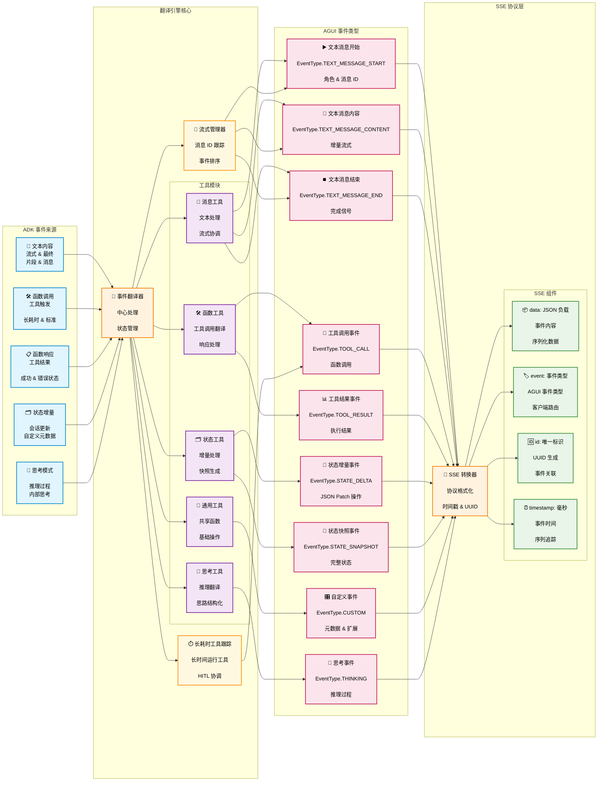
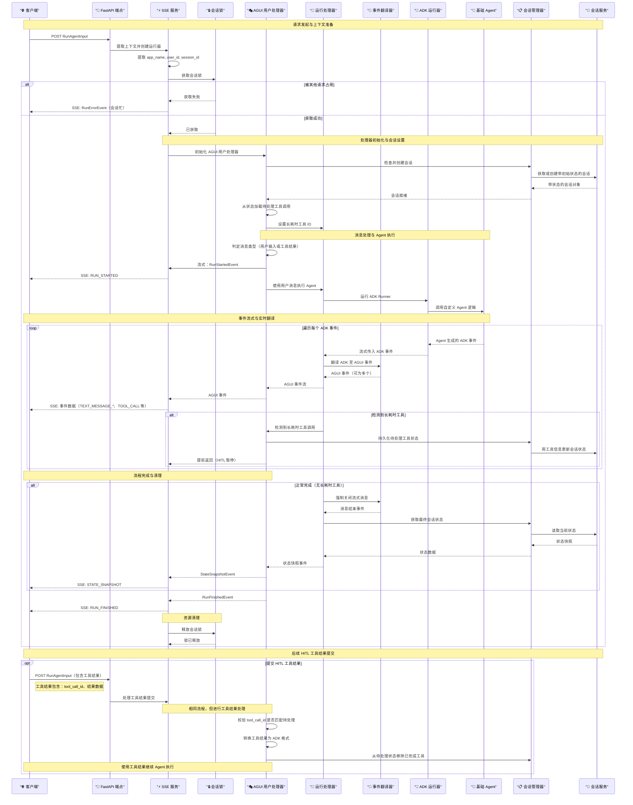
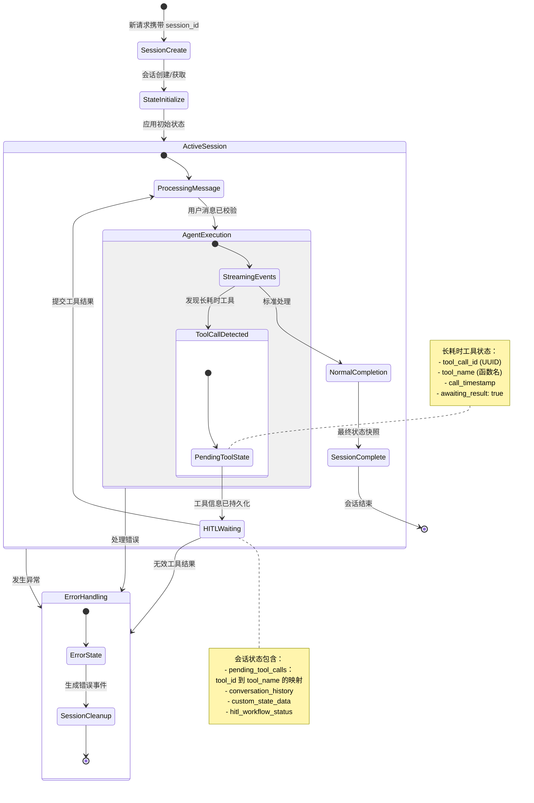

# ADK AGUI Middleware

[](https://deepwiki.com/trendmicro/adk-agui-middleware)
[](https://github.com/trendmicro/adk-agui-middleware/actions/workflows/ci.yml)
[](https://github.com/trendmicro/adk-agui-middleware/actions/workflows/codeql.yml)
[](https://github.com/trendmicro/adk-agui-middleware/actions/workflows/semgrep.yml)
[](https://github.com/trendmicro/adk-agui-middleware/actions/workflows/gitleaks.yml)
[](https://opensource.org/licenses/MIT)
[](https://github.com/astral-sh/ruff)
[](https://github.com/PyCQA/bandit)
[](https://github.com/python/mypy)

Languages: [English](README.md) | [繁體中文](README.zh-TW.md) | [简体中文](README.zh-CN.md) | [日本語](README.ja.md)

**企业级 Python 3.13+ 中间件，无缝桥接 Google 的 Agent Development Kit (ADK) 与 AGUI 协议，提供高性能的 Server-Sent Events (SSE) 流式传输与 Human-in-the-Loop (HITL) 工作流编排。**

## 概览

企业级 Python 3.13+ 中间件，桥接 Google 的 Agent Development Kit (ADK) 与 AGUI 协议，通过 Server-Sent Events 流式传输与 HITL 工作流，支持实时 AI Agent 应用。

### 核心特性

- **⚡ SSE 流式传输**：高性能 SSE，实时进行 ADK ↔ AGUI 事件转换
- **🔒 会话管理**：线程安全锁，支持可配置超时与重试机制
- **🤝 HITL 工作流**：完整的人机协同编排，支持状态持久化
- **🏗️ 企业级架构**：模块化设计，依赖注入与职责清晰分离
- **🛡️ 生产可用**：完善的错误处理、日志记录与优雅关停
- **🎯 类型安全**：完整 Python 3.13 类型标注，严格 mypy 校验

## 安装

```bash
pip install adk-agui-middleware
```

### 环境要求

- Python 3.13+（推荐 3.13.3+）
- Google ADK >= 1.9.0
- AGUI 协议 >= 0.1.7
- FastAPI >= 0.104.0

## 示例

从 `examples/` 目录开始，逐步上手更丰富的示例。

- 01_minimal_sse
  - 最小可运行示例：从 ADK 的 `LlmAgent` 进行 SSE 流式传输。
  - 路径：`examples/01_minimal_sse/app.py`
- 02_context_history
  - 主 SSE 端点 + 历史与状态端点，包含简单的上下文提取。
  - 路径：`examples/02_context_history/app.py`
- 03_advanced_pipeline
  - 增加自定义输入/输出记录器与 `RunAgentInput` 安全预处理器。
  - 路径：`examples/03_advanced_pipeline/app.py`
- 04_lifecycle_handlers
  - 演示完整的请求生命周期与 `HandlerContext` 钩子（会话锁、ADK/AGUI 处理器、翻译、状态快照、I/O 记录）。
  - 路径：`examples/04_lifecycle_handlers/app.py`

## 架构总览

### 高层系统架构

```mermaid
graph TB
    subgraph "客户端应用"
        WEB[🌐 Web 应用<br/>React/Vue/Angular]
        MOBILE[📱 移动应用<br/>iOS/Android/Flutter]
        API[🔌 API 客户端<br/>REST/GraphQL/SDK]
    end

    subgraph "FastAPI 端点层"
        MAIN_EP[🎯 主端点<br/>/agui_main_path<br/>POST RunAgentInput]
        HIST_EP[📚 历史端点<br/>GET /thread/list<br/>DELETE /thread/ID<br/>GET /message_snapshot/ID]
        STATE_EP[🗄️ 状态端点<br/>PATCH /state/ID<br/>GET /state_snapshot/ID]
    end

    subgraph "服务层"
        SSE_SVC[⚡ SSE 服务<br/>事件编排<br/>& 流式管理]
        HIST_SVC[📖 历史服务<br/>会话检索<br/>& 线程管理]
        STATE_SVC[🗃️ 状态服务<br/>会话状态管理<br/>& JSON Patch 操作]
    end

    subgraph "处理器上下文系统"
        LOCK_HDL[🔒 会话锁处理器<br/>并发控制<br/>& 资源保护]
        IO_HDL[📊 输入/输出处理器<br/>请求/响应日志<br/>& 审计追踪]
        CTX_MGR[🎛️ 处理器上下文<br/>可插拔事件处理<br/>& 自定义工作流]
    end

    subgraph "核心处理流水线"
        AGUI_USER[🎭 AGUI 用户处理器<br/>工作流编排<br/>& HITL 协同]
        RUNNING[🏃 运行处理器<br/>Agent 执行引擎<br/>& 事件翻译]
        USER_MSG[💬 用户消息处理器<br/>输入处理<br/>& 工具结果处理]
        SESSION_HDL[📝 会话处理器<br/>状态管理<br/>& 工具调用跟踪]
    end

    subgraph "事件翻译引擎"
        TRANSLATOR[🔄 事件翻译器<br/>ADK ↔ AGUI 转换<br/>流式管理]
        MSG_UTIL[📝 消息工具<br/>文本事件处理<br/>& 流式协调]
        FUNC_UTIL[🛠️ 函数工具<br/>工具调用翻译<br/>& 响应处理]
        STATE_UTIL[🗂️ 状态工具<br/>增量处理<br/>& 快照生成]
        THK_UTIL[🤔 思考工具<br/>推理模式
<br/>& 思考处理]
    end

    subgraph "会话与状态管理"
        SESS_MGR[📋 会话管理器<br/>ADK 会话操作<br/>& 生命周期管理]
        SESS_PARAM[🏷️ 会话参数<br/>应用/用户/会话 ID<br/>& 上下文提取]
        CONFIG_CTX[⚙️ 配置上下文<br/>多租户支持<br/>& 动态配置]
    end

    subgraph "Google ADK 集成"
        ADK_RUNNER[🚀 ADK 运行器<br/>Agent 容器<br/>& 执行环境]
        BASE_AGENT[🤖 基础 Agent<br/>自定义实现<br/>& 业务逻辑]
        ADK_SESS[💾 ADK 会话服务<br/>状态持久化<br/>& 事件存储]
        RUN_CONFIG[⚙️ 运行配置<br/>流式模式<br/>& 执行参数]
    end

    subgraph "服务配置"
        ARTIFACT_SVC[📎 制品服务<br/>文件管理<br/>& 数据存储]
        MEMORY_SVC[🧠 记忆服务<br/>Agent 记忆
<br/>& 上下文保留]
        CREDENTIAL_SVC[🔐 凭证服务<br/>认证
<br/>& 安全管理]
    end

    subgraph "基础设施与工具"
        LOGGER[📋 结构化日志
<br/>事件追踪<br/>& 调试信息]
        SHUTDOWN[🔌 关停处理器
<br/>优雅清理<br/>& 资源管理]
        JSON_ENC[📤 JSON 编码器
<br/>序列化<br/>& 数据格式化]
        CONVERT[🔄 转换工具
<br/>数据变换<br/>& 格式适配]
    end

    %% 客户端到端点
    WEB --> MAIN_EP
    MOBILE --> MAIN_EP
    API --> MAIN_EP
    WEB --> HIST_EP
    WEB --> STATE_EP

    %% 端点到服务
    MAIN_EP --> SSE_SVC
    HIST_EP --> HIST_SVC
    STATE_EP --> STATE_SVC

    %% 服务到处理器
    SSE_SVC --> LOCK_HDL
    SSE_SVC --> IO_HDL
    SSE_SVC --> CTX_MGR
    SSE_SVC --> AGUI_USER

    %% 核心处理流程
    AGUI_USER --> RUNNING
    AGUI_USER --> USER_MSG
    AGUI_USER --> SESSION_HDL
    RUNNING --> TRANSLATOR

    %% 翻译引擎组件
    TRANSLATOR --> MSG_UTIL
    TRANSLATOR --> FUNC_UTIL
    TRANSLATOR --> STATE_UTIL
    TRANSLATOR --> THK_UTIL

    %% 会话管理连接
    SESSION_HDL --> SESS_MGR
    SESS_MGR --> ADK_SESS
    SESS_MGR --> SESS_PARAM
    SSE_SVC --> CONFIG_CTX

    %% ADK 集成
    RUNNING --> ADK_RUNNER
    ADK_RUNNER --> BASE_AGENT
    ADK_RUNNER --> RUN_CONFIG
    SESS_MGR --> ADK_SESS

    %% 服务配置
    ADK_RUNNER --> ARTIFACT_SVC
    ADK_RUNNER --> MEMORY_SVC
    ADK_RUNNER --> CREDENTIAL_SVC

    %% 基础设施连接
    RUNNING --> LOGGER
    SESS_MGR --> LOGGER
    TRANSLATOR --> JSON_ENC
    SSE_SVC --> CONVERT
    SSE_SVC --> SHUTDOWN

    %% 样式
    classDef client fill:#e3f2fd,color:#000,stroke:#1976d2,stroke-width:2px
    classDef endpoint fill:#e8f5e8,color:#000,stroke:#388e3c,stroke-width:2px
    classDef service fill:#fff3e0,color:#000,stroke:#f57c00,stroke-width:2px
    classDef handler fill:#f3e5f5,color:#000,stroke:#7b1fa2,stroke-width:2px
    classDef core fill:#fce4ec,color:#000,stroke:#c2185b,stroke-width:2px
    classDef translation fill:#e1f5fe,color:#000,stroke:#0288d1,stroke-width:2px
    classDef session fill:#f1f8e9,color:#000,stroke:#689f38,stroke-width:2px
    classDef adk fill:#fff8e1,color:#000,stroke:#ff8f00,stroke-width:2px
    classDef config fill:#fafafa,color:#000,stroke:#424242,stroke-width:2px
    classDef infra fill:#e8eaf6,color:#000,stroke:#3f51b5,stroke-width:2px

    class WEB,MOBILE,API client
    class MAIN_EP,HIST_EP,STATE_EP endpoint
    class SSE_SVC,HIST_SVC,STATE_SVC service
    class LOCK_HDL,IO_HDL,CTX_MGR handler
    class AGUI_USER,RUNNING,USER_MSG,SESSION_HDL core
    class TRANSLATOR,MSG_UTIL,FUNC_UTIL,STATE_UTIL,THK_UTIL translation
    class SESS_MGR,SESS_PARAM,CONFIG_CTX session
    class ADK_RUNNER,BASE_AGENT,ADK_SESS,RUN_CONFIG adk
    class ARTIFACT_SVC,MEMORY_SVC,CREDENTIAL_SVC config
    class LOGGER,SHUTDOWN,JSON_ENC,CONVERT infra
```



### 事件翻译流水线



### Human-in-the-Loop（HITL）工作流

```mermaid
graph TD
    subgraph "客户端请求处理"
        REQ[📥 客户端请求<br/>RunAgentInput<br/>POST /]
        AUTH[🔐 认证
<br/>提取用户上下文
<br/>会话校验]
        LOCK[🔒 会话锁
<br/>获取排他访问
<br/>防止并发]
    end

    subgraph "会话与状态管理"
        SESS_CHECK[📋 会话检查
<br/>获取或创建会话
<br/>加载已有状态]
        STATE_INIT[🗂️ 状态初始化
<br/>应用初始状态
<br/>加载待处理工具]
        TOOL_RESUME[⏱️ 工具恢复检查
<br/>检测长耗时工具
<br/>恢复 HITL 流程]
    end

    subgraph "消息处理"
        MSG_TYPE{❓ 消息类型？}
        USER_MSG[💬 用户消息
<br/>提取内容
<br/>准备传入 Agent]
        TOOL_RESULT[🛠️ 工具结果
<br/>校验工具调用 ID
<br/>转换为 ADK 格式]
        MSG_ERROR[❌ 消息错误
<br/>无效工具 ID 或
<br/>缺少内容]
    end

    subgraph "Agent 执行流水线"
        AGENT_START[▶️ Agent 执行
<br/>RUN_STARTED 事件
<br/>开始处理]
        ADK_RUN[🚀 ADK 运行器
<br/>Agent 处理
<br/>流式事件]
        EVENT_PROC[🔄 事件处理
<br/>ADK → AGUI 翻译
<br/>实时流式]
    end

    subgraph "工具调用检测"
        TOOL_CHECK{🔍 长耗时工具？}
        LRO_DETECT[⏱️ 长耗时检测
<br/>标记为长耗时
<br/>保存调用信息]
        HITL_PAUSE[⏸️ HITL 暂停
<br/>提前返回
<br/>等待人工输入]
        NORMAL_FLOW[➡️ 正常流程
<br/>继续处理
<br/>标准工具]
    end

    subgraph "状态持久化"
        TOOL_PERSIST[💾 工具状态持久化
<br/>保存待处理工具
<br/>更新会话状态]
        STATE_SNAP[📸 状态快照
<br/>生成最终状态
<br/>发送至客户端]
        COMPLETION[✅ 完成
<br/>RUN_FINISHED 事件
<br/>释放资源]
    end

    subgraph "错误处理"
        ERROR_CATCH[🚨 错误捕获
<br/>捕获异常
<br/>生成错误事件]
        ERROR_EVENT[⚠️ 错误事件
<br/>AGUI 错误格式
<br/>通知客户端]
        CLEANUP[🧹 清理
<br/>释放会话锁
<br/>资源清理]
    end

    %% 请求处理流程
    REQ --> AUTH
    AUTH --> LOCK
    LOCK --> SESS_CHECK

    %% 会话管理流程
    SESS_CHECK --> STATE_INIT
    STATE_INIT --> TOOL_RESUME
    TOOL_RESUME --> MSG_TYPE

    %% 消息处理流程
    MSG_TYPE -->|用户消息| USER_MSG
    MSG_TYPE -->|工具结果| TOOL_RESULT
    MSG_TYPE -->|错误| MSG_ERROR
    USER_MSG --> AGENT_START
    TOOL_RESULT --> AGENT_START
    MSG_ERROR --> ERROR_EVENT

    %% Agent 执行流程
    AGENT_START --> ADK_RUN
    ADK_RUN --> EVENT_PROC
    EVENT_PROC --> TOOL_CHECK

    %% 工具调用处理
    TOOL_CHECK -->|长耗时工具| LRO_DETECT
    TOOL_CHECK -->|标准工具| NORMAL_FLOW
    LRO_DETECT --> HITL_PAUSE
    NORMAL_FLOW --> STATE_SNAP

    %% HITL 流程
    HITL_PAUSE --> TOOL_PERSIST
    TOOL_PERSIST --> COMPLETION

    %% 正常完成流程
    STATE_SNAP --> COMPLETION

    %% 错误处理流程
    ADK_RUN -.->|异常| ERROR_CATCH
    EVENT_PROC -.->|异常| ERROR_CATCH
    ERROR_CATCH --> ERROR_EVENT
    ERROR_EVENT --> CLEANUP

    %% 最终清理
    COMPLETION --> CLEANUP
    CLEANUP --> REQ

    %% 样式
    classDef request fill:#e3f2fd,color:#000,stroke:#1976d2,stroke-width:2px
    classDef session fill:#f1f8e9,color:#000,stroke:#689f38,stroke-width:2px
    classDef message fill:#fff3e0,color:#000,stroke:#f57c00,stroke-width:2px
    classDef agent fill:#fce4ec,color:#000,stroke:#c2185b,stroke-width:2px
    classDef tool fill:#fff8e1,color:#000,stroke:#ff8f00,stroke-width:2px
    classDef state fill:#f3e5f5,color:#000,stroke:#7b1fa2,stroke-width:2px
    classDef error fill:#ffebee,color:#000,stroke:#d32f2f,stroke-width:2px
    classDef decision fill:#e8f5e8,color:#000,stroke:#388e3c,stroke-width:3px

    class REQ,AUTH,LOCK request
    class SESS_CHECK,STATE_INIT,TOOL_RESUME session
    class USER_MSG,TOOL_RESULT,MSG_ERROR message
    class AGENT_START,ADK_RUN,EVENT_PROC agent
    class LRO_DETECT,HITL_PAUSE,NORMAL_FLOW tool
    class TOOL_PERSIST,STATE_SNAP,COMPLETION state
    class ERROR_CATCH,ERROR_EVENT,CLEANUP error
    class MSG_TYPE,TOOL_CHECK decision
```



### 完整请求时序



### 会话状态管理时序



## ⚠️ 关键配置：SSE 响应模式

### CopilotKit 前端兼容性问题

【重要】CopilotKit 的前端实现并不遵循标准的 Server-Sent Events (SSE) 规范，使用 FastAPI 标准的 `EventSourceResponse` 时会导致解析失败。尽管 CopilotKit 将其流式标注为“SSE”，但其实现并不符合 SSE 规范——这在其实现中是一个明显的问题。

#### 问题描述

- **标准 SSE 格式（`EventSourceResponse`）**：遵循 [W3C SSE 规范](https://html.spec.whatwg.org/multipage/server-sent-events.html)，具备正确的事件格式
- **CopilotKit 的期望**：需要使用 `StreamingResponse` 的非标准数据格式，破坏了 SSE 兼容性
- **影响**：如果使用标准的 `EventSourceResponse`，CopilotKit 前端无法正确解析事件

#### 解决方案

我们在 `ConfigContext` 中提供了一个开关，用于在符合标准的 SSE 与 CopilotKit 兼容流式之间切换：

```python
from adk_agui_middleware.data_model.context import ConfigContext

# CopilotKit 前端（默认，非标准）
config_context = ConfigContext(
    app_name="my-app",
    user_id=extract_user_id,
    session_id=extract_session_id,
    event_source_response_mode=False  # 默认：为 CopilotKit 使用 StreamingResponse
)

# 符合 SSE 标准的前端（推荐用于自研前端）
config_context = ConfigContext(
    app_name="my-app",
    user_id=extract_user_id,
    session_id=extract_session_id,
    event_source_response_mode=True  # 使用标准的 EventSourceResponse
)
```

#### 配置指南

| 配置 | 响应类型 | 使用场景 | SSE 合规性 |
|--------------|---------------|----------|----------------|
| `event_source_response_mode=False`（默认） | `StreamingResponse` | CopilotKit 前端 | ❌ 非标准 |
| `event_source_response_mode=True` | `EventSourceResponse` | 自研/标准前端 | ✅ 符合 W3C |

#### 我们的立场

由于我们的自研前端是完全重构且不使用 CopilotKit，因此我们要求后端严格遵循 SSE 规范。但为保持对 CopilotKit 用户的兼容性，我们提供了可配置选项，且默认采用 CopilotKit 的非标准模式。

【生产环境且使用自研前端时，强烈建议】：

```python
config_context = ConfigContext(
    app_name="my-app",
    user_id=extract_user_id,
    session_id=extract_session_id,
    event_source_response_mode=True  # 使用标准 SSE
)
```

这样可以确保实现遵循 Web 标准，并在长期内与标准的 SSE 客户端保持兼容。

---

## 快速开始

### 基础实现

```python
from fastapi import FastAPI, Request
from google.adk.agents import BaseAgent
from adk_agui_middleware import SSEService
from adk_agui_middleware.endpoint import register_agui_endpoint
from adk_agui_middleware.data_model.config import RunnerConfig
from adk_agui_middleware.data_model.context import ConfigContext

# 初始化 FastAPI 应用
app = FastAPI(title="AI Agent Service", version="1.0.0")

# 定义自定义 ADK Agent
class MyAgent(BaseAgent):
    def __init__(self):
        super().__init__()
        self.instructions = "You are a helpful AI assistant."

# 简单的用户 ID 提取
async def extract_user_id(content, request: Request) -> str:
    return request.headers.get("x-user-id", "default-user")

# 创建 SSE 服务
agent = MyAgent()
sse_service = SSEService(
    agent=agent,
    config_context=ConfigContext(
        app_name="my-app",
        user_id=extract_user_id,
        session_id=lambda content, req: content.thread_id,
    )
)

# 注册端点
register_agui_endpoint(app, sse_service)

if __name__ == "__main__":
    import uvicorn
    uvicorn.run(app, host="0.0.0.0", port=8000)
```

### RunnerConfig 配置

`RunnerConfig` 负责管理 ADK 运行器与服务配置。它为开发与测试环境提供灵活的服务配置与自动内存实现的回退策略。

#### 默认配置（内存服务）

默认情况下，`RunnerConfig` 使用内存实现，非常适合开发与测试：

```python
from adk_agui_middleware.data_model.config import RunnerConfig
from adk_agui_middleware import SSEService

# 默认：自动使用内存服务
runner_config = RunnerConfig()

sse_service = SSEService(
    agent=MyAgent(),
    config_context=config_context,
    runner_config=runner_config  # 可选：未提供时使用默认
)
```

#### 自定义服务配置

在生产环境中，配置自定义服务：

```python
from google.adk.sessions import FirestoreSessionService
from google.adk.artifacts import GCSArtifactService
from google.adk.memory import RedisMemoryService
from google.adk.auth.credential_service import VaultCredentialService
from google.adk.agents.run_config import StreamingMode
from google.adk.agents import RunConfig

# 生产配置
runner_config = RunnerConfig(
    # 服务配置
    session_service=FirestoreSessionService(project_id="my-project"),
    artifact_service=GCSArtifactService(bucket_name="my-artifacts"),
    memory_service=RedisMemoryService(host="redis.example.com"),
    credential_service=VaultCredentialService(vault_url="https://vault.example.com"),

    # 生产禁用自动内存回退
    use_in_memory_services=False,

    # 可选：添加 ADK 插件扩展 Agent 能力
    plugins=[MyCustomPlugin(), AnotherPlugin()],

    # 自定义 Agent 执行行为
    run_config=RunConfig(
        streaming_mode=StreamingMode.SSE,
        max_iterations=50,
        timeout=300
    )
)

sse_service = SSEService(
    agent=MyAgent(),
    config_context=config_context,
    runner_config=runner_config
)
```

#### RunnerConfig 属性

| 属性 | 类型 | 默认值 | 说明 |
|-----------|------|---------|-------------|
| `use_in_memory_services` | `bool` | `True` | 当服务为 `None` 时自动创建内存服务 |
| `run_config` | `RunConfig` | `RunConfig(streaming_mode=SSE)` | ADK 运行配置（控制 Agent 执行行为）|
| `session_service` | `BaseSessionService` | `InMemorySessionService()` | 会话持久化服务 |
| `artifact_service` | `BaseArtifactService` | `None` | 制品/文件与数据管理服务 |
| `memory_service` | `BaseMemoryService` | `None` | Agent 记忆管理服务 |
| `credential_service` | `BaseCredentialService` | `None` | 认证凭证服务 |
| `plugins` | `list[BasePlugin]` | `None` | ADK 插件列表，用于扩展 Agent 能力 |

#### 配置示例

**开发/测试环境：**
```python
# 自动使用内存服务
runner_config = RunnerConfig()
```

**Firestore 生产环境：**
```python
from google.adk.sessions import FirestoreSessionService

runner_config = RunnerConfig(
    use_in_memory_services=False,
    session_service=FirestoreSessionService(
        project_id="my-project",
        database_id="my-database"
    )
)
```

**混合环境（部分自定义，部分内存）：**
```python
# 自定义会话服务，其余自动内存创建
runner_config = RunnerConfig(
    use_in_memory_services=True,  # 自动创建缺失服务
    session_service=FirestoreSessionService(project_id="my-project"),
    # artifact_service、memory_service、credential_service 将自动创建
)
```

**自定义 Agent 执行配置：**
```python
from google.adk.agents import RunConfig
from google.adk.agents.run_config import StreamingMode

runner_config = RunnerConfig(
    run_config=RunConfig(
        streaming_mode=StreamingMode.SSE,  # 使用 SSE 模式
        max_iterations=100,  # 最大迭代次数
        timeout=600,  # 执行超时时间（秒）
        enable_thinking=True,  # 启用思考/推理模式
    )
)
```

### 使用配置类的高级配置

```python
from fastapi import FastAPI, Request
from google.adk.agents import BaseAgent
from adk_agui_middleware import SSEService
from adk_agui_middleware.endpoint import (
    register_agui_endpoint,
    register_agui_history_endpoint,
    register_state_endpoint
)
from adk_agui_middleware.data_model.config import HistoryConfig, RunnerConfig, StateConfig
from adk_agui_middleware.data_model.context import ConfigContext, HandlerContext
from adk_agui_middleware.service.history_service import HistoryService
from adk_agui_middleware.service.state_service import StateService
from ag_ui.core import RunAgentInput

class MyAgent(BaseAgent):
    def __init__(self):
        super().__init__()
        self.instructions = "You are a helpful AI assistant."

class AGUIConfig:
    @staticmethod
    async def extract_user_id(request: Request) -> str:
        return request.headers.get("x-user-id", "default-user")

    @staticmethod
    async def extract_session_id(request: Request) -> str:
        return request.path_params.get("thread_id", "default-session")

    @staticmethod
    async def extract_initial_state(content: RunAgentInput, request: Request) -> dict:
        return {"frontend_state": content.state or {}}

    def create_sse_service(self) -> SSEService:
        return SSEService(
            agent=MyAgent(),
            config_context=ConfigContext(
                app_name="my-app",
                user_id=lambda content, req: self.extract_user_id(req),
                session_id=lambda content, req: content.thread_id,
                extract_initial_state=self.extract_initial_state,
            ),
            # 可选：自定义处理器
            # handler_context=HandlerContext(
            #     translate_handler=MyTranslateHandler,
            #     adk_event_handler=MyADKEventHandler,
            #     in_out_record_handler=MyInOutHandler,
            # ),
        )

    def create_history_service(self) -> HistoryService:
        return HistoryService(
            HistoryConfig(
                app_name="my-app",
                user_id=self.extract_user_id,
                session_id=self.extract_session_id,
            )
        )

    def create_state_service(self) -> StateService:
        return StateService(
            StateConfig(
                app_name="my-app",
                user_id=self.extract_user_id,
                session_id=self.extract_session_id,
            )
        )

# 初始化 FastAPI 与服务
app = FastAPI(title="AI Agent Service", version="1.0.0")
config = AGUIConfig()

# 注册全部端点
register_agui_endpoint(app, config.create_sse_service())
register_agui_history_endpoint(app, config.create_history_service())
register_state_endpoint(app, config.create_state_service())

if __name__ == "__main__":
    import uvicorn
    uvicorn.run(app, host="0.0.0.0", port=8000)
```

### 自定义事件处理器

```python
from collections.abc import AsyncGenerator
from adk_agui_middleware.base_abc.handler import (
    BaseADKEventHandler,
    BaseInOutHandler,
    BaseTranslateHandler
)
from adk_agui_middleware.data_model.common import InputInfo
from adk_agui_middleware.data_model.event import TranslateEvent
from google.adk.events import Event

class MyADKEventHandler(BaseADKEventHandler):
    def __init__(self, input_info: InputInfo | None):
        pass  # 初始化你的处理器

    async def process(self, event: Event) -> AsyncGenerator[Event | None]:
        # 在翻译前过滤或修改 ADK 事件
        yield event

class MyTranslateHandler(BaseTranslateHandler):
    def __init__(self, input_info: InputInfo | None):
        pass  # 初始化你的处理器

    async def translate(self, adk_event: Event) -> AsyncGenerator[TranslateEvent]:
        # 自定义翻译逻辑
        yield TranslateEvent()  # 你的自定义翻译

class MyInOutHandler(BaseInOutHandler):
    async def input_record(self, input_info: InputInfo) -> None:
        # 记录输入用于审计/调试
        pass

    async def output_record(self, agui_event: dict[str, str]) -> None:
        # 记录输出事件
        pass

    async def output_catch_and_change(self, agui_event: dict[str, str]) -> dict[str, str]:
        # 在发送给客户端前修改输出
        return agui_event
```

## 示例

示例目录提供开箱即用的实践模式。每个示例都包含注释，可直接通过 uvicorn 启动。

- 基础 SSE：`uvicorn examples.01_basic_sse_app.main:app --reload`
- 自定义上下文 + 输入转换：`uvicorn examples.02_custom_context.main:app --reload`
- 插件与超时：`uvicorn examples.03_plugins_and_timeouts.main:app --reload`
- 历史 API（线程/快照/补丁）：`uvicorn examples.04_history_api.main:app --reload`
- 自定义会话锁：`uvicorn examples.05_custom_lock.main:app --reload`
- HITL 工具流程：`uvicorn examples.06_hitl_tool_flow.main:app --reload`

详见 `examples/README.md`。

## HandlerContext 生命周期

HandlerContext 配置请求生命周期中的可插拔钩子。实例按请求构建（会话锁除外，会在 SSEService 创建时实例化），并在约定阶段被调用。

- session_lock_handler（在 SSEService 初始化时创建）
  - 时机：运行请求流之前与 finally 清理时
  - 用于：SSEService.runner（加/解锁，生成“已锁定”错误事件）
- in_out_record_handler
  - 时机：构建完 InputInfo 立即触发（input_record），随后对每个 SSE 事件触发（output_record、output_catch_and_change）
  - 用于：SSEService.get_runner 与 SSEService.event_generator
- adk_event_handler
  - 时机：每个 ADK 事件在翻译前
  - 用于：RunningHandler._process_events_with_handler（处理 ADK 流）
- adk_event_timeout_handler
  - 时机：为 ADK 事件处理包裹超时；若超时抛出 TimeoutError，则产出回退事件
  - 用于：RunningHandler._process_events_with_handler(enable_timeout=True)
- translate_handler
  - 时机：默认翻译前；可产出 AGUI 事件、请求重调或替换 ADK 事件
  - 用于：RunningHandler._translate_adk_to_agui_async
- agui_event_handler
  - 时机：每个 AGUI 事件在翻译后、编码前
  - 用于：RunningHandler._process_events_with_handler（处理 AGUI 流）
- agui_state_snapshot_handler
  - 时机：结束前一次，用于在创建 StateSnapshotEvent 前转换最终状态
  - 用于：RunningHandler.create_state_snapshot_event

## API 参考

### 主 AGUI 端点
通过 `register_agui_endpoint(app, sse_service)` 注册

| 方法 | 路径 | 描述 | 请求体 | 响应类型 |
|--------|----------|-------------|--------------|---------------|
| `POST` | `/` | 流式执行 Agent | `RunAgentInput` | `EventSourceResponse` |

### 历史端点
通过 `register_agui_history_endpoint(app, history_service)` 注册

| 方法 | 路径 | 描述 | 请求体 | 响应类型 |
|--------|----------|-------------|--------------|---------------|
| `GET` | `/thread/list` | 列出用户会话线程 | - | `List[Dict[str, str]]` |
| `DELETE` | `/thread/{thread_id}` | 删除会话线程 | - | `Dict[str, str]` |
| `GET` | `/message_snapshot/{thread_id}` | 获取会话历史 | - | `MessagesSnapshotEvent` |

### 状态管理端点
通过 `register_state_endpoint(app, state_service)` 注册

| 方法 | 路径 | 描述 | 请求体 | 响应类型 |
|--------|----------|-------------|--------------|---------------|
| `GET` | `/state_snapshot/{thread_id}` | 获取会话状态快照 | - | `StateSnapshotEvent` |
| `PATCH` | `/state/{thread_id}` | 更新会话状态 | `List[JSONPatch]` | `Dict[str, str]` |

### 事件类型

该中间件支持 ADK 与 AGUI 格式之间的全面事件翻译：

#### AGUI 事件类型
- `TEXT_MESSAGE_START` - 开始流式文本响应
- `TEXT_MESSAGE_CONTENT` - 流式文本内容片段
- `TEXT_MESSAGE_END` - 完成流式文本响应
- `TOOL_CALL` - Agent 工具/函数调用
- `TOOL_RESULT` - 工具执行结果
- `STATE_DELTA` - 增量状态更新
- `STATE_SNAPSHOT` - 完整状态快照
- `RUN_STARTED` - Agent 执行开始
- `RUN_FINISHED` - Agent 执行完成
- `ERROR` - 携带详细信息的错误事件

## 许可证

本项目基于 MIT 许可证开源 - 详见 [LICENSE](LICENSE)。

## 参与贡献

请阅读 [CONTRIBUTING.md](CONTRIBUTING.md) 了解我们的行为准则与提交流程。

## 安全

参见 [SECURITY.md](SECURITY.md) 了解安全策略与漏洞上报流程。
