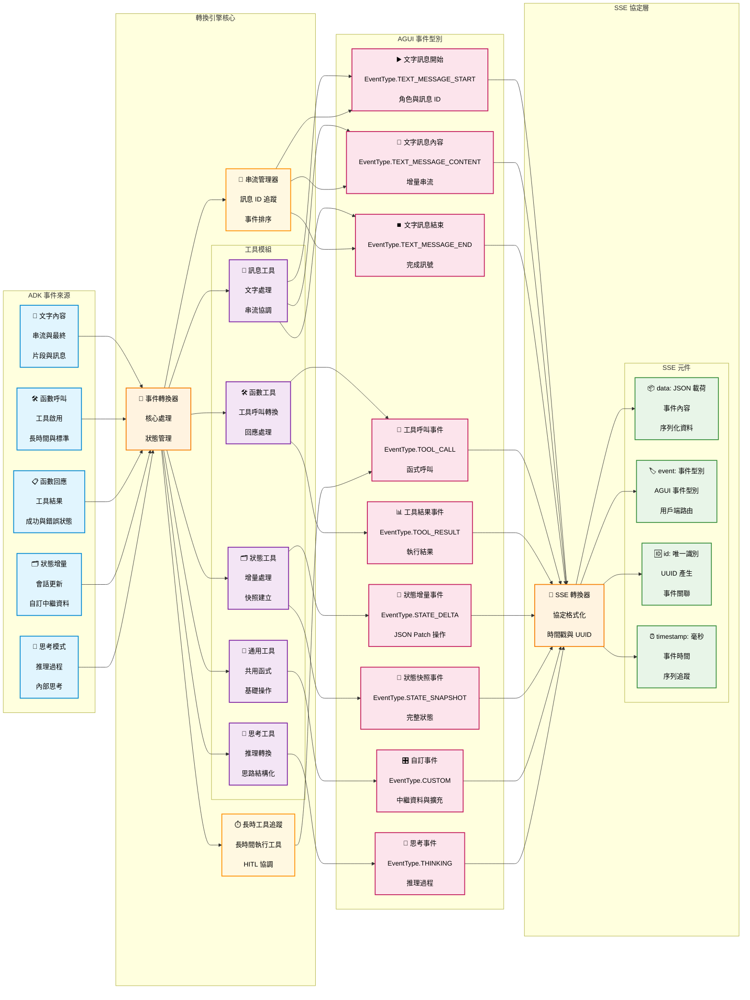
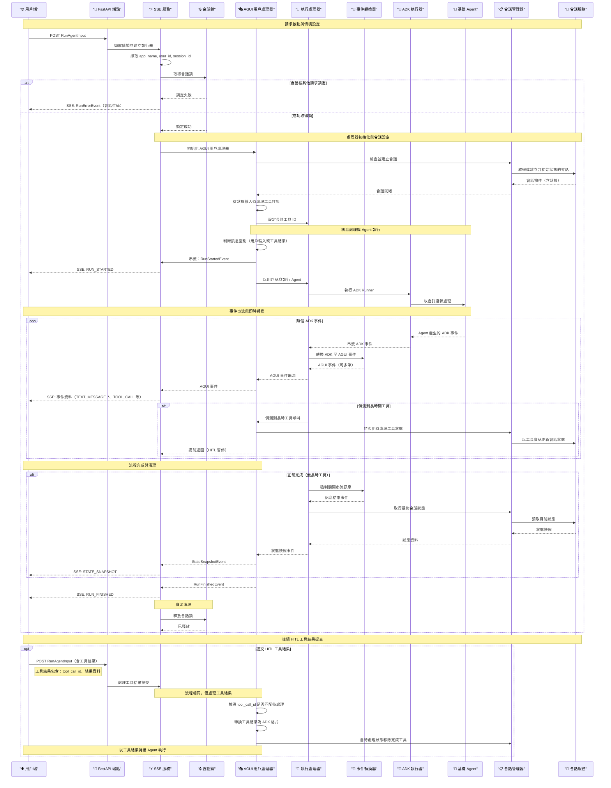
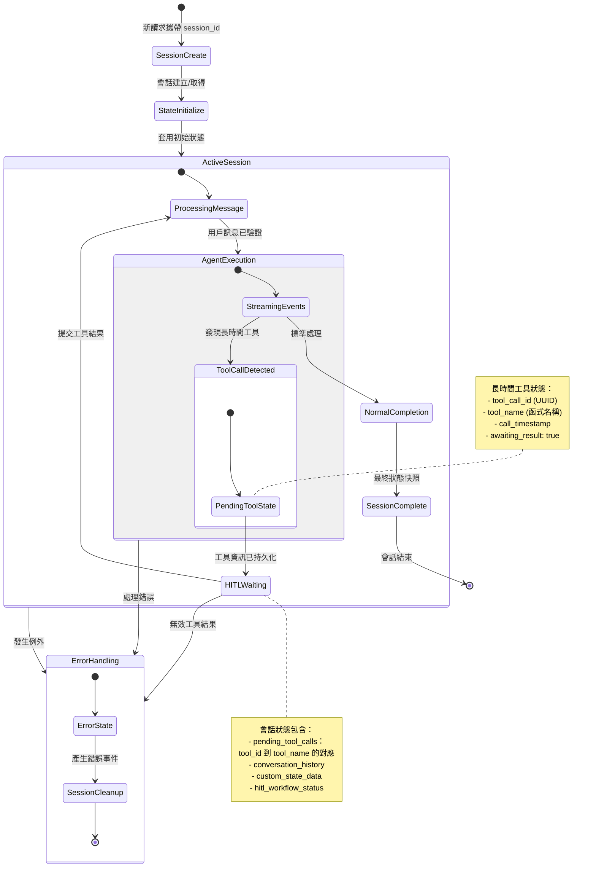

# ADK AGUI Middleware

[](https://deepwiki.com/trendmicro/adk-agui-middleware)
[](https://github.com/trendmicro/adk-agui-middleware/actions/workflows/ci.yml)
[](https://github.com/trendmicro/adk-agui-middleware/actions/workflows/codeql.yml)
[](https://github.com/trendmicro/adk-agui-middleware/actions/workflows/semgrep.yml)
[](https://github.com/trendmicro/adk-agui-middleware/actions/workflows/gitleaks.yml)
[](https://opensource.org/licenses/MIT)
[](https://github.com/astral-sh/ruff)
[](https://github.com/PyCQA/bandit)
[](https://github.com/python/mypy)

Languages: [English](README.md) | [繁體中文](README.zh-TW.md) | [简体中文](README.zh-CN.md) | [日本語](README.ja.md)

**企業級 Python 3.13+ 中介軟體，無縫銜接 Google 的 Agent Development Kit (ADK) 與 AGUI 協議，提供高效能的 Server-Sent Events (SSE) 串流與 Human-in-the-Loop (HITL) 工作流程編排。**

## 概覽

企業級 Python 3.13+ 中介軟體，銜接 Google 的 Agent Development Kit (ADK) 與 AGUI 協議，透過 Server-Sent Events 串流與 HITL 工作流程，支援即時 AI Agent 應用。

### 主要特性

- **⚡ SSE 串流**：高效能 SSE，即時進行 ADK ↔ AGUI 事件轉換
- **🔒 會話管理**：執行緒安全鎖，支援可設定的逾時與重試機制
- **🤝 HITL 工作流程**：完整的人機協作編排，支援狀態持久化
- **🏗️ 企業級架構**：模組化設計、相依性注入、清楚的職責切分
- **🛡️ 生產可用**：完善的錯誤處理、日誌紀錄與優雅關閉
- **🎯 型別安全**：完整 Python 3.13 型別標註，嚴格 mypy 驗證

## 安裝

```bash
pip install adk-agui-middleware
```

### 需求

- Python 3.13+（建議 3.13.3+）
- Google ADK >= 1.9.0
- AGUI 協議 >= 0.1.7
- FastAPI >= 0.104.0

## 範例

從 `examples/` 目錄開始，逐步上手更完整的範例。

- 01_minimal_sse
  - 最小可運作範例：從 ADK 的 `LlmAgent` 進行 SSE 串流。
  - 路徑：`examples/01_minimal_sse/app.py`
- 02_context_history
  - 主 SSE 端點 + 歷史與狀態端點，包含簡單的情境（上下文）擷取。
  - 路徑：`examples/02_context_history/app.py`
- 03_advanced_pipeline
  - 加入自訂輸入/輸出紀錄器與 `RunAgentInput` 安全前處理器。
  - 路徑：`examples/03_advanced_pipeline/app.py`
- 04_lifecycle_handlers
  - 展示完整請求生命週期與 `HandlerContext` 勾點（會話鎖、ADK/AGUI 處理器、轉換、狀態快照、I/O 紀錄）。
  - 路徑：`examples/04_lifecycle_handlers/app.py`

## 架構總覽

### 高階系統架構

```mermaid
graph TB
    subgraph "用戶端應用"
        WEB[🌐 網頁應用<br/>React/Vue/Angular]
        MOBILE[📱 行動應用<br/>iOS/Android/Flutter]
        API[🔌 API 用戶端<br/>REST/GraphQL/SDK]
    end

    subgraph "FastAPI 端點層"
        MAIN_EP[🎯 主端點<br/>/agui_main_path<br/>POST RunAgentInput]
        HIST_EP[📚 歷史端點<br/>GET /thread/list<br/>DELETE /thread/ID<br/>GET /message_snapshot/ID]
        STATE_EP[🗄️ 狀態端點<br/>PATCH /state/ID<br/>GET /state_snapshot/ID]
    end

    subgraph "服務層"
        SSE_SVC[⚡ SSE 服務<br/>事件編排<br/>& 串流管理]
        HIST_SVC[📖 歷史服務<br/>對話檢索
<br/>& 執行緒管理]
        STATE_SVC[🗃️ 狀態服務<br/>會話狀態管理<br/>& JSON Patch 操作]
    end

    subgraph "處理器情境系統"
        LOCK_HDL[🔒 會話鎖處理器<br/>並行控制
<br/>& 資源保護]
        IO_HDL[📊 輸入/輸出處理器<br/>請求/回應日誌
<br/>& 稽核軌跡]
        CTX_MGR[🎛️ 處理器情境
<br/>可插拔事件處理
<br/>& 自訂工作流程]
    end

    subgraph "核心處理管線"
        AGUI_USER[🎭 AGUI 用戶處理器<br/>工作流程編排<br/>& HITL 協調]
        RUNNING[🏃 執行處理器<br/>Agent 執行引擎<br/>& 事件轉換]
        USER_MSG[💬 用戶訊息處理器<br/>輸入處理
<br/>& 工具結果處理]
        SESSION_HDL[📝 會話處理器<br/>狀態管理
<br/>& 工具呼叫追蹤]
    end

    subgraph "事件轉換引擎"
        TRANSLATOR[🔄 事件轉換器<br/>ADK ↔ AGUI 轉換<br/>串流管理]
        MSG_UTIL[📝 訊息工具
<br/>文字事件處理
<br/>& 串流協調]
        FUNC_UTIL[🛠️ 函數工具
<br/>工具呼叫轉換
<br/>& 回應處理]
        STATE_UTIL[🗂️ 狀態工具
<br/>增量處理
<br/>& 快照建立]
        THK_UTIL[🤔 思考工具
<br/>推理模式
<br/>& 思考處理]
    end

    subgraph "會話與狀態管理"
        SESS_MGR[📋 會話管理器<br/>ADK 會話操作<br/>& 生命週期管理]
        SESS_PARAM[🏷️ 會話參數
<br/>應用/用戶/會話 ID
<br/>& 情境擷取]
        CONFIG_CTX[⚙️ 設定情境
<br/>多租戶支援
<br/>& 動態設定]
    end

    subgraph "Google ADK 整合"
        ADK_RUNNER[🚀 ADK 執行器<br/>Agent 容器<br/>& 執行環境]
        BASE_AGENT[🤖 基礎 Agent
<br/>自訂實作
<br/>& 商務邏輯]
        ADK_SESS[💾 ADK 會話服務
<br/>狀態持久化
<br/>& 事件儲存]
        RUN_CONFIG[⚙️ 執行設定
<br/>串流模式
<br/>& 執行參數]
    end

    subgraph "服務設定"
        ARTIFACT_SVC[📎 成品服務
<br/>檔案管理
<br/>& 資料儲存]
        MEMORY_SVC[🧠 記憶服務
<br/>Agent 記憶
<br/>& 情境保留]
        CREDENTIAL_SVC[🔐 憑證服務
<br/>身分驗證
<br/>& 安全管理]
    end

    subgraph "基礎設施與工具"
        LOGGER[📋 結構化日誌
<br/>事件追蹤
<br/>& 除錯資訊]
        SHUTDOWN[🔌 關閉處理器
<br/>優雅清理
<br/>& 資源管理]
        JSON_ENC[📤 JSON 編碼器
<br/>序列化
<br/>& 資料格式化]
        CONVERT[🔄 轉換工具
<br/>資料轉換
<br/>& 格式相容]
    end

    %% 用戶端到端點
    WEB --> MAIN_EP
    MOBILE --> MAIN_EP
    API --> MAIN_EP
    WEB --> HIST_EP
    WEB --> STATE_EP

    %% 端點到服務
    MAIN_EP --> SSE_SVC
    HIST_EP --> HIST_SVC
    STATE_EP --> STATE_SVC

    %% 服務到處理器
    SSE_SVC --> LOCK_HDL
    SSE_SVC --> IO_HDL
    SSE_SVC --> CTX_MGR
    SSE_SVC --> AGUI_USER

    %% 核心處理流程
    AGUI_USER --> RUNNING
    AGUI_USER --> USER_MSG
    AGUI_USER --> SESSION_HDL
    RUNNING --> TRANSLATOR

    %% 轉換引擎元件
    TRANSLATOR --> MSG_UTIL
    TRANSLATOR --> FUNC_UTIL
    TRANSLATOR --> STATE_UTIL
    TRANSLATOR --> THK_UTIL

    %% 會話管理連結
    SESSION_HDL --> SESS_MGR
    SESS_MGR --> ADK_SESS
    SESS_MGR --> SESS_PARAM
    SSE_SVC --> CONFIG_CTX

    %% ADK 整合
    RUNNING --> ADK_RUNNER
    ADK_RUNNER --> BASE_AGENT
    ADK_RUNNER --> RUN_CONFIG
    SESS_MGR --> ADK_SESS

    %% 服務設定
    ADK_RUNNER --> ARTIFACT_SVC
    ADK_RUNNER --> MEMORY_SVC
    ADK_RUNNER --> CREDENTIAL_SVC

    %% 基礎設施連結
    RUNNING --> LOGGER
    SESS_MGR --> LOGGER
    TRANSLATOR --> JSON_ENC
    SSE_SVC --> CONVERT
    SSE_SVC --> SHUTDOWN

    %% 樣式
    classDef client fill:#e3f2fd,color:#000,stroke:#1976d2,stroke-width:2px
    classDef endpoint fill:#e8f5e8,color:#000,stroke:#388e3c,stroke-width:2px
    classDef service fill:#fff3e0,color:#000,stroke:#f57c00,stroke-width:2px
    classDef handler fill:#f3e5f5,color:#000,stroke:#7b1fa2,stroke-width:2px
    classDef core fill:#fce4ec,color:#000,stroke:#c2185b,stroke-width:2px
    classDef translation fill:#e1f5fe,color:#000,stroke:#0288d1,stroke-width:2px
    classDef session fill:#f1f8e9,color:#000,stroke:#689f38,stroke-width:2px
    classDef adk fill:#fff8e1,color:#000,stroke:#ff8f00,stroke-width:2px
    classDef config fill:#fafafa,color:#000,stroke:#424242,stroke-width:2px
    classDef infra fill:#e8eaf6,color:#000,stroke:#3f51b5,stroke-width:2px

    class WEB,MOBILE,API client
    class MAIN_EP,HIST_EP,STATE_EP endpoint
    class SSE_SVC,HIST_SVC,STATE_SVC service
    class LOCK_HDL,IO_HDL,CTX_MGR handler
    class AGUI_USER,RUNNING,USER_MSG,SESSION_HDL core
    class TRANSLATOR,MSG_UTIL,FUNC_UTIL,STATE_UTIL,THK_UTIL translation
    class SESS_MGR,SESS_PARAM,CONFIG_CTX session
    class ADK_RUNNER,BASE_AGENT,ADK_SESS,RUN_CONFIG adk
    class ARTIFACT_SVC,MEMORY_SVC,CREDENTIAL_SVC config
    class LOGGER,SHUTDOWN,JSON_ENC,CONVERT infra
```



### 事件轉換管線



### Human-in-the-Loop（HITL）工作流程

```mermaid
graph TD
    subgraph "用戶端請求處理"
        REQ[📥 用戶端請求<br/>RunAgentInput<br/>POST /]
        AUTH[🔐 驗證
<br/>擷取用戶情境
<br/>會話驗證]
        LOCK[🔒 會話鎖
<br/>取得獨占存取
<br/>避免並發]
    end

    subgraph "會話與狀態管理"
        SESS_CHECK[📋 會話檢查
<br/>取得或建立會話
<br/>載入既有狀態]
        STATE_INIT[🗂️ 狀態初始化
<br/>套用初始狀態
<br/>載入待處理工具]
        TOOL_RESUME[⏱️ 工具恢復檢查
<br/>偵測長時間工具
<br/>恢復 HITL 流程]
    end

    subgraph "訊息處理"
        MSG_TYPE{❓ 訊息型別？}
        USER_MSG[💬 用戶訊息
<br/>擷取內容
<br/>準備給 Agent]
        TOOL_RESULT[🛠️ 工具結果
<br/>驗證工具呼叫 ID
<br/>轉成 ADK 格式]
        MSG_ERROR[❌ 訊息錯誤
<br/>無效工具 ID 或
<br/>缺少內容]
    end

    subgraph "Agent 執行管線"
        AGENT_START[▶️ Agent 執行
<br/>RUN_STARTED 事件
<br/>開始處理]
        ADK_RUN[🚀 ADK 執行器
<br/>Agent 處理
<br/>串流事件]
        EVENT_PROC[🔄 事件處理
<br/>ADK → AGUI 轉換
<br/>即時串流]
    end

    subgraph "工具呼叫偵測"
        TOOL_CHECK{🔍 長時間工具？}
        LRO_DETECT[⏱️ 長時工具偵測
<br/>標記為長時間
<br/>儲存呼叫資訊]
        HITL_PAUSE[⏸️ HITL 暫停
<br/>提前返回
<br/>等待人工輸入]
        NORMAL_FLOW[➡️ 正常流程
<br/>持續處理
<br/>標準工具]
    end

    subgraph "狀態持久化"
        TOOL_PERSIST[💾 工具狀態持久化
<br/>儲存待處理工具
<br/>更新會話狀態]
        STATE_SNAP[📸 狀態快照
<br/>建立最終狀態
<br/>傳送至用戶端]
        COMPLETION[✅ 完成
<br/>RUN_FINISHED 事件
<br/>釋放資源]
    end

    subgraph "錯誤處理"
        ERROR_CATCH[🚨 錯誤攔截
<br/>捕捉例外
<br/>產生錯誤事件]
        ERROR_EVENT[⚠️ 錯誤事件
<br/>AGUI 錯誤格式
<br/>通知用戶端]
        CLEANUP[🧹 清理
<br/>釋放會話鎖
<br/>資源清理]
    end

    %% 請求處理流程
    REQ --> AUTH
    AUTH --> LOCK
    LOCK --> SESS_CHECK

    %% 會話管理流程
    SESS_CHECK --> STATE_INIT
    STATE_INIT --> TOOL_RESUME
    TOOL_RESUME --> MSG_TYPE

    %% 訊息處理流程
    MSG_TYPE -->|用戶訊息| USER_MSG
    MSG_TYPE -->|工具結果| TOOL_RESULT
    MSG_TYPE -->|錯誤| MSG_ERROR
    USER_MSG --> AGENT_START
    TOOL_RESULT --> AGENT_START
    MSG_ERROR --> ERROR_EVENT

    %% Agent 執行流程
    AGENT_START --> ADK_RUN
    ADK_RUN --> EVENT_PROC
    EVENT_PROC --> TOOL_CHECK

    %% 工具呼叫處理
    TOOL_CHECK -->|長時間工具| LRO_DETECT
    TOOL_CHECK -->|標準工具| NORMAL_FLOW
    LRO_DETECT --> HITL_PAUSE
    NORMAL_FLOW --> STATE_SNAP

    %% HITL 流程
    HITL_PAUSE --> TOOL_PERSIST
    TOOL_PERSIST --> COMPLETION

    %% 正常完成流程
    STATE_SNAP --> COMPLETION

    %% 錯誤處理流程
    ADK_RUN -.->|例外| ERROR_CATCH
    EVENT_PROC -.->|例外| ERROR_CATCH
    ERROR_CATCH --> ERROR_EVENT
    ERROR_EVENT --> CLEANUP

    %% 最終清理
    COMPLETION --> CLEANUP
    CLEANUP --> REQ

    %% 樣式
    classDef request fill:#e3f2fd,color:#000,stroke:#1976d2,stroke-width:2px
    classDef session fill:#f1f8e9,color:#000,stroke:#689f38,stroke-width:2px
    classDef message fill:#fff3e0,color:#000,stroke:#f57c00,stroke-width:2px
    classDef agent fill:#fce4ec,color:#000,stroke:#c2185b,stroke-width:2px
    classDef tool fill:#fff8e1,color:#000,stroke:#ff8f00,stroke-width:2px
    classDef state fill:#f3e5f5,color:#000,stroke:#7b1fa2,stroke-width:2px
    classDef error fill:#ffebee,color:#000,stroke:#d32f2f,stroke-width:2px
    classDef decision fill:#e8f5e8,color:#000,stroke:#388e3c,stroke-width:3px

    class REQ,AUTH,LOCK request
    class SESS_CHECK,STATE_INIT,TOOL_RESUME session
    class USER_MSG,TOOL_RESULT,MSG_ERROR message
    class AGENT_START,ADK_RUN,EVENT_PROC agent
    class LRO_DETECT,HITL_PAUSE,NORMAL_FLOW tool
    class TOOL_PERSIST,STATE_SNAP,COMPLETION state
    class ERROR_CATCH,ERROR_EVENT,CLEANUP error
    class MSG_TYPE,TOOL_CHECK decision
```



### 完整請求時序



### 會話狀態管理時序



## ⚠️ 關鍵設定：SSE 回應模式

### CopilotKit 前端相容性問題

【重要】CopilotKit 的前端實作並不遵循標準的 Server-Sent Events (SSE) 規範，使用 FastAPI 標準的 `EventSourceResponse` 會導致解析失敗。雖然 CopilotKit 將其串流標示為「SSE」，但其實作並不符合 SSE 規範——這是其實作中的重大問題。

#### 問題說明

- **標準 SSE 格式（`EventSourceResponse`）**：遵循 [W3C SSE 規範](https://html.spec.whatwg.org/multipage/server-sent-events.html)，具備正確事件格式
- **CopilotKit 的期望**：需要 `StreamingResponse` 的非標準格式，破壞 SSE 相容性
- **影響**：若使用標準 `EventSourceResponse`，CopilotKit 前端無法正確解析事件

#### 解決方案

我們在 `ConfigContext` 中提供設定，可於標準 SSE 與 CopilotKit 相容串流間切換：

```python
from adk_agui_middleware.data_model.context import ConfigContext

# CopilotKit 前端（預設，非標準）
config_context = ConfigContext(
    app_name="my-app",
    user_id=extract_user_id,
    session_id=extract_session_id,
    event_source_response_mode=False  # 預設：為 CopilotKit 使用 StreamingResponse
)

# 符合 SSE 標準的前端（建議自研前端使用）
config_context = ConfigContext(
    app_name="my-app",
    user_id=extract_user_id,
    session_id=extract_session_id,
    event_source_response_mode=True  # 使用標準 EventSourceResponse
)
```

#### 設定指南

| 設定 | 回應型別 | 使用情境 | SSE 相容性 |
|--------------|---------------|----------|----------------|
| `event_source_response_mode=False`（預設） | `StreamingResponse` | CopilotKit 前端 | ❌ 非標準 |
| `event_source_response_mode=True` | `EventSourceResponse` | 自研/標準前端 | ✅ 符合 W3C |

#### 我們的立場

由於我們的自研前端是完全重構且不使用 CopilotKit，因此我們要求後端必須嚴格遵循 SSE 規範。但為維持對 CopilotKit 使用者的相容性，我們提供可設定選項，且預設為 CopilotKit 的非標準模式。

【生產系統且採用自研前端時，強烈建議】：

```python
config_context = ConfigContext(
    app_name="my-app",
    user_id=extract_user_id,
    session_id=extract_session_id,
    event_source_response_mode=True  # 使用標準 SSE
)
```

此作法可確保實作遵循網頁標準，並與標準 SSE 用戶端維持長期相容。

---

## 快速開始

### 基礎實作

```python
from fastapi import FastAPI, Request
from google.adk.agents import BaseAgent
from adk_agui_middleware import SSEService
from adk_agui_middleware.endpoint import register_agui_endpoint
from adk_agui_middleware.data_model.config import RunnerConfig
from adk_agui_middleware.data_model.context import ConfigContext

# 初始化 FastAPI 應用
app = FastAPI(title="AI Agent Service", version="1.0.0")

# 定義自訂 ADK Agent
class MyAgent(BaseAgent):
    def __init__(self):
        super().__init__()
        self.instructions = "You are a helpful AI assistant."

# 簡單的用戶 ID 擷取
async def extract_user_id(content, request: Request) -> str:
    return request.headers.get("x-user-id", "default-user")

# 建立 SSE 服務
agent = MyAgent()
sse_service = SSEService(
    agent=agent,
    config_context=ConfigContext(
        app_name="my-app",
        user_id=extract_user_id,
        session_id=lambda content, req: content.thread_id,
    )
)

# 註冊端點
register_agui_endpoint(app, sse_service)

if __name__ == "__main__":
    import uvicorn
    uvicorn.run(app, host="0.0.0.0", port=8000)
```

### RunnerConfig 設定

`RunnerConfig` 負責管理 ADK 執行器與服務設定。它提供彈性的服務設定，並在開發/測試環境中自動回退為記憶體實作。

#### 預設設定（記憶體服務）

預設情況下，`RunnerConfig` 使用記憶體服務，十分適合開發與測試：

```python
from adk_agui_middleware.data_model.config import RunnerConfig
from adk_agui_middleware import SSEService

# 預設：自動使用記憶體服務
runner_config = RunnerConfig()

sse_service = SSEService(
    agent=MyAgent(),
    config_context=config_context,
    runner_config=runner_config  # 選用：未提供時使用預設
)
```

#### 自訂服務設定

在生產環境中，設定自訂服務：

```python
from google.adk.sessions import FirestoreSessionService
from google.adk.artifacts import GCSArtifactService
from google.adk.memory import RedisMemoryService
from google.adk.auth.credential_service import VaultCredentialService
from google.adk.agents.run_config import StreamingMode
from google.adk.agents import RunConfig

# 生產設定
runner_config = RunnerConfig(
    # 服務設定
    session_service=FirestoreSessionService(project_id="my-project"),
    artifact_service=GCSArtifactService(bucket_name="my-artifacts"),
    memory_service=RedisMemoryService(host="redis.example.com"),
    credential_service=VaultCredentialService(vault_url="https://vault.example.com"),

    # 生產環境關閉自動記憶體回退
    use_in_memory_services=False,

    # 選用：加入 ADK 外掛擴充 Agent 能力
    plugins=[MyCustomPlugin(), AnotherPlugin()],

    # 自訂 Agent 執行行為
    run_config=RunConfig(
        streaming_mode=StreamingMode.SSE,
        max_iterations=50,
        timeout=300
    )
)

sse_service = SSEService(
    agent=MyAgent(),
    config_context=config_context,
    runner_config=runner_config
)
```

#### RunnerConfig 屬性

| 屬性 | 型別 | 預設 | 說明 |
|-----------|------|---------|-------------|
| `use_in_memory_services` | `bool` | `True` | 當服務為 `None` 時自動建立記憶體服務 |
| `run_config` | `RunConfig` | `RunConfig(streaming_mode=SSE)` | ADK 執行設定（控制 Agent 執行行為）|
| `session_service` | `BaseSessionService` | `InMemorySessionService()` | 會話持久化服務 |
| `artifact_service` | `BaseArtifactService` | `None` | 成品/檔案與資料管理服務 |
| `memory_service` | `BaseMemoryService` | `None` | Agent 記憶管理服務 |
| `credential_service` | `BaseCredentialService` | `None` | 身分驗證憑證服務 |
| `plugins` | `list[BasePlugin]` | `None` | ADK 外掛清單，用於擴充 Agent 能力 |

#### 設定範例

**開發/測試環境：**
```python
# 自動使用記憶體服務
runner_config = RunnerConfig()
```

**使用 Firestore 的生產環境：**
```python
from google.adk.sessions import FirestoreSessionService

runner_config = RunnerConfig(
    use_in_memory_services=False,
    session_service=FirestoreSessionService(
        project_id="my-project",
        database_id="my-database"
    )
)
```

**混合環境（部分自訂、部分記憶體）：**
```python
# 自訂會話服務，其餘自動建立記憶體服務
runner_config = RunnerConfig(
    use_in_memory_services=True,  # 自動建立缺少的服務
    session_service=FirestoreSessionService(project_id="my-project"),
    # artifact_service、memory_service、credential_service 會自動建立
)
```

**自訂 Agent 執行設定：**
```python
from google.adk.agents import RunConfig
from google.adk.agents.run_config import StreamingMode

runner_config = RunnerConfig(
    run_config=RunConfig(
        streaming_mode=StreamingMode.SSE,  # 使用 SSE 模式
        max_iterations=100,  # 最大迭代次數
        timeout=600,  # 執行逾時（秒）
        enable_thinking=True,  # 啟用思考/推理模式
    )
)
```

### 進階：使用設定類別

```python
from fastapi import FastAPI, Request
from google.adk.agents import BaseAgent
from adk_agui_middleware import SSEService
from adk_agui_middleware.endpoint import (
    register_agui_endpoint,
    register_agui_history_endpoint,
    register_state_endpoint
)
from adk_agui_middleware.data_model.config import HistoryConfig, RunnerConfig, StateConfig
from adk_agui_middleware.data_model.context import ConfigContext, HandlerContext
from adk_agui_middleware.service.history_service import HistoryService
from adk_agui_middleware.service.state_service import StateService
from ag_ui.core import RunAgentInput

class MyAgent(BaseAgent):
    def __init__(self):
        super().__init__()
        self.instructions = "You are a helpful AI assistant."

class AGUIConfig:
    @staticmethod
    async def extract_user_id(request: Request) -> str:
        return request.headers.get("x-user-id", "default-user")

    @staticmethod
    async def extract_session_id(request: Request) -> str:
        return request.path_params.get("thread_id", "default-session")

    @staticmethod
    async def extract_initial_state(content: RunAgentInput, request: Request) -> dict:
        return {"frontend_state": content.state or {}}

    def create_sse_service(self) -> SSEService:
        return SSEService(
            agent=MyAgent(),
            config_context=ConfigContext(
                app_name="my-app",
                user_id=lambda content, req: self.extract_user_id(req),
                session_id=lambda content, req: content.thread_id,
                extract_initial_state=self.extract_initial_state,
            ),
            # 選用：自訂處理器
            # handler_context=HandlerContext(
            #     translate_handler=MyTranslateHandler,
            #     adk_event_handler=MyADKEventHandler,
            #     in_out_record_handler=MyInOutHandler,
            # ),
        )

    def create_history_service(self) -> HistoryService:
        return HistoryService(
            HistoryConfig(
                app_name="my-app",
                user_id=self.extract_user_id,
                session_id=self.extract_session_id,
            )
        )

    def create_state_service(self) -> StateService:
        return StateService(
            StateConfig(
                app_name="my-app",
                user_id=self.extract_user_id,
                session_id=self.extract_session_id,
            )
        )

# 初始化 FastAPI 與服務
app = FastAPI(title="AI Agent Service", version="1.0.0")
config = AGUIConfig()

# 註冊全部端點
register_agui_endpoint(app, config.create_sse_service())
register_agui_history_endpoint(app, config.create_history_service())
register_state_endpoint(app, config.create_state_service())

if __name__ == "__main__":
    import uvicorn
    uvicorn.run(app, host="0.0.0.0", port=8000)
```

### 自訂事件處理器

```python
from collections.abc import AsyncGenerator
from adk_agui_middleware.base_abc.handler import (
    BaseADKEventHandler,
    BaseInOutHandler,
    BaseTranslateHandler
)
from adk_agui_middleware.data_model.common import InputInfo
from adk_agui_middleware.data_model.event import TranslateEvent
from google.adk.events import Event

class MyADKEventHandler(BaseADKEventHandler):
    def __init__(self, input_info: InputInfo | None):
        pass  # 初始化你的處理器

    async def process(self, event: Event) -> AsyncGenerator[Event | None]:
        # 在轉換前過濾或修改 ADK 事件
        yield event

class MyTranslateHandler(BaseTranslateHandler):
    def __init__(self, input_info: InputInfo | None):
        pass  # 初始化你的處理器

    async def translate(self, adk_event: Event) -> AsyncGenerator[TranslateEvent]:
        # 自訂轉換邏輯
        yield TranslateEvent()  # 你的自訂轉換

class MyInOutHandler(BaseInOutHandler):
    async def input_record(self, input_info: InputInfo) -> None:
        # 紀錄輸入以供稽核/除錯
        pass

    async def output_record(self, agui_event: dict[str, str]) -> None:
        # 紀錄輸出事件
        pass

    async def output_catch_and_change(self, agui_event: dict[str, str]) -> dict[str, str]:
        # 在傳送至用戶端前修改輸出
        return agui_event
```

## 範例

範例目錄提供即可運行的使用模式。每個範例皆含註解，可直接透過 uvicorn 啟動。

- 基礎 SSE：`uvicorn examples.01_basic_sse_app.main:app --reload`
- 自訂情境 + 輸入轉換：`uvicorn examples.02_custom_context.main:app --reload`
- 外掛與逾時：`uvicorn examples.03_plugins_and_timeouts.main:app --reload`
- 歷史 API（執行緒/快照/補丁）：`uvicorn examples.04_history_api.main:app --reload`
- 自訂會話鎖：`uvicorn examples.05_custom_lock.main:app --reload`
- HITL 工具流程：`uvicorn examples.06_hitl_tool_flow.main:app --reload`

詳見 `examples/README.md`。

## HandlerContext 生命週期

HandlerContext 設定請求生命週期中的可插拔勾點。實例以請求為單位建立（會話鎖例外，在 SSEService 建立時產生），並在定義階段被呼叫。

- session_lock_handler（於 SSEService 初始化時建立）
  - 時機：執行請求串流前與 finally 清理時
  - 用於：SSEService.runner（加/解鎖、產生已鎖定錯誤事件）
- in_out_record_handler
  - 時機：建立完 InputInfo 立即觸發（input_record），之後對每個 SSE 事件觸發（output_record、output_catch_and_change）
  - 用於：SSEService.get_runner 與 SSEService.event_generator
- adk_event_handler
  - 時機：每個 ADK 事件在轉換前
  - 用於：RunningHandler._process_events_with_handler（處理 ADK 串流）
- adk_event_timeout_handler
  - 時機：以逾時包裹 ADK 事件處理；TimeoutError 時產出回退事件
  - 用於：RunningHandler._process_events_with_handler(enable_timeout=True)
- translate_handler
  - 時機：預設轉換前；可產出 AGUI 事件、要求重新調整或取代 ADK 事件
  - 用於：RunningHandler._translate_adk_to_agui_async
- agui_event_handler
  - 時機：每個 AGUI 事件在轉換後、編碼前
  - 用於：RunningHandler._process_events_with_handler（處理 AGUI 串流）
- agui_state_snapshot_handler
  - 時機：結束前一次，用於在建立 StateSnapshotEvent 前轉換最終狀態
  - 用於：RunningHandler.create_state_snapshot_event

## API 參考

### 主 AGUI 端點
以 `register_agui_endpoint(app, sse_service)` 註冊

| 方法 | 端點 | 說明 | 請求本文 | 回應型別 |
|--------|----------|-------------|--------------|---------------|
| `POST` | `/` | 以串流回應執行 Agent | `RunAgentInput` | `EventSourceResponse` |

### 歷史端點
以 `register_agui_history_endpoint(app, history_service)` 註冊

| 方法 | 端點 | 說明 | 請求本文 | 回應型別 |
|--------|----------|-------------|--------------|---------------|
| `GET` | `/thread/list` | 列出用戶的對話執行緒 | - | `List[Dict[str, str]]` |
| `DELETE` | `/thread/{thread_id}` | 刪除對話執行緒 | - | `Dict[str, str]` |
| `GET` | `/message_snapshot/{thread_id}` | 取得對話歷史 | - | `MessagesSnapshotEvent` |

### 狀態管理端點
以 `register_state_endpoint(app, state_service)` 註冊

| 方法 | 端點 | 說明 | 請求本文 | 回應型別 |
|--------|----------|-------------|--------------|---------------|
| `GET` | `/state_snapshot/{thread_id}` | 取得會話狀態快照 | - | `StateSnapshotEvent` |
| `PATCH` | `/state/{thread_id}` | 更新會話狀態 | `List[JSONPatch]` | `Dict[str, str]` |

### 事件型別

此中介軟體支援 ADK 與 AGUI 之間的完整事件轉換：

#### AGUI 事件型別
- `TEXT_MESSAGE_START` - 開始串流文字回應
- `TEXT_MESSAGE_CONTENT` - 串流文字內容區塊
- `TEXT_MESSAGE_END` - 完成串流文字回應
- `TOOL_CALL` - Agent 工具/函式呼叫
- `TOOL_RESULT` - 工具執行結果
- `STATE_DELTA` - 增量狀態更新
- `STATE_SNAPSHOT` - 完整狀態快照
- `RUN_STARTED` - Agent 執行開始
- `RUN_FINISHED` - Agent 執行完成
- `ERROR` - 含詳細資訊的錯誤事件

## 授權

本專案以 MIT 授權條款釋出 - 請參閱 [LICENSE](LICENSE)。

## 貢獻

請閱讀 [CONTRIBUTING.md](CONTRIBUTING.md) 以了解我們的行為準則與提交流程。

## 安全

請參閱 [SECURITY.md](SECURITY.md) 以了解安全政策與弱點通報流程。

